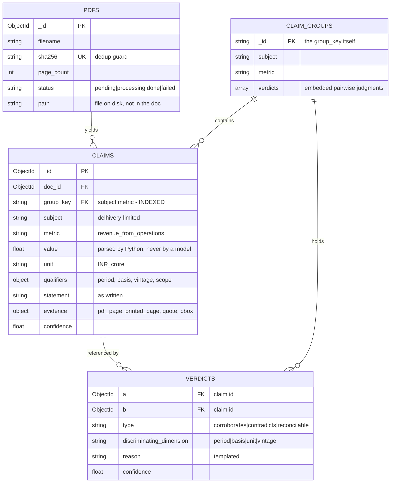
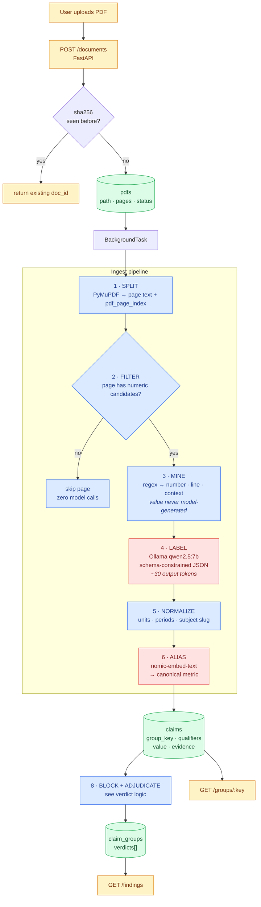
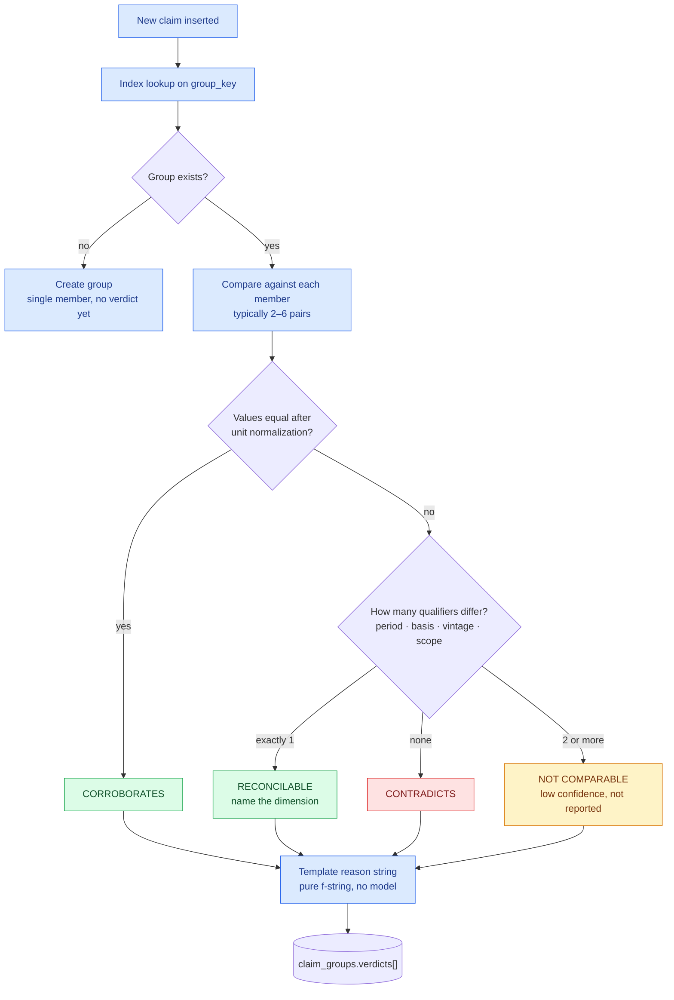

# superjoin-assignment

Fact knowledge layer for the Superjoin VIT 2026 engineering intern assignment.

## Setup and Run Instructions

Everything runs locally. No API keys, no paid services.

**Prerequisites:** Python 3.10+, Docker Desktop (running), [Ollama](https://ollama.com),
and a POSIX shell (Git Bash on Windows).

```bash
python run_pipeline.py
```

That one command installs the Python dependencies, brings up a three-node MongoDB
replica set with TLS and RBAC, pulls the local model, ingests every PDF under
`starter-datasets/`, asks you to confirm which entity each document is about,
labels the evidence, adjudicates, and writes `factlayer-dump.zip`.

Useful flags:

| flag | effect |
|---|---|
| `--yes` | accept every proposed entity without asking |
| `--limit N` | cap model calls per document, for a quick partial run |
| `--pdfs DIR` | ingest a different folder |
| `--skip-setup` | dependencies, database and model are already up |
| `--restore FILE.zip` | load a dump instead of running anything |

**It is safe to stop and re-run.** Claims are keyed by evidence id and already
labelled evidence is skipped, so a second run resumes rather than restarting or
duplicating.

**Budget the time.** Mining is about a second per 100-page PDF. Labelling is
roughly 40 seconds per model call and around 1,500 calls across the six starter
documents, so a full run wants a GPU and a few hours. `--limit 40` gives a
representative sample in minutes.

### Running it on someone else's machine

The labelling is the only slow part, and it is portable. Whoever has the faster
GPU runs `python run_pipeline.py` and sends back `factlayer-dump.zip`; you load it
with no model involved:

```bash
python run_pipeline.py --restore factlayer-dump.zip
```

The dump is JSONL per collection rather than `mongodump`, because the official
MongoDB server image does not always ship the database tools and a dump you
cannot produce on the machine holding the data is not a dump.

### The web UI

```bash
python -m uvicorn app:app --port 8000
```

Upload PDFs, confirm each document's entity, inspect mined evidence with its
source line and page, and read findings as two quotes side by side with the
verdict between them.

### Checks

Three self-checks run without a database, a model, or a network:

```bash
python extract.py && python label.py && python verdict.py
```

## Video Demo

_TODO_

## Approach

> **Status:** the architecture and data model below are settled; implementation is in
> progress. This section describes the system being built, not working software.
> Setup instructions, the demo video, and the four required cases land here as they ship.

### Core idea

A **claim** is one atomic fact together with the evidence that supports it.
A **claim group** is every claim about the same topic.

Corroboration, contradiction, and reconciliation are properties of a **pair of claims
inside a group** — never of a claim on its own. A fact is not "a contradiction"; two
facts are in contradiction. That single distinction drives the entire schema.

Grouping is deliberately **loose**, discrimination is **tight**:

- The **group key** is `subject | metric`. Only this decides membership.
- **Qualifiers** — `period`, `basis`, `vintage`, `scope` — stay *out* of the key.

This matters more than it looks. If `period` were part of the key, two revenue figures
covering different periods would never land in the same group, and an apparent
contradiction explained by time could never be detected at all. Keeping qualifiers off
the key and comparing them *within* the group makes "apparent contradiction, explained by
context" fall out of the comparison mechanically, instead of needing a special rule.

### Data model

Three MongoDB collections. `VERDICTS` is drawn as an entity for readability but is
embedded in `claim_groups.verdicts[]`.



Membership is `claims.group_key` (indexed), not a `claim_ids` array on the group. Adding
a claim is a single insert with no write contention on a hot group document, which is
what makes incremental ingestion of a new PDF cheap.

Evidence is **embedded on the claim**, not a separate collection — it is 1:1 with the
claim and always read alongside it, so a separate collection would be a join for nothing.

One note specific to this dataset: the curated excerpts skip pages, so the page number
*printed* on a page is not its index in the PDF. Both are stored (`printed_page`,
`pdf_page`) or every citation points at the wrong page.

### Ingest pipeline



Red is the only place a model touches the data, and that is the point.

**Numbers are found by regex; the model only labels them.** Asking a small local model to
"read this financial page and extract facts" produces noise. Mining candidate numbers
deterministically and then asking a narrow question — *what metric is this number?* —
turns generation into classification, which small models handle well. Three consequences:

1. **The value can never be corrupted by a model.** Transposed digits and dropped decimal
   points, the classic small-model failure, are designed out rather than guarded against.
2. **Evidence is verbatim by construction.** The quote is the source line the number was
   mined from, so it does not need a grounding check — it cannot be a paraphrase.
3. **Output shrinks from ~400 tokens to ~30**, roughly a 10x throughput win, and the
   difference between a tractable ingest and an overnight one on local hardware.

Pages with no candidate numbers never reach the model at all.

### Verdict logic



Two branches deserve comment.

**"2 or more qualifiers differ" is not a finding.** Two facts differing on several
dimensions at once are not in tension — they are different measurements that happen to
share a topic. Surfacing them is the fastest way to bury the real cases in noise, so they
are stored and withheld from `/findings`.

**Most apparent contradictions in this corpus are reconcilable, not genuine.** The
macroeconomy set is the Economic Survey, the RBI, and the IMF describing the same economy;
they disagree on GDP growth and inflation because of data vintage, revision cycle, and
fiscal-year convention. Without qualifiers on every claim, a naive value comparison flags
all of it as contradiction. The qualifier bag is what keeps the output honest.

This maps directly onto the four cases the assignment asks for:

| Required case | Produced by |
|---|---|
| 1 · Corroborated across documents | `CORROBORATES` — values agree after unit normalization |
| 2 · Genuine contradiction | `CONTRADICTS` — values differ, every qualifier identical |
| 3 · Apparent contradiction explained by context | `RECONCILABLE` — values differ, exactly one qualifier differs, and that dimension is named |
| 4 · Extraction or reasoning failure | Documented under Limitations, with the wrong fact it produced |

### Deterministic vs. model

The boundary is drawn explicitly, because it is the most consequential decision here.

| Job | Who | Why |
|---|---|---|
| Mine candidate numbers from a page | Python | Regex; the value must not be model-generated |
| Label a number with its metric and qualifiers | **Local SLM** | Genuinely needs language understanding |
| Normalize units, periods, subject | Python | Pure functions, unit-testable |
| Canonicalize metric aliases | **Local embeddings** | Stops `revenue_from_operations` and `operating_revenue` splitting into two groups |
| Group membership | Mongo index | Not a judgment call |
| Numeric verdict | Python | The comparison table above — reproducible and auditable |
| Reason string | Python | Templated from the discriminating dimension |
| Non-numeric claims | **Local SLM** | "Director appointed" vs. "resigned" needs semantics |

Cross-document contradiction detection over numbers is therefore **deterministic and
reproducible** — it does not depend on a prompt behaving the same way twice. The model's
role is confined to labelling and to semantic claims.

### Storage

MongoDB, as a three-node replica set in Docker. `deploy/bootstrap.sh` brings the
whole thing up from nothing and is safe to re-run:

```bash
bash deploy/bootstrap.sh
```

It generates credentials, an internal-auth keyfile, a self-signed CA and server
certificate, starts the nodes, initiates the set, and applies roles. Everything
it generates is gitignored; no credential is committed, and the application
connection string is written to `.env`.

**RBAC.** Three principals. `root` administers the cluster and is never used by
the application. `facts_app` holds a custom `factsWriter` role over exactly the
four collections. `facts_ro` holds `factsReader` and can only read. The writer
role is custom rather than the built-in `readWrite` because `readWrite` carries
`dropCollection` and `dropDatabase` - an ingest bug should be able to write a bad
claim, not delete the corpus. Verified: the app user is refused both a collection
drop and a read of the `admin` database, and the read-only user is refused a
write.

**Encryption in transit.** `--tlsMode requireTLS` on every client and
intra-cluster connection, against the generated CA. Verified: a `tls=false`
client is refused.

**Encryption at rest.** Not enabled by default, and this is a real limitation
rather than an oversight. WiredTiger encryption at rest is a MongoDB *Enterprise*
feature; the Community image cannot do it at any setting. `ENCRYPTED=1 bash
deploy/bootstrap.sh` switches the images to Percona Server for MongoDB, a
Community fork that does ship it, and enables `--enableEncryption` with
AES256-CBC. That key sits on the same host as the data it encrypts, which
protects a stolen disk image and nothing else; a real deployment would point at a
KMIP service.

**Availability.** Three voting members, so one can be lost without losing the
primary, and writes use `w: "majority"` with journalling - a claim that only
reached the primary is a claim that disappears when the primary does. On a single
host this survives a process failure, not a machine failure: it gives real
election and replication semantics, not real HA.

One consequence worth stating plainly. Members are named by their container
hostnames, which is what lets each node recognise itself and reach its peers. A
driver running on the host cannot follow that topology, because it would be told
to dial `mongo2`, which does not resolve outside the compose network. So the
application connects with `directConnection=true` to the primary's mapped port.
The cluster still replicates and still elects; the *client* will not fail over on
its own. Mapping `mongo1`/`mongo2`/`mongo3` to `127.0.0.1` in the host's hosts
file removes the restriction, at the cost of a change outside the repository.

### Stack

| Layer | Choice | Why |
|---|---|---|
| API | FastAPI + `BackgroundTasks` | Ingest takes minutes; async without adding a queue broker |
| PDF | PyMuPDF (`fitz`) | Text, page index, and bounding boxes from one dependency |
| Store | MongoDB replica set | Relations are a table with two foreign keys, not a graph; three nodes for majority writes |
| Labelling | Ollama · `qwen2.5:7b-instruct` | Runs locally, no API spend; good JSON adherence at this size |
| Aliasing | Ollama · `nomic-embed-text` | 137M params, CPU-speed |
| UI | One static page against the API | Not a frontend project |

Endpoints:

```
POST /documents            upload → {doc_id, status}
GET  /documents/{id}       {status, pages_done, claims_found, errors[]}
GET  /claims?subject=&metric=
GET  /groups/{group_key}   members + evidence + pairwise verdicts
GET  /findings?type=contradicts|reconcilable|corroborates
```

### Trade-offs taken

| Decision | Rationale | Cost |
|---|---|---|
| Local SLMs over a hosted API | No API spend; the whole system runs on one machine | Weaker on open-domain semantic extraction; more metric-alias drift |
| One `claims` collection, not a numeric/textual split | Access patterns are identical, so a split buys nothing and costs a union everywhere; a fact can be both numeric and semantic | A `fact_type` field and a partial index instead of separate collections |
| Regex-first mining | Values stay model-free; evidence is verbatim by construction; ~10x throughput | Facts expressed without a number are out of scope for this path |
| Deterministic verdicts | Reproducible, explainable, free | Only works where values are comparable; semantic claims still need the model |
| Templated reason strings | Instant, consistent, no model call | Less fluent than generated prose |
| Page filtering before any model call | Cuts a ~600-page corpus to roughly a third | A fact on a page with no digits is missed |
| No graph database | The brief rules it out, and the relation layer is one embedded array | None identified |
| Evidence as its own collection, not embedded on the claim as drawn above | The two halves have different writers and lifecycles: evidence is deterministic and immutable, claims are model-written and re-runnable | One extra lookup on the inspection query |
| `directConnection` from the host | Container-named members are what let nodes self-identify and reach peers | Client-side failover needs a hosts-file entry |
| `sha256` dedup on upload | A re-uploaded file would otherwise manufacture corroborations between a document and its own copy | None |

### AI tools used

Claude Code (Opus 5) was used throughout, primarily as a design critic rather than a code
generator: pressure-testing the first architecture sketch, finding the missing
canonicalization layer, and reworking the pipeline for local models. Every prompt and
response is recorded verbatim in [`docs/ai-log/`](docs/ai-log/) — see the AI Transparency
Log below.

### AI Transparency Log

Every prompt sent to Claude Code while building this project, together with its
response, is recorded in [`docs/ai-log/`](docs/ai-log/).

The log is not written by hand. Claude Code already stores each session as JSONL
under `~/.claude/projects/`, so [`tools/export_transcript.py`](tools/export_transcript.py)
just renders those existing transcripts to Markdown. A `Stop` hook in
[`.claude/settings.json`](.claude/settings.json) reruns it after every turn, so the
log cannot drift out of date.

- Tool calls are collapsed to a one-line summary per turn; the prompts and replies are verbatim.
- Personal identifiers and local filesystem paths are redacted by the exporter itself,
  so redaction cannot be forgotten. `python tools/export_transcript.py --check` re-scans
  the output and exits non-zero if anything slips through.
- Full fidelity (reasoning traces, tool inputs and outputs) remains in the raw JSONL,
  which is deliberately not committed.

## Limitations and Next Steps

_TODO_

## Additional Notes

_TODO_
