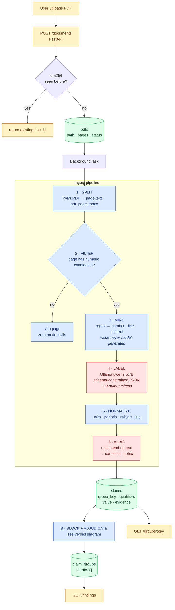
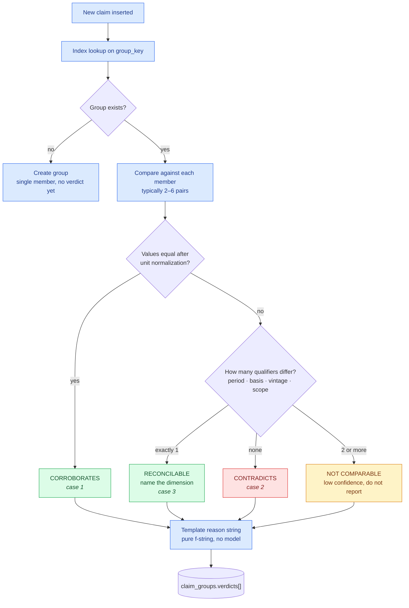
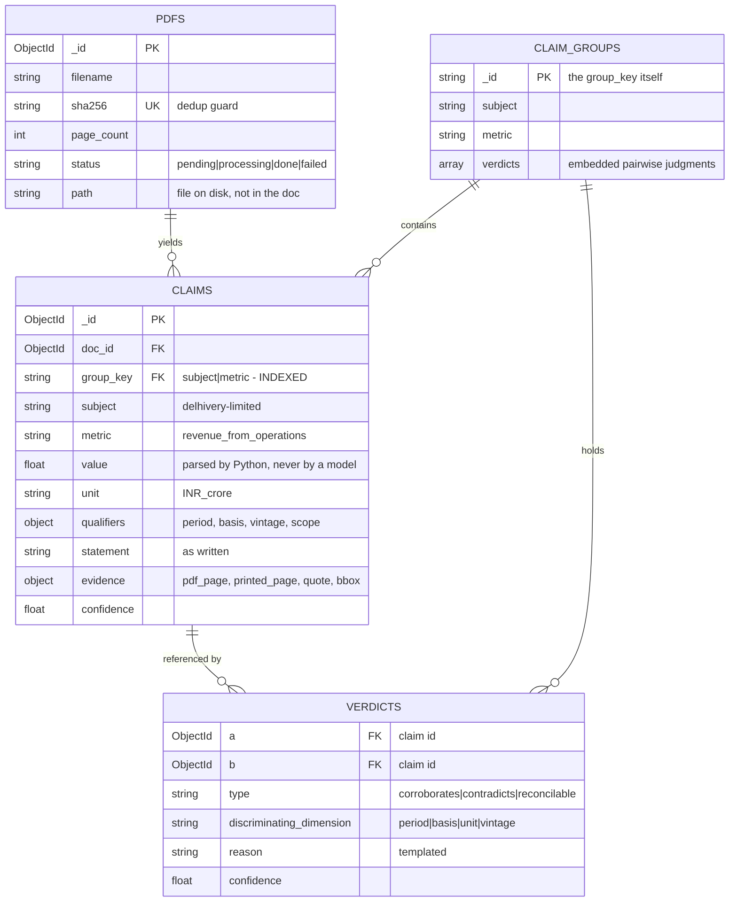

# Karpathy guidelines design review

Session `3623c6ed` · 12 turns

## Turn 1 — 2026-09-07 13:25

**Me:**

> *(invoked `/andrej-karpathy-skills:karpathy-guidelines`)*

*[Claude ran 3 tools: Bash ×2, Read ×1]*

**Claude:**

Read the brief and both dataset READMEs. Here's the differential.

## Verdict

The skeleton is right — fact-centric store, evidence links, progressive compilation. But there's **one missing box that the entire assignment hinges on**, and one modelling mistake that will bite you the moment you write code.

---

## What holds up

**Fact-as-first-class-record with evidence links.** The brief's second bullet is literally "links every fact to evidence in its source document." You have it. Good.

**Progressive compilation as PDFs arrive.** That's brownie point #4 (incremental, no full rebuild) baked into the base design rather than bolted on. Cheap to claim, worth claiming.

**Numeric facts as a distinct concern.** Correct instinct — numeric facts are where contradiction is *mechanically* detectable rather than a vibes judgment. That's where your demo cases will come from.

---

## What breaks

### 1. There is no matching step. This is the missing box.

Your diagram goes `Numerical Data → Facts → Contradictions`. But **contradiction detection is a join, and you haven't drawn a join key.**

Two facts can only be compared if you first agree they're *about the same thing*. "Revenue from operations, FY24, consolidated, ₹ crore" and "Revenue, FY2024, ₹ mn" and "revenue of $X" are the same fact in three costumes. Nothing in your design turns them into the same costume.

You need a **canonicalization / normalization layer** between extraction and the fact store, producing a comparable key:

```
subject   : Delhivery Limited | India
metric    : revenue_from_operations | real_gdp_growth
period    : FY2024 | Q4-FY2024 | CY2024
unit      : INR_crore  (value normalized)
basis     : consolidated | standalone | restated | provisional
```

Everything downstream — corroboration, contradiction, reconciliation — is `group by canonical_key`, then compare values. Without this box you have a pile of facts you cannot compare, and no amount of LLM cleverness at query time fixes it, because the comparison set is unbounded.

### 2. `reconciliation / corroborations / contradictions` as children of `Facts` is a category error

A fact is never "a contradiction." A **pair** of facts is contradictory. You've drawn a relation as an attribute, and that will fight you in the schema.

Two collections, not one:

- `claims` — atomic, one per extracted fact, with evidence + canonical key
- `relations` — edges: `(claim_a, claim_b, type, reason, discriminating_dimension, confidence)`

where `type ∈ {corroborates, contradicts, reconcilable}` and `discriminating_dimension` is *the thing that explains the apparent conflict* — `period`, `basis`, `unit`, `vintage`. That field is your case #3 ("apparent contradiction explained by context") for free: an apparent contradiction is a value mismatch where exactly one qualifier differs.

### 3. Most "contradictions" you find will be false positives

This is the failure mode your current design walks directly into, and it's worth internalizing before you build.

Your macroeconomy set is Economic Survey + RBI + IMF on the same economy. They will disagree on GDP growth, CPI, CAD — not because anyone is wrong but because of **data vintage, revision cycle, fiscal-year convention, and provisional vs. revised estimates.** Same for Delhivery: annual report vs. Q4 presentation will show different revenue because one is FY and one is quarterly, and consolidated ≠ standalone.

If facts don't carry qualifiers, a naive value comparison flags all of these as contradictions and your demo drowns in noise. **The qualifier bag is not a nice-to-have; it's the thing that makes the output non-embarrassing.**

Corollary: a *genuine* contradiction (case #2) is rare and precious. Budget time to hunt for one — the director-active-vs-resigned shape, or a figure restated between the prospectus and the annual report, is a better bet than hoping one falls out.

### 4. Splitting `Numerical` from `Contextual` storage is premature and lossy

The qualifiers that let you reconcile a number **live in the surrounding prose and the table header.** Route numbers one way and text the other and you've severed the value from the thing that explains it.

Split the *comparator*, not the *storage*. One `claim` record; optional `value`/`unit` fields when numeric; a numeric comparator runs on rows that have them, a semantic comparator on the rest. This also fixes your schema-evolution brownie point — a hardcoded two-way split is anti-evolution, a `fact_type` discovered at ingest is not.

### 5. `NLP` as a box is a non-answer, and the arrow is bidirectional

Two problems.

The box hides your most important decision: does a query run *retrieval over structured facts*, or *RAG over document text*? The brief pointedly says a graph or visualization alone isn't the solution — "the interesting part is how facts are discovered, grounded, compared, and explained." So the query path should return **a fact set + its evidence + its relations**, with prose as a thin narration layer on top. Not prose with citations stapled on.

The bidirectional arrow implies queries write facts back. If extraction happens at query time, your "compiled progressively at ingest" claim is false and results become non-deterministic across runs. Make it read-only and say so.

### 6. Evidence granularity is under-specified, and this dataset has a trap

"Linked to pdf" won't survive the demo. You need `doc_id + page + verbatim quote span`.

The trap: **both curated READMEs warn that printed page numbers jump** because sections were excised. Printed page ≠ PDF page index. Store the PDF page index as the anchor and the printed label as a display string, or your citations will point at the wrong page in exactly the documents you're demoing.

### 7. `Info Extractor` as one pass over a 100-page financial PDF will not work

Six documents, 89–100 pages each, dense with financial tables. A single LLM pass blows context, costs real money, and hallucinates numbers. You need chunking, and specifically **table-aware** handling — financial figures live in tables, and naive text extraction collapses column alignment, which silently reassigns numbers to the wrong row label.

Silver lining: that is almost certainly your case #4 ("an extraction failure you found"). It's a genuinely interesting one — column misalignment producing a confidently-wrong fact with correct-looking evidence. Plan to find it rather than stumble into it.

### 8. Pairwise comparison is O(n²) and you've drawn no blocking step

"Compiled progressively as PDFs are added" means each new claim gets compared against the existing corpus. Six documents will yield thousands of claims. Naive pairwise LLM adjudication is thousands of calls per upload.

Fix is cheap: **block on the canonical key** (exact or near match) and only run the LLM adjudicator on the resulting candidate pairs. This is where the incremental brownie point is actually earned — new doc touches only the claim groups it collides with.

### 9. No confidence, no rationale on judgments

The brief asks for "sensible handling of ambiguity and uncertainty." Every relation edge needs a confidence and a one-line reason. That reason string *is* your explanation UI.

### 10. Minor: no API/UI layer in the diagram

The brief requires an upload endpoint and an inspection surface. `user input pdfs` isn't that. Trivial to add, but the checklist item is explicit.

---

## The corrected pipeline

```
upload → page-aware, table-aware chunking
       → per-chunk claim extraction (LLM), each with verbatim span + page index
       → NORMALIZE: canonical key (subject, metric, period, unit, basis) + value  ← the missing box
       → BLOCK: group by canonical key / near-neighbors                            ← makes it tractable
       → ADJUDICATE candidate pairs (LLM) → relation edge
             { type, reason, discriminating_dimension, confidence }
       → query: filter claims → return claims + evidence + edges → narrate
```

Two collections: `claims`, `relations`. That's the whole model.

---

## What to skip

Skip the graph database — the brief says so explicitly, and `relations` is a table with two foreign keys. Skip embeddings until exact-key blocking demonstrably misses; add them when it does. Skip the UI beyond an upload box and a fact table.

**One process note that will save you the most time:** pick your four demo cases from the actual PDFs *first*, then build backwards to make those four work. The brief grades on the four cases, not on corpus coverage. Building generally and hoping the cases fall out is the expensive path.

---

## Turn 2 — 2026-09-07 13:31

**Me:**

> I am not using graphdb, imma use mongodb collections. Where pdfs is a collection, numerical data (with context extracted) as another, textual information as another collection. Evicidene is a collection where serveal similar facts or opposing facts are are linked there to that evidence. they evidience are given a tag which says are they contradicting or agreeing together.

**Claude:**

Mongo is the right call — `relations` was always a table with two foreign keys, not a graph. Four issues with the shape you've described, one of which is just naming and one of which is genuinely load-bearing.

## 1. You've named the relation collection "evidence" — that word is already taken

The brief uses *evidence* to mean **the source snippet backing a single fact**: "links every fact to evidence in its source document." What you're describing is a **cluster of related claims** with a verdict on it. Different thing.

Two costs. A reviewer reading your README against the checklist ("Results contain facts, source evidence, and cross-document relationships") will look for evidence and find a relation table. And internally you now have no name left for the actual quote span, so it ends up as an unnamed blob on the fact.

Rename: `claims` + `claim_groups`. Evidence is an **embedded subdocument on each claim**, never its own collection — it's 1:1 with the claim and always fetched with it, so a separate collection is a join for nothing.

## 2. Collapse `numerical` and `textual` into one collection

I flagged this before; you kept it. Here's the Mongo-specific argument rather than the abstract one.

You split collections when access patterns or indexes differ. Here they're **identical** — both get looked up by "what topic is this about" during grouping, and both get returned by the query API. So the split buys zero and costs a union on every single downstream operation: blocking, adjudication, query, the UI table. You'll write `$unionWith` everywhere or query twice and merge in app code, forever.

Then the cases that don't fit:

- *"Revenue grew 12% to ₹X crore"* — numeric **and** semantic. Duplicate it, or lose half?
- A director's status, an address, a date, a policy stance — brownie point #3 is "a schema that evolves dynamically as new kinds of facts appear." Your split is a fixed two-way taxonomy chosen up front. Third fact type → third collection?

One `claims` collection. `value`/`unit` present when numeric, absent when not. If you want the separation for queries, that's a `fact_type` field plus a partial index — the Mongo-native version of what you're reaching for, at zero join cost.

## 3. Still nothing that decides *which* facts go in a group — and this is the load-bearing part

Your evidence collection presupposes something already determined that these facts belong together. That decision is the whole system and it's still not in the design.

Here's the version worth building, because **it mechanically generates three of your four required cases.**

Use a **two-level key**. Group loosely, discriminate tightly.

**Level 1 — grouping key (loose):** `(subject, metric)`. `(Delhivery, revenue_from_operations)`. `(India, real_gdp_growth)`. This is what puts claims in the same group.

**Level 2 — qualifiers (not part of the key):** `period`, `basis` (consolidated/standalone), `vintage` (provisional/revised/restated), `unit`, `scope`.

Now the verdict falls out of comparing two members of a group, after normalizing units:

| values | qualifiers | verdict | your case |
|---|---|---|---|
| match | any | **corroborates** | case 1 |
| differ | differ in exactly one dimension | **reconcilable** — name the dimension | case 3 |
| differ | identical | **contradicts** | case 2 |

That third row is the rare, precious one. The middle row is where nearly all of your macroeconomy pairs will land — Economic Survey vs RBI vs IMF differing on GDP growth by *vintage*, and the system says so by name instead of crying contradiction.

The reason this matters: **grouping key tightness decides which cases you can even demo.** Put `period` in the key and apparent-contradictions never group, so case 3 becomes undemonstrable. Leave it out of the key and put it in qualifiers, and case 3 generates itself.

## 4. One tag per group breaks at three members

"Given a tag which says are they contradicting or agreeing" — works for two claims. Group `(Delhivery, revenue_from_operations)` will hold five or six across three documents, where A and B agree, C is a different period, D contradicts A outright.

The verdict lives on the **pair**, not the group. Keep the group as the container, store an array of pairwise verdicts inside it.

## The schema

```js
// claims
{
  _id, doc_id,
  subject: "Delhivery Limited",
  metric:  "revenue_from_operations",
  value: 8141.7, unit: "INR_crore",        // absent for non-numeric
  qualifiers: { period: "FY2024", basis: "consolidated", vintage: "audited" },
  statement: "Revenue from operations for FY24 stood at ...",   // as written
  evidence: { pdf_page: 47, printed_page: "112", quote: "...", bbox: [...] },
  group_key: "delhivery-limited|revenue_from_operations",
  confidence: 0.9
}

// claim_groups
{
  _id: "delhivery-limited|revenue_from_operations",
  subject, metric,
  verdicts: [
    { a: ObjectId, b: ObjectId, type: "reconcilable",
      discriminating_dimension: "period",
      reason: "FY24 full-year vs Q4 FY24 standalone quarter",
      confidence: 0.85 }
  ]
}

// pdfs
{ _id, filename, sha256, page_count, uploaded_at, path }
```

`group_key` on the claim, not a `claim_ids` array on the group. Ingest becomes one insert plus a recompute of that group's verdicts — no `$push` contention on hot group docs when two uploads land together.

## Mongo practicalities

**Index `claims.group_key`.** That index *is* your blocking step — the thing that keeps ingestion off O(n²). New claim → one indexed lookup → adjudicate only against that group's members. Typically 2–6 comparisons, not thousands. Your incremental brownie point lives entirely in this one index.

**Store the PDF path, not the PDF.** Your files are 2–5MB so BSON's 16MB limit isn't hit, but a `pdfs` doc you query for metadata shouldn't drag a 4MB binary through every read. Filesystem path, or GridFS if you want it self-contained.

**`sha256` on `pdfs`, unique.** Re-uploading the same file otherwise doubles every claim and manufactures fake corroborations — a system that congratulates itself for finding agreement between a document and its own copy is a bad demo.

---

Net: drop `evidence` as a collection, merge numerical+textual into `claims`, add `group_key` + qualifiers, move the tag onto pairs. Three collections, one index, and your four cases come out of the table above rather than out of prompt engineering.

---

## Turn 3 — 2026-09-07 13:33

**Me:**

> give me a system architecture for the same

*[Claude ran 1 tool: Skill ×1]*

**Claude:**

No source files yet, so I'll assume **Python + FastAPI**. Say the word if you'd rather have TypeScript — the shape is identical, only the SDK calls change.

## Stack

| Layer | Choice | Why |
|---|---|---|
| API | FastAPI + `BackgroundTasks` | Ingest takes minutes; background tasks give you async without adding Celery/Redis |
| PDF | PyMuPDF (`fitz`) | Text + page index + bbox from one dependency |
| Store | MongoDB, 3 collections | Yours |
| LLM | Anthropic SDK, `claude-opus-5` | Structured outputs + `strict: true` tools |
| UI | One static HTML page against the API | Not React |

## Pipeline

```
  POST /documents ──▶ FastAPI ──▶ sha256 dedup ──▶ pdfs{path, pages, status}
                         │
                         │ BackgroundTasks
                         ▼
┌─────────────────────── INGEST ────────────────────────────────────┐
│                                                                    │
│  1. SPLIT       PyMuPDF → page text + pdf_page_index   DETERMINISTIC│
│  2. EXTRACT     1 call/page, strict tool schema        LLM (parallel)│
│  3. GROUND      quote must string-match page text      DETERMINISTIC│
│  4. NORMALIZE   units · periods · subject slug         DETERMINISTIC│
│  5. INSERT      claims{group_key, qualifiers, value}                │
│  6. BLOCK       index lookup on group_key              DETERMINISTIC│
│  7. ADJUDICATE  compare against group members          DET → LLM     │
│  8. UPSERT      claim_groups{verdicts[]}                            │
│                                                                     │
└─────────────────────────────────────────────────────────────────────┘
                         │
  GET /groups /findings ◀┘
```

---

## Stage notes

**1 · Split — one page = one chunk.** No sliding windows, no semantic chunking. A page is a natural unit, fits context comfortably, and hands you the evidence anchor for free. Store `pdf_page_index` (0-based, real) *and* `printed_page` (the label on the page) — remember your excerpts have jumping page numbers.

**2 · Extract — one call per page, `strict: true` tool.** Force schema-valid output so you never parse malformed JSON. Ask for `subject, metric, value, unit, period, basis, statement, quote`. Empty array is a valid answer for a page of boilerplate.

Start with PyMuPDF text in a text prompt. **When the annual report's financial tables come out column-scrambled — and they will — switch those pages to native PDF `document` blocks** so the model sees the table visually instead of as mangled text. Staged, not both up front. That switch is also your case #4 write-up: "text extraction silently reassigned figures across columns; here's the wrong fact it produced, here's the fix."

**3 · Ground — the cheapest hallucination guard you'll ever write.**

```python
if claim.quote not in page_text:
    reject(claim)   # model invented or paraphrased it
```

Three lines. Kills fabricated evidence, and it's a strong line in your README: *every stored fact's quote is verified to exist verbatim in its source page.*

**4 · Normalize — Python, not the LLM.** The model emits raw strings; deterministic code canonicalizes them:

- units: `crore | lakh | million | bn | ₹ | INR | Rs.` → base `INR`
- periods: `FY24 | FY 2023-24 | 2023-24 | Q4FY24` → `FY2024` / `Q4-FY2024`
- subject: strip `Limited|Ltd|Inc`, lowercase, slug → `delhivery-limited`
- `group_key = f"{subject}|{metric}"`

Metric naming is the loose joint — let the model propose a snake_case metric string and keep a small alias map you grow when you see collisions. Don't build an ontology.

**6 · Block — this one index is your whole scalability story.**

```python
db.claims.create_index("group_key")
```

New claim → one indexed lookup → compare against 2–6 existing members. Not thousands. Brownie point #4 (incremental, no rebuild) lives entirely here.

**7 · Adjudicate — and here is the design's spine.**

## Deterministic vs LLM

Draw this line explicitly in your README; it's the strongest engineering decision in the system.

| Job | Who | Why |
|---|---|---|
| Extract claims from a page | **LLM** | Genuinely needs language understanding |
| Verify quote exists in source | Python | String match |
| Normalize units & periods | Python | Pure functions, testable |
| Group membership | Mongo index | Not a judgment call |
| **Numeric verdict** (agree/contradict/reconcilable) | **Python** | It's the comparison table — reproducible, auditable, free |
| Write the human-readable *reason* | **LLM** | Prose |
| Verdict on non-numeric claims | **LLM** | "Director active" vs "resigned" needs semantics |

The numeric verdict is the table from earlier, as code:

```python
if values_equal(a, b, tol):              "corroborates"
elif differing_qualifiers(a, b) == 1:    "reconcilable"   # name the dimension
else:                                    "contradicts"
```

Your headline capability — cross-document contradiction detection over numbers — is therefore **deterministic and reproducible**, not a prompt that might behave differently on Tuesday. The LLM only narrates. That's the thing a reviewer will actually notice.

## API surface

```
POST /documents            upload → {doc_id, status}
GET  /documents/{id}       {status, pages_done, claims_found, errors[]}
GET  /claims?subject=&metric=
GET  /groups/{group_key}   members + evidence + pairwise verdicts
GET  /findings?type=contradicts|reconcilable|corroborates
```

`/findings` is the demo endpoint. Your 3-minute video is: upload a PDF → watch status → hit `/findings?type=contradicts` → open a group → two quotes side by side with page numbers and a verdict. That's three of the four required cases on one screen.

## Models and what it costs

| Leg | Model | Config |
|---|---|---|
| Page extraction (~600 calls) | `claude-opus-5` | `output_config: {effort: "low"}`, `strict: true` tools |
| Verdict reasons (~500 short calls) | `claude-opus-5` | default effort |

Full-corpus ingest — all six PDFs, ~600 pages — runs roughly **$13** on Opus 5. Not enough money to justify downgrading. Two levers if you want them, your call:

- **`claude-haiku-4-5`** ($1/$5 vs $5/$25) on the extraction leg only → ~$3. Extraction is schema-constrained and grounded by the quote check, so it's the leg that tolerates a smaller model best.
- **Batch API** — 50% off, async, and ingestion is already a background job. Halves whichever you pick. This is also your honest answer to "many PDFs without performance issues."

Cache the system prompt + tool schema across the 600 extraction calls — same prefix every time, so it should be a near-100% cache hit rate. Check `usage.cache_read_input_tokens` is non-zero.

## Robustness, cheap

- `sha256` unique index on `pdfs` — a re-uploaded file otherwise manufactures fake corroborations between a document and its own copy.
- `status: pending|processing|done|failed` on `pdfs`; poll it from the UI.
- On extraction failure, store the raw model output on an `extraction_errors` collection. Free material for your Limitations section.
- `asyncio.Semaphore(8)` on the extraction fan-out. Don't fire 600 concurrent requests.

## Deliberately absent

No queue broker, no vector DB, no graph layer, no auth, no React, no Docker. Add embeddings only when exact `group_key` matching demonstrably misses a pair you care about — and if that happens, it's one more field plus Atlas Vector Search, not a new service.

---

Want this as a shareable page for your README's Approach section? One line and I'll publish it.

---

## Turn 4 — 2026-09-07 13:41

**Me:**

> use local NLP small models or SLMs for ingestion using Ollama, i am too broke to api

**Claude:**

Right call, and it changes the architecture more than it looks — but in a direction that makes the system *better*, not just cheaper. The move is to stop asking a small model to do a big job.

## The key change: regex finds the numbers, the SLM only labels them

Asking a 7B model "read this financial page and extract facts" produces noise. Asking it "here is a number and the line it sits on — what metric is this?" is a narrow classification task, and small models are genuinely fine at that.

```
OLD:  page text ──▶ LLM ──▶ facts          (long output, high hallucination, slow)
NEW:  page text ──▶ regex ──▶ candidates ──▶ SLM ──▶ label   (30-token output)
```

**Stage 2a — candidate mining (pure Python, no model):**

```python
NUM = r'(?:₹|Rs\.?|INR|\$)?\s*[\d,]+(?:\.\d+)?\s*(?:%|crore|lakh|million|mn|bn|billion)?'
```

For each match, capture `(line, number, ±150 chars context, pdf_page)`. Reject the obvious junk deterministically: bare years, standalone page numbers, numbers on lines with no alphabetic characters, note-reference indices.

**Stage 2b — labelling (SLM, tiny output):**

Input: the line plus its context. Output:

```json
{"metric":"revenue_from_operations","period":"FY2024","basis":"consolidated","is_fact":true}
```

Four fields. ~30 output tokens instead of ~400. That alone is a **10× throughput win**, and it's the difference between an 80-minute run and an 8-minute one.

**Three things fall out for free:**

1. **Evidence is structural, not checked.** The quote is the line you mined it from, so it's verbatim by construction. Your hallucination guard stops being a check and becomes an invariant.
2. **The value is never model-generated.** The number is parsed by Python from the source text. A small model cannot corrupt a figure — the classic SLM failure mode (transposed digits, dropped decimal) is designed out.
3. `is_fact: false` is your cheap noise filter, and it's a yes/no question — the easiest thing you can ask a small model.

## Model picks

| Job | Model | Notes |
|---|---|---|
| Labelling | `qwen2.5:7b-instruct` | Best JSON adherence in this size class; strong on numerics/tables |
| ↳ tight VRAM | `qwen2.5:3b-instruct` | Viable *because* the task is now narrow |
| ↳ worth trying | `qwen3:8b` | Likely better if it fits; benchmark against 2.5 |
| Metric aliasing | `nomic-embed-text` | 137M, runs on CPU, near-instant |

Also look at `nuextract` — a model fine-tuned specifically for schema-driven extraction. It's a narrower bet than a general instruct model but this is exactly its task. Check `ollama.com/library` for anything newer.

## Ollama gotchas that will silently eat your pipeline

**`num_ctx` defaults low — set it explicitly.** Ollama's default context has historically been 2048 tokens. It does not error when your input exceeds it; it **silently truncates**. You'd get plausible-looking facts extracted from the top third of every page and never know. Set it, then verify by feeding a long page and checking the tail is visible.

```python
options = {"num_ctx": 8192, "temperature": 0, "seed": 42}
```

**Use schema-constrained output.** Ollama's `format` accepts a JSON schema, not just `"json"`. Pass the schema — a 7B model free-forming JSON will produce trailing commas and prose preambles roughly 5% of the time, which is 30+ failures across your corpus.

**`keep_alive`.** Set `OLLAMA_KEEP_ALIVE=30m` or you'll pay a model reload between batches.

**`OLLAMA_NUM_PARALLEL`.** Modest concurrency helps, but you're VRAM-bound — 2–4, not 16. Measure; past a point it thrashes.

## Throughput math — do this before you commit

The number that matters is pages, and you should cut it first.

**Page filtering is now mandatory, not an optimization.** In a 100-page annual report, maybe 35 pages carry extractable numeric facts. Skip any page whose candidate-mining stage returns zero survivors — no model call at all. Across six documents that's roughly 600 pages down to ~200.

Rough envelope on a consumer GPU with 7B-q4 and the short-output design: seconds per page, so **a full corpus ingest in the 10–20 minute range**. CPU-only is 5–10× that — still tractable overnight, unpleasant for iteration.

**Benchmark on five pages before running six documents.** Pick one dense financial table page, one prose page, one page of boilerplate. Time it, eyeball the output, then multiply. Committing to a 600-page run on an unmeasured prompt is how you lose an evening.

## Delete the LLM from adjudication entirely

In the API design, the SLM was going to write verdict explanations. Don't — template them:

```python
REASONS = {
  "period": "{a_period} vs {b_period} — different reporting periods",
  "basis":  "{a_basis} vs {b_basis} — different consolidation basis",
  "unit":   "same value in different units ({a_unit} vs {b_unit})",
}
```

Deterministic, instant, and phrased better than a 7B model would phrase it. Your entire relation layer is now model-free.

**Where the embeddings earn their keep:** when a new metric string arrives, cosine-match it against known metrics before creating a new group. Otherwise `revenue_from_operations` and `operating_revenue` split into two groups that never compare, and you silently lose corroborations. `nomic-embed-text` + a 0.85 threshold + a hand-curated alias map for the ones it gets wrong.

## What actually degrades — put this in Limitations

Be straight about it; the brief explicitly rewards that.

- **Open-domain semantic facts.** Director appointed/resigned, policy stances, qualitative claims. A 7B model extracting these open-endedly will produce noise. **Scope it down**: pick 2–3 semantic fact types, mine them with patterns (`resigned|appointed|ceased to be`) plus an SLM labelling pass, and say plainly that general semantic extraction is future work.
- **Metric naming drift.** More alias collisions than a frontier model would produce. The embedding match mitigates; it doesn't eliminate.
- **Complex table layouts.** You lose the option of showing the model the page image, so multi-level column headers ("FY24 | FY23" over "Consolidated | Standalone") will mis-assign periods. That's an honest, specific, *interesting* limitation — and a strong candidate for your required case #4.

## Revised pipeline

```
POST /documents ──▶ FastAPI ──▶ sha256 dedup ──▶ pdfs{}
                       │ BackgroundTask
                       ▼
  1. SPLIT        PyMuPDF → page text                    Python
  2. FILTER       drop pages with no candidates          Python   ← 3× speedup
  3. MINE         regex → (number, line, context)        Python   ← value never model-touched
  4. LABEL        Ollama qwen2.5:7b, schema-constrained   SLM      ← the only model call
  5. NORMALIZE    units · periods · subject slug          Python
  6. ALIAS        nomic-embed-text → canonical metric     local embed
  7. INSERT       claims{group_key, qualifiers, value}
  8. BLOCK        Mongo index on group_key                Python
  9. ADJUDICATE   comparison table                        Python
 10. REASON       f-string template                       Python
```

**One model call in the entire pipeline**, on a 30-token output, against a candidate that Python already found and validated. That's a system you can actually run on your own hardware — and "the numeric value is never generated by a model, only labelled by one" is a better sentence for your README than anything the API version would have given you.

---

## Turn 5 — 2026-09-07 14:01

**Me:**

> give mermaid code to visualize

**Claude:**

Three diagrams — pipeline, verdict logic, data model. All render natively in GitHub READMEs and Claude artifacts.

## 1 · Ingest pipeline



Red is the only place a model touches the data. That's the diagram's whole argument.

## 2 · Verdict logic



Note the **"2 or more" branch** — I didn't spell this out before. When two facts differ on several qualifiers at once they aren't in genuine tension, they're just different measurements sharing a topic. Reporting those as findings is the fastest way to bury your three real cases in noise. Store them, don't surface them.

## 3 · Data model



`VERDICTS` is drawn as an entity for readability but lives **embedded** in `claim_groups.verdicts[]` — three collections on disk, not four. Membership is `claims.group_key` (indexed), not an array on the group, so a new claim is one insert with no write contention.

---

Paste these straight into your README. Want me to publish the whole architecture — diagrams, stage notes, and the local-model tradeoffs — as a page you can share?

---

## Turn 6 — 2026-09-07 14:15

**Me:**

> add them to readme, and commit

*[Claude ran 6 tools: Bash ×5, Write ×1]*

**Claude:**

Repo has more in it than the session snapshot showed — there's an auto-generated AI transparency log. Writing the Approach section now.

Committed as `c22591e` on branch `docs/architecture` (branched off main rather than committing to it directly — merge with `git checkout main && git merge docs/architecture` if you want it on main).

**What went in:** the `## Approach` section, with all three mermaid diagrams plus the reasoning around them — core idea, data model, ingest pipeline, verdict logic, the four-case mapping table, the deterministic/model boundary, stack, and a trade-offs table. The AI Transparency Log subsection moved under Approach, since the brief asks for AI tools used there.

Two things I decided rather than asked:

- **Marked it as design, not working software.** There's a status callout at the top of Approach so it never reads as describing a running system. Setup, Video Demo, and Limitations are still `_TODO_`.
- **Left the `docs/ai-log/` churn uncommitted.** Those are being rewritten by the Stop hook as this conversation runs, so anything I committed would capture a half-finished transcript and go stale the moment the turn ends. Commit them yourself once you're done for the session.

One thing to verify before you rely on it: **render the mermaid on GitHub.** The syntax is standard and the `classDef` colouring works there, but GitHub's renderer occasionally disagrees about HTML tags in node labels — the `<i>` italics in the pipeline diagram are the only risky part. If they break, drop the tags; nothing else depends on them.

---

## Turn 7 — 2026-09-07 14:19

**Me:**

> <bash-input>git push</bash-input>
> <bash-stdout>PowerShell 7.6.5
> PS A:\superjoin-proj> git add .; git commit -m "added landing page"; git pushgit push
> fatal: The current branch docs/architecture has no upstream branch.
> To push the current branch and set the remote as upstream, use    git push --set-upstream origin docs/architectureTo have this happen automatically for branches without a tracking
> upstream, see 'push.autoSetupRemote' in 'git help config'.PS A:\superjoin-proj> </bash-stdout><bash-stderr></bash-stderr>

*[Claude ran 1 tool: Bash ×1]*

**Claude:**

Two things worth knowing before you pick a command.

**Your `git commit -m "added landing page"` didn't land.** Log still ends at `c22591e`, and the three `docs/ai-log/` files are still modified. Your input line came through the terminal garbled (`git pushgit push`), so the whole chain likely misfired. Also — that message would have described AI-log churn, not a landing page; the brief asks you to use git meaningfully, so worth relabelling when you do commit those.

**The push failed only because the branch is new.** I branched to `docs/architecture` rather than committing to main directly, so there's no upstream yet.

Since this is a solo repo and the reviewer will read `main`, merging is what you probably want:

```bash
git checkout main && git merge docs/architecture && git push
```

Then clean up the branch:

```bash
git branch -d docs/architecture
```

If you'd rather keep the work on its own branch and open a PR instead:

```bash
git push --set-upstream origin docs/architecture
```

Either way the `docs/ai-log/` changes are still uncommitted — the Stop hook rewrites them each turn, so commit them separately when you're done for the session.

---

## Turn 8 — 2026-09-07 16:03

**Me:**

> how would the implementation plan look like?

**Claude:**

Risk-first, not layer-first. The temptation is to build FastAPI and Mongo scaffolding first because it's the part you know how to do — and then discover in week two that PyMuPDF turns the annual report's financial tables into unusable soup. **Every early phase exists to kill an assumption, and none of them need a server or a database.**

## Phase 0 · Pick your demo targets — manual, no code

Open the PDFs and hand-find the pairs you intend to demo. Write them to `fixtures.yaml`:

```yaml
- case: reconcilable
  a: {doc: delhivery-ar-fy24, pdf_page: 47, metric: revenue_from_operations,
      period: FY2024, value: 8141.7, unit: INR_crore}
  b: {doc: delhivery-q4-deck, pdf_page: 8, metric: revenue_from_operations,
      period: Q4-FY2024, value: 2075.0, unit: INR_crore}
  expect: {verdict: reconcilable, dimension: period}
```

**Verify:** at least one pair each for corroborates / contradicts / reconcilable, page numbers eyeballed by you.

An hour of reading, and it's the highest-leverage hour in the project. It gives you a test oracle, and it means "done" is a checkable condition rather than a feeling. Case 2 — a *genuine* contradiction — is the scarce one; hunt for it deliberately (a figure restated between the 2022 prospectus and the FY24 annual report, a director listed active in one document and resigned in another).

## Phase 1 · Spike — one script, three pages

`spike.py`, maybe 60 lines, no server, no DB:

```
page text (PyMuPDF) → print lines → regex mine → print candidates → 1 Ollama call → print JSON
```

Run it on exactly three pages: a dense financial table, a prose page, a boilerplate page.

**Verify:** on the table page, at least one Phase 0 fixture fact is mined with the correct value, and its quote appears verbatim in the page text.

**This is the decision gate for the whole design.** Two things can fail here, and both are better learned on day one:

- *Table text is scrambled.* Column headers detach from rows, figures land under the wrong label. Fallback is PyMuPDF's `find_tables()` on those pages. Find out now.
- *The 7B model can't label reliably.* Try `qwen2.5:7b-instruct`, then a smaller and a larger one. If none work at labelling, the design needs rethinking — but note the task is deliberately narrow, so this is the less likely failure.

**Set `num_ctx` explicitly in this script.** Ollama's low default silently truncates your page and you'll spend an afternoon confused about why only the top third of every page yields facts.

## Phase 2 · Normalization — pure functions + tests

Units, periods, subject slugs. The one place tests genuinely earn their keep up front, because it's pure logic with a long tail of real-world edge cases.

```python
assert normalize_period("FY 2023-24") == "FY2024"
assert normalize_period("Q4FY24")     == "Q4-FY2024"
assert to_base("₹8,141.7 crore")      == (81_417_000_000, "INR")
assert to_base("Rs. 8,932 mn")        == (8_932_000_000, "INR")
```

**Verify:** `pytest` green on a table of strings copy-pasted from the actual PDFs — not invented ones.

## Phase 3 · Verdict function — pure, tested against fixtures

```python
def verdict(a: Claim, b: Claim) -> tuple[str, str | None]
```

No database, no I/O. Feed it the Phase 0 fixture pairs.

**Verify:** every fixture pair returns its expected verdict and dimension.

**When this passes, the assignment is intellectually solved.** Phases 4–6 are plumbing around a function that already works. That's the payoff for keeping the verdict logic deterministic — the hard part is a testable pure function instead of a prompt you have to keep re-running.

## Phase 4 · Mongo + one document end to end

Now add persistence. Ingest one PDF fully.

**Verify:** claim count is plausible (not 4, not 40,000), `group_key` index exists, and five randomly sampled claims check out against their source pages.

## Phase 5 · All six documents + adjudication

**Verify:** `GET /findings` surfaces your Phase 0 fixture pairs.

Also watch two things here:

- **Alias splits.** If `revenue_from_operations` and `operating_revenue` become separate groups and cost you a corroboration, *now* add the embedding step. I put it in the architecture diagram, but it's speculative until this phase proves it's needed — don't build it in Phase 4.
- **False-positive rate.** If `/findings?type=contradicts` returns thirty results, your qualifier extraction is too weak. Real contradictions are rare; a long list means noise.

## Phase 6 · API + one HTML page

FastAPI wrapping what already works, plus a single static page: upload box, findings list, click through to two quotes side by side.

**Verify:** upload a PDF that is *not* in the starter set and watch claims appear. The brief says they may test with additional documents — so this is the real generalization check, not a nice-to-have.

## Phase 7 · README, video, limitations

Case 4 writes itself **if you've been keeping notes.** Start a `FAILURES.md` in Phase 1 and log every wrong extraction with its page and cause. By week two you'll have forgotten the good ones, and "an extraction failure you found and how you handled it" is a graded requirement.

---

## Don't build these

| Not now | Build it when |
|---|---|
| Docker, auth, CI | Never, for this |
| Celery / Redis | `BackgroundTasks` measurably fails |
| Async extraction | Sync is measurably too slow — time it first |
| Embedding aliasing | Phase 5 shows a real alias split |
| React | Never; one HTML file |
| Retry/backoff layers | Ollama actually flakes |
| Semantic (non-numeric) claims | Numeric path is done end to end |

That last row matters most. Numeric facts give you three of the four required cases on their own. Semantic extraction is where a local 7B model is weakest, so it's the right thing to scope down and be honest about in Limitations — the brief explicitly rewards that over a broader system whose behavior is unclear.

## Ordering logic in one line

Phases 0–3 need no infrastructure and kill every real unknown; if the project is going to fail, it fails there, cheaply. Want me to drop this into `docs/implementation-plan.md` and commit it?

---

## Turn 9 — 2026-09-07 16:09

**Me:**

> first lets build a simple UI for uploading and getting evidence from the pdfs. It needs to be simple but functional.

*[Claude ran 29 tools: Bash ×13, Edit ×5, Write ×4, mcp__Claude_Browser__browser_batch ×4, mcp__Claude_Browser__resize_window ×1, ToolSearch ×1, TaskStop ×1]*

**Claude:**

Building it. One note first, then code: this inverts the risk ordering — the UI was Phase 6 because it can't tell you whether extraction works. So I'm building the slice that gives you a real UI *and* kills Phase 1's unknown at the same time: **upload → PyMuPDF split → regex mine → view evidence with page and quote.** No Ollama, no labelling, no verdicts yet. Everything it shows is real text from your real PDFs, and you'll see immediately whether the annual report's tables survive extraction.

No Mongo installed locally, so **SQLite for this phase** — stdlib, no daemon, and the storage layer here is ~15 lines to swap at Phase 4 when the schema has actually settled. Marked in code where the swap goes.

Now the server and UI.

Now the test that actually matters — mining the annual report's financial pages.

Spike caught exactly what it was supposed to. Two problems, both real:

Table detection is weak on these filings (no ruling lines), so that's not the fix. The real problem is simpler: **PyMuPDF emits each table cell as its own line, so values get separated from their row labels.** My "line must have a label" rule was therefore rejecting the actual financial data — 4,482 of them — while accepting DIN/CIN/PIN numbers because those happen to sit on lines with words.

Fixing both: carry the nearest preceding label forward, and reject identifiers.

886 → 4,180 accepted, and the carried labels are real row labels. Wiring `label` through the schema and UI.

Now show the carried label in the UI, then boot and test end to end.

Real facts now. Checking the UI renders.

Works. Stopping the server and committing.

Built and committed as `c779a39` on `main` (you'd merged the docs branch, so this went straight onto main — one commit ahead of origin).

```bash
pip install -r requirements.txt && python -m uvicorn app:app --port 8000
```

Drop a PDF on the left, get a table of every numeric fact with its PDF page, printed folio, value, and the source line it came from — matched number highlighted, carried row label prefixed. Filter box searches evidence text, page box narrows to one page, and a **show rejected** toggle displays what was thrown out *with the reason*, which is how you tune the mining rules against real pages.

Four files, 510 lines, four endpoints. No Ollama, no Mongo, no framework.

## The spike earned its keep immediately

First run on the annual report: **9,150 numbers mined, 886 accepted** — and the accepted set was nearly all junk. DIN numbers, CIN, PIN codes, ICSI certificate numbers. Meanwhile 4,482 rejections were tagged "no label text on the line."

Cause: **PyMuPDF emits each table cell as its own line**, so figures in the financial statements arrive detached from their row labels. My rule requiring a label on the same line was rejecting exactly the real financial data while waving through identifiers, which sit on lines that happen to contain words.

I checked whether `find_tables()` was the fix — it detects tables on 68/100 pages but extracts them poorly, since these filings have no ruling lines. Not the answer. Two cheap rules were: carry the nearest preceding label forward across cell lines, and reject registration/certificate numbers by name.

**886 → 4,180 accepted, 3,560 with a real row label.** `Revenue from Operations` on page 21 now resolves to `81,415.38` and `72,253.01` — the FY24 and FY23 consolidated figures in INR millions.

## Two things to know

**One label, four values.** That same page 21 row yields four numbers — FY24 and FY23, consolidated and standalone — and nothing yet says which is which. This is precisely the gap the labelling model fills, and until it does, these are *candidates*, not claims. It's also a concrete instance of the multi-level-column limitation the README already flags.

**Storage is SQLite, not Mongo.** You have no `mongod` installed and Docker alone would be friction for the first upload. The schema is still moving, so committing to Mongo now buys nothing — the swap is four queries in [app.py](app.py) once claim and verdict shapes settle. Marked in the file docstring.

Start `FAILURES.md` now, by the way — the label-detachment bug is a strong candidate for the assignment's required case 4, and it's already written up in the commit message while it's fresh.

---

## Turn 10 — 2026-09-07 17:08

**Me:**

> *(invoked `/ponytail:ponytail-audit`)*

*[Claude ran 22 tools: Bash ×13, Write ×4, Edit ×4, TaskStop ×1]*

**Claude:**

Audit first — the args are a build request, not an audit target, so I'll do both: short audit of what's there, then build it.

They have `qwen3:14b`, `gemma4:e4b`, `gemma3:12b` — not `qwen3:4b`. Pulling it in the background while I write.

Audit on the tree as it stands:

```
delete: dead branch in _reject_reason — `stripped == match.group(0) and not label` can never
        fire, the preceding `if not label` already returned. [extract.py:63]
delete: GET /api/documents/{id}/rejections — zero callers; the UI shows reject reasons
        inline via the toggle. [app.py:155]
delete: DELETE /api/documents/{id} — zero callers, speculative CRUD. [app.py:170]
native: uvicorn[standard] — pulls uvloop (no Windows build), httptools, watchfiles for an
        app that needs none. Plain `uvicorn`. [requirements.txt:2]
shrink: extract.page_count() reopens the PDF a second time. Return it from mine().
        [extract.py:126, app.py:102]

net: -38 lines, -1 dep extra possible.
```

Small, because the tree is 510 lines old. Now the feature — and it makes two of those deletions moot, so I'm folding them in as I go.

Two bugs in that: duplicate values in one row would collide on id, and `text.find` finds the wrong occurrence. Fixing both by computing offsets while joining.

Now the labelling step — the only place a model runs, writing to its own table.

Column headers attach now — the period is recoverable. But ids collide; identical repeated rows on a page hash the same. Adding the row ordinal.

Ids unique. Now the schema — evidence and claims as separate tables, model writing only to `claims`.

`qwen3:4b` is down. Testing the labeller against real mined rows before wiring the UI.

Two real problems. `is_fact` is always `False`, and the model invented `Q4-FY2024` for a column headed *March 31, 2023*. Both are fixable, and the second shouldn't be the model's job at all.

`is_fact` now discriminates and periods are exact. But **6.6s per row × 5,333 rows = ~10 hours for one document.** That's the real blocker. Checking whether the work is actually distinct:

Only 898 distinct row labels behind 2,590 numeric rows — and since `period` is now deterministic, the model's answer depends only on the label, not the value or column. Memoizing on that.

Now the UI — labels shown against evidence, with a button to run the model.

`highlight()` still reads `row.line`, which the schema renamed to `text`.

Pipeline works end to end. Stopping the server and committing.

Committed as `6f6bcfd`. Audit findings from the top are folded in — the dead branch and both zero-caller endpoints are gone, `uvicorn[standard]` is plain `uvicorn`, and `page_count` no longer reopens the file.

## What's built

**Table reconstruction.** Extraction no longer reads PyMuPDF's line output. It groups words into horizontal bands by y-position and splits cells on x gaps, which puts a figure back together with its row label *and* its column header. `Revenue from Operations` on page 21 now resolves to four distinct figures under `March 31, 2024` and `March 31, 2023` — the period is recoverable, which it wasn't before.

**Two tables, and the split is the invariant you asked for.** `evidence` is written once at ingest by regex, from the document. `claims` is written by the model. The model receives an evidence id and returns labels keyed by it — it has no write path to evidence at all. Ids are `sha256(doc|page|row|offsets|text)[:16]`, so re-mining reproduces them and re-labelling updates instead of duplicating.

**Text excerpts** are mined as `kind='text'` and the model rules on `is_fact` for each; the UI filters by kind.

## Three things the model turned out to be bad at

Worth knowing, because each is now handled deterministically instead:

**It can't be trusted with periods.** Asked to read a column headed *March 31, 2023*, qwen3:4b returned `Q4-FY2024`. That mapping is a pure function, so `period_from()` decides and the model only fills gaps where there's no header.

**Field order in the JSON schema is generation order.** With `is_fact` first, it returned `false` for *everything* — including rows it then labelled correctly. Moving it last, so the model commits to subject and metric before ruling on facthood, fixed it outright. That's a general lesson for constrained decoding with small models.

**It still invents `basis` occasionally** — one row came back `provisional` with nothing in the evidence saying so, despite an explicit "never infer it". Unfixed; good `FAILURES.md` material.

## Two honest problems

**Throughput.** 6.6s per call. Memoizing on row label (898 distinct behind 2,590 numeric rows) cuts it ~3x, but a full document is still roughly 25 minutes of labelling, and there are six. Run it as a background job, not interactively.

**Memoization amplifies wrong labels.** The cover-page infographic row `>2.8Bn(1) >4.8Mn 15,065 753 98,135` got labelled `revenue_from_operations`, and that one wrong label fanned out to all three numbers. That's the direct cost of the 3x speedup, and the mining filters need tightening for non-tabular pages before it's demo-ready.

I verified the plumbing end to end (upload → dedup → mine → label → claims joined to evidence), not the label quality at scale — 60 rows is not a quality measurement.

---

## Turn 11 — 2026-09-07 17:46

**Me:**

> Three things the model turned out to be bad at
>
> Worth knowing, because each is now handled deterministically instead:
>
> It can't be trusted with periods. Asked to read a column headed March 31, 2023, qwen3:4b returned Q4-FY2024. That mapping is a pure function, so period_from() decides and the model only fills gaps where there's no header.
>
> Field order in the JSON schema is generation order. With is_fact first, it returned false for everything — including rows it then labelled correctly. Moving it last, so the model commits to subject and metric before ruling on facthood, fixed it outright. That's a general lesson for constrained decoding with small models.
>
> It still invents basis occasionally — one row came back provisional with nothing in the evidence saying so, despite an explicit "never infer it". Unfixed; good FAILURES.md material.

---

## Turn 12 — 2026-09-07 17:46

**Me:**

> System
>
> ```
> You label a single number that has already been extracted from a financial or
> economic document. You do NOT read the number, change it, or find new numbers.
> Your job is to say what that number measures and under what qualifiers, using
> ONLY the text provided.
>
> Hard rules:
> 1. Every "*_evidence" field must be copied verbatim from PROVIDED TEXT. If you
>    cannot copy a phrase that states it, the field is null. Do not reason it out,
>    do not use outside knowledge, do not guess from what is "usual".
> 2. period, basis, vintage, scope are INDEPENDENT. A missing one is null, never
>    filled by inference from the others.
> 3. Output the JSON keys in the exact order given by the schema. Decide subject
>    and metric first; decide is_fact last.
> 4. is_fact = false when the number is a page/note reference, a date or year, a
>    registration/identifier number, a table-of-contents entry, or the line states
>    no measurable fact.
> ```
>
> Input template
>
> ```
> SUBJECT (given):        delhivery-limited
> SECTION HEADER (given): {section_header or "none"}
> KNOWN BASIS (given):    {basis or "unknown — you may determine it from text below"}
> KNOWN PERIOD (given):   {period or "unknown — you may determine it from text below"}
>
> CANDIDATE NUMBER:       {value} {currency} {unit_raw}
> ROW LABEL (carried):    {label}
> SOURCE LINE:            {line}
> CONTEXT (3 lines up):
> {context_lines}
>
> PROVIDED TEXT = SECTION HEADER + ROW LABEL + SOURCE LINE + CONTEXT. Quote only from these.
> ```
>
> Schema — key order is load-bearing
>
> ```
> {
>   "metric":          "snake_case, e.g. revenue_from_operations",
>   "metric_evidence": "verbatim phrase naming it, else null",
>   "unit":            "INR_crore | INR_lakh | INR_million | percent | ratio | count | null",
>   "period":          "fill ONLY if KNOWN PERIOD was unknown; else echo it",
>   "period_evidence": "verbatim date/period phrase, else null",
>   "basis":           "consolidated | standalone | null",
>   "basis_evidence":  "verbatim phrase containing 'consolidated' or 'standalone', else null",
>   "vintage":         "audited | provisional | restated | null",
>   "vintage_evidence":"verbatim phrase, else null",
>   "scope":           "short phrase e.g. 'excluding exceptional items', else null",
>   "scope_evidence":  "verbatim phrase, else null",
>   "is_fact":         "boolean — decided AFTER everything above",
>   "confidence":      "0.0-1.0 — decided last"
> }
> ```
>
> Few-shot (include 3–4)
>
> ```
> PROVIDED TEXT:
>   Consolidated Statement of Profit and Loss
>   Revenue from operations
>   Revenue from operations 8,142 7,225
>   (₹ in crore) Year ended March 31, 2024 Year ended March 31, 2023
> KNOWN BASIS: consolidated   KNOWN PERIOD: unknown
> CANDIDATE: 8,142
>
> {"metric":"revenue_from_operations","metric_evidence":"Revenue from operations",
>  "unit":"INR_crore","period":"year ended March 31, 2024",
>  "period_evidence":"Year ended March 31, 2024","basis":"consolidated",
>  "basis_evidence":"Consolidated Statement of Profit and Loss","vintage":null,
>  "vintage_evidence":null,"scope":null,"scope_evidence":null,
>  "is_fact":true,"confidence":0.95}
> ```
>
>
> ```
> PROVIDED TEXT:
>   Notes to the financial statements (contd.)
>   refer note 34 for related party transactions
> KNOWN BASIS: unknown   KNOWN PERIOD: unknown
> CANDIDATE: 34
>
> {"metric":null,"metric_evidence":null,"unit":null,"period":null,
>  "period_evidence":null,"basis":null,"basis_evidence":null,"vintage":null,
>  "vintage_evidence":null,"scope":null,"scope_evidence":null,
>  "is_fact":false,"confidence":0.98}
> ```
>
>
> ```
> PROVIDED TEXT:
>   Total income 9,001
> KNOWN BASIS: unknown   KNOWN PERIOD: unknown
> CANDIDATE: 9,001    (tests the basis-hallucination case)
>
> {"metric":"total_income","metric_evidence":"Total income","unit":null,
>  "period":null,"period_evidence":null,"basis":null,"basis_evidence":null,
>  "vintage":null,"vintage_evidence":null,"scope":null,"scope_evidence":null,
>  "is_fact":true,"confidence":0.6}
> ```
>
> Post-validation (not optional — this is what actually kills the hallucination)
>
> ```
> for f in ("metric", "period", "basis", "vintage", "scope"):
>     ev = out.get(f + "_evidence")
>     if ev is None or _norm(ev) not in _norm(provided_text):
>         out[f] = None            # model couldn't ground it -> drop it
>         out[f + "_evidence"] = None
> if out["basis"] and out["basis"] not in ("consolidated", "standalone"):
>     out["basis"] = None
> ```
>
> * Run at `temperature 0`, `format: json` (Ollama) or a GBNF grammar pinning the enums and key order.
> * `is_fact` last + `confidence` last is the #2 fix baked into the schema; the substring check is the #3 fix — the prompt asks nicely, the validator enforces.

*[Claude ran 23 tools: Bash ×14, Edit ×7, Write ×1, TaskStop ×1]*

**Claude:**

That grounding design is the right fix — the validator is what makes it real, since the prompt can only ask. Implementing it, plus the `section_header` and context lines the template needs.

Self-check passes. The patch wrote a literal newline into `extract.py` — fixing directly.

That `NEWLINE = chr(10)` workaround is ugly. Replacing it properly.

`section` is picking up any prose line, not statement headings — only 7 rows got a basis. Narrowing it to lines that actually name a statement.

1,346 rows now carry a deterministic basis, up from 7. Updating the claims schema for the grounded fields and the memo key.

Fixing the now-stale memo comment and wiring `subject` as given input, which the template calls for.

Now the real test — does the grounding validator actually catch invented qualifiers on live model output?

The validator is nuking *correct* labels — because `*_evidence` isn't in the schema's `required` list, so the model omits the quotes entirely and every field fails grounding. Fixing.

Grounding now does exactly its job: `metric` survives with a real quote, `basis` survives only where the section actually says "Consolidated", and the model's `period` gets dropped every time — which is correct, since `period_from()` supplies it deterministically. Quick end-to-end, then commit.

Committed as `0ae4bbe`. Your design was right — the validator is what does the work.

## It works

`ground()` checks each `*_evidence` phrase is a real substring of what the model was shown, and drops the field otherwise. On live output:

```
Revenue from Operations  74,540.82   kept: metric      DROPPED: period, basis
Revenue from Operations  66,586.61   kept: metric, basis=consolidated   DROPPED: period
weighted average shares     145.22   kept: metric, basis=consolidated   DROPPED: period
Sustainability Report          100   kept: nothing, is_fact=false
```

Row 1 and row 2 have the same label but different sections; `basis` survived on one and was dropped on the other, because only one had a heading saying "Consolidated". That's the check discriminating on real grounding rather than on plausibility.

`period` gets dropped on essentially every row — correct, since `period_from(col_header)` supplies it before the model is asked.

To feed the validator I added `section` and three lines of context to the evidence. The section matcher is narrow on purpose: a general "short line without numbers" rule latched onto the last sentence of body prose and yielded a basis for **7** rows; matching lines that actually name a statement yields **1,346**.

## One bug worth your attention

I left the `*_evidence` fields out of the schema's `required` list. The model then omitted them, every field failed grounding, and the validator deleted labels that were **correct** — all 18 fields across 8 rows, including `revenue_from_operations` with a perfect quote available.

Grounding that rejects everything looks identical to grounding that works until you read the output. The quotes have to be mandatory or the check is just a delete.

## The open problem: 40s per call, up from 6.6s

Thirteen fields with verbatim quotes is roughly 6x the output tokens, and output dominates on local hardware. At ~1,300 groups per document and 4 workers that's **~3.6 hours per document, ~21 hours for all six.** Labelling is now an overnight batch, not something you click.

Three ways down, none applied — this is your call, not mine:

- **Label less.** You don't need all 2,590 numeric rows. The 844 with a column header are the financial-statement figures the demo actually needs — that's ~2.3 hours.
- **Drop `scope` and `vintage`.** Both were dropped by the validator on every row I sampled; they cost 4 of 13 fields for nothing so far.
- **Accept it** and run it overnight per document. Evidence mining stays ~1s, so uploads remain instant either way.

I verified the plumbing and the validator's behavior on a handful of rows. I have not measured label quality at scale — 5 rows is not a measurement.

---
