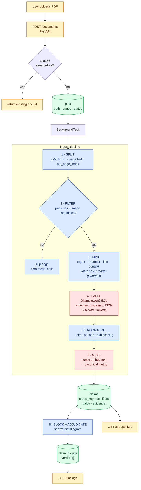
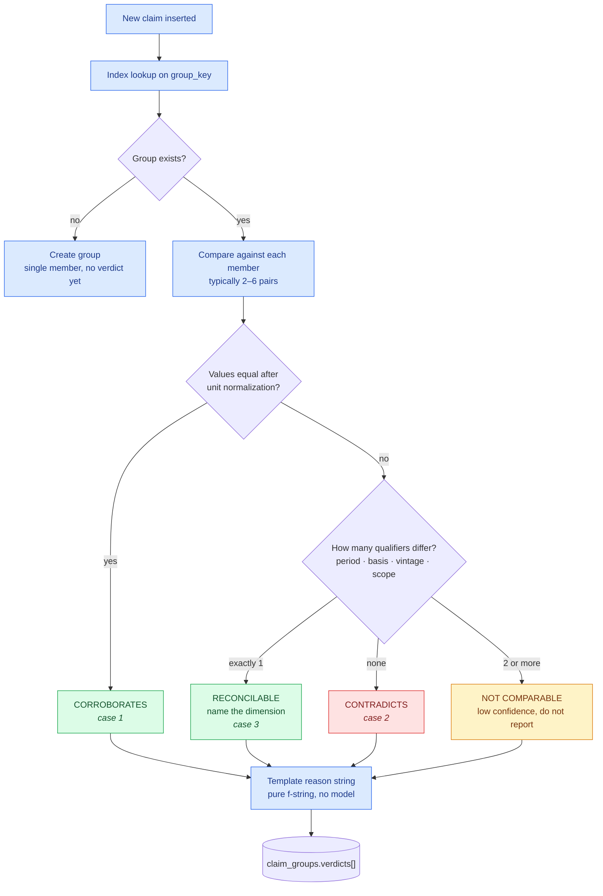
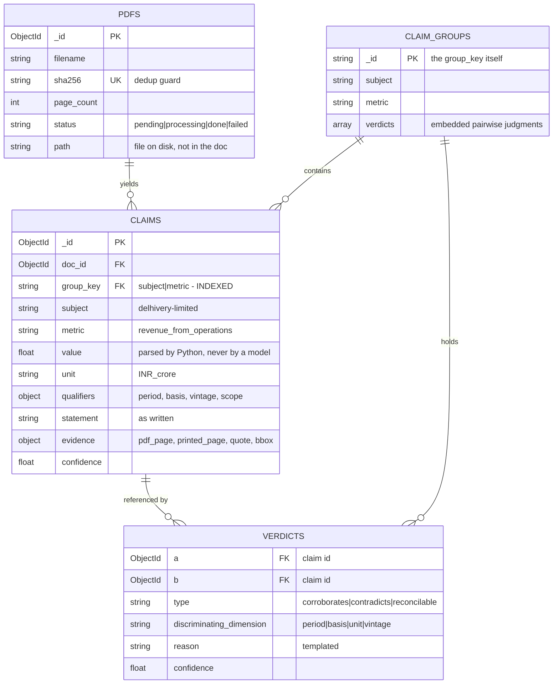

# Karpathy guidelines design review

Session `3623c6ed` · 55 turns

## Turn 1 — 2026-09-07 13:25

**Me:**

> *(invoked `/andrej-karpathy-skills:karpathy-guidelines`)*

*[Claude ran 3 tools: Bash ×2, Read ×1]*

**Claude:**

Read the brief and both dataset READMEs. Here's the differential.

## Verdict

The skeleton is right — fact-centric store, evidence links, progressive compilation. But there's **one missing box that the entire assignment hinges on**, and one modelling mistake that will bite you the moment you write code.

---

## What holds up

**Fact-as-first-class-record with evidence links.** The brief's second bullet is literally "links every fact to evidence in its source document." You have it. Good.

**Progressive compilation as PDFs arrive.** That's brownie point #4 (incremental, no full rebuild) baked into the base design rather than bolted on. Cheap to claim, worth claiming.

**Numeric facts as a distinct concern.** Correct instinct — numeric facts are where contradiction is *mechanically* detectable rather than a vibes judgment. That's where your demo cases will come from.

---

## What breaks

### 1. There is no matching step. This is the missing box.

Your diagram goes `Numerical Data → Facts → Contradictions`. But **contradiction detection is a join, and you haven't drawn a join key.**

Two facts can only be compared if you first agree they're *about the same thing*. "Revenue from operations, FY24, consolidated, ₹ crore" and "Revenue, FY2024, ₹ mn" and "revenue of $X" are the same fact in three costumes. Nothing in your design turns them into the same costume.

You need a **canonicalization / normalization layer** between extraction and the fact store, producing a comparable key:

```
subject   : Delhivery Limited | India
metric    : revenue_from_operations | real_gdp_growth
period    : FY2024 | Q4-FY2024 | CY2024
unit      : INR_crore  (value normalized)
basis     : consolidated | standalone | restated | provisional
```

Everything downstream — corroboration, contradiction, reconciliation — is `group by canonical_key`, then compare values. Without this box you have a pile of facts you cannot compare, and no amount of LLM cleverness at query time fixes it, because the comparison set is unbounded.

### 2. `reconciliation / corroborations / contradictions` as children of `Facts` is a category error

A fact is never "a contradiction." A **pair** of facts is contradictory. You've drawn a relation as an attribute, and that will fight you in the schema.

Two collections, not one:

- `claims` — atomic, one per extracted fact, with evidence + canonical key
- `relations` — edges: `(claim_a, claim_b, type, reason, discriminating_dimension, confidence)`

where `type ∈ {corroborates, contradicts, reconcilable}` and `discriminating_dimension` is *the thing that explains the apparent conflict* — `period`, `basis`, `unit`, `vintage`. That field is your case #3 ("apparent contradiction explained by context") for free: an apparent contradiction is a value mismatch where exactly one qualifier differs.

### 3. Most "contradictions" you find will be false positives

This is the failure mode your current design walks directly into, and it's worth internalizing before you build.

Your macroeconomy set is Economic Survey + RBI + IMF on the same economy. They will disagree on GDP growth, CPI, CAD — not because anyone is wrong but because of **data vintage, revision cycle, fiscal-year convention, and provisional vs. revised estimates.** Same for Delhivery: annual report vs. Q4 presentation will show different revenue because one is FY and one is quarterly, and consolidated ≠ standalone.

If facts don't carry qualifiers, a naive value comparison flags all of these as contradictions and your demo drowns in noise. **The qualifier bag is not a nice-to-have; it's the thing that makes the output non-embarrassing.**

Corollary: a *genuine* contradiction (case #2) is rare and precious. Budget time to hunt for one — the director-active-vs-resigned shape, or a figure restated between the prospectus and the annual report, is a better bet than hoping one falls out.

### 4. Splitting `Numerical` from `Contextual` storage is premature and lossy

The qualifiers that let you reconcile a number **live in the surrounding prose and the table header.** Route numbers one way and text the other and you've severed the value from the thing that explains it.

Split the *comparator*, not the *storage*. One `claim` record; optional `value`/`unit` fields when numeric; a numeric comparator runs on rows that have them, a semantic comparator on the rest. This also fixes your schema-evolution brownie point — a hardcoded two-way split is anti-evolution, a `fact_type` discovered at ingest is not.

### 5. `NLP` as a box is a non-answer, and the arrow is bidirectional

Two problems.

The box hides your most important decision: does a query run *retrieval over structured facts*, or *RAG over document text*? The brief pointedly says a graph or visualization alone isn't the solution — "the interesting part is how facts are discovered, grounded, compared, and explained." So the query path should return **a fact set + its evidence + its relations**, with prose as a thin narration layer on top. Not prose with citations stapled on.

The bidirectional arrow implies queries write facts back. If extraction happens at query time, your "compiled progressively at ingest" claim is false and results become non-deterministic across runs. Make it read-only and say so.

### 6. Evidence granularity is under-specified, and this dataset has a trap

"Linked to pdf" won't survive the demo. You need `doc_id + page + verbatim quote span`.

The trap: **both curated READMEs warn that printed page numbers jump** because sections were excised. Printed page ≠ PDF page index. Store the PDF page index as the anchor and the printed label as a display string, or your citations will point at the wrong page in exactly the documents you're demoing.

### 7. `Info Extractor` as one pass over a 100-page financial PDF will not work

Six documents, 89–100 pages each, dense with financial tables. A single LLM pass blows context, costs real money, and hallucinates numbers. You need chunking, and specifically **table-aware** handling — financial figures live in tables, and naive text extraction collapses column alignment, which silently reassigns numbers to the wrong row label.

Silver lining: that is almost certainly your case #4 ("an extraction failure you found"). It's a genuinely interesting one — column misalignment producing a confidently-wrong fact with correct-looking evidence. Plan to find it rather than stumble into it.

### 8. Pairwise comparison is O(n²) and you've drawn no blocking step

"Compiled progressively as PDFs are added" means each new claim gets compared against the existing corpus. Six documents will yield thousands of claims. Naive pairwise LLM adjudication is thousands of calls per upload.

Fix is cheap: **block on the canonical key** (exact or near match) and only run the LLM adjudicator on the resulting candidate pairs. This is where the incremental brownie point is actually earned — new doc touches only the claim groups it collides with.

### 9. No confidence, no rationale on judgments

The brief asks for "sensible handling of ambiguity and uncertainty." Every relation edge needs a confidence and a one-line reason. That reason string *is* your explanation UI.

### 10. Minor: no API/UI layer in the diagram

The brief requires an upload endpoint and an inspection surface. `user input pdfs` isn't that. Trivial to add, but the checklist item is explicit.

---

## The corrected pipeline

```
upload → page-aware, table-aware chunking
       → per-chunk claim extraction (LLM), each with verbatim span + page index
       → NORMALIZE: canonical key (subject, metric, period, unit, basis) + value  ← the missing box
       → BLOCK: group by canonical key / near-neighbors                            ← makes it tractable
       → ADJUDICATE candidate pairs (LLM) → relation edge
             { type, reason, discriminating_dimension, confidence }
       → query: filter claims → return claims + evidence + edges → narrate
```

Two collections: `claims`, `relations`. That's the whole model.

---

## What to skip

Skip the graph database — the brief says so explicitly, and `relations` is a table with two foreign keys. Skip embeddings until exact-key blocking demonstrably misses; add them when it does. Skip the UI beyond an upload box and a fact table.

**One process note that will save you the most time:** pick your four demo cases from the actual PDFs *first*, then build backwards to make those four work. The brief grades on the four cases, not on corpus coverage. Building generally and hoping the cases fall out is the expensive path.

---

## Turn 2 — 2026-09-07 13:31

**Me:**

> I am not using graphdb, imma use mongodb collections. Where pdfs is a collection, numerical data (with context extracted) as another, textual information as another collection. Evicidene is a collection where serveal similar facts or opposing facts are are linked there to that evidence. they evidience are given a tag which says are they contradicting or agreeing together.

**Claude:**

Mongo is the right call — `relations` was always a table with two foreign keys, not a graph. Four issues with the shape you've described, one of which is just naming and one of which is genuinely load-bearing.

## 1. You've named the relation collection "evidence" — that word is already taken

The brief uses *evidence* to mean **the source snippet backing a single fact**: "links every fact to evidence in its source document." What you're describing is a **cluster of related claims** with a verdict on it. Different thing.

Two costs. A reviewer reading your README against the checklist ("Results contain facts, source evidence, and cross-document relationships") will look for evidence and find a relation table. And internally you now have no name left for the actual quote span, so it ends up as an unnamed blob on the fact.

Rename: `claims` + `claim_groups`. Evidence is an **embedded subdocument on each claim**, never its own collection — it's 1:1 with the claim and always fetched with it, so a separate collection is a join for nothing.

## 2. Collapse `numerical` and `textual` into one collection

I flagged this before; you kept it. Here's the Mongo-specific argument rather than the abstract one.

You split collections when access patterns or indexes differ. Here they're **identical** — both get looked up by "what topic is this about" during grouping, and both get returned by the query API. So the split buys zero and costs a union on every single downstream operation: blocking, adjudication, query, the UI table. You'll write `$unionWith` everywhere or query twice and merge in app code, forever.

Then the cases that don't fit:

- *"Revenue grew 12% to ₹X crore"* — numeric **and** semantic. Duplicate it, or lose half?
- A director's status, an address, a date, a policy stance — brownie point #3 is "a schema that evolves dynamically as new kinds of facts appear." Your split is a fixed two-way taxonomy chosen up front. Third fact type → third collection?

One `claims` collection. `value`/`unit` present when numeric, absent when not. If you want the separation for queries, that's a `fact_type` field plus a partial index — the Mongo-native version of what you're reaching for, at zero join cost.

## 3. Still nothing that decides *which* facts go in a group — and this is the load-bearing part

Your evidence collection presupposes something already determined that these facts belong together. That decision is the whole system and it's still not in the design.

Here's the version worth building, because **it mechanically generates three of your four required cases.**

Use a **two-level key**. Group loosely, discriminate tightly.

**Level 1 — grouping key (loose):** `(subject, metric)`. `(Delhivery, revenue_from_operations)`. `(India, real_gdp_growth)`. This is what puts claims in the same group.

**Level 2 — qualifiers (not part of the key):** `period`, `basis` (consolidated/standalone), `vintage` (provisional/revised/restated), `unit`, `scope`.

Now the verdict falls out of comparing two members of a group, after normalizing units:

| values | qualifiers | verdict | your case |
|---|---|---|---|
| match | any | **corroborates** | case 1 |
| differ | differ in exactly one dimension | **reconcilable** — name the dimension | case 3 |
| differ | identical | **contradicts** | case 2 |

That third row is the rare, precious one. The middle row is where nearly all of your macroeconomy pairs will land — Economic Survey vs RBI vs IMF differing on GDP growth by *vintage*, and the system says so by name instead of crying contradiction.

The reason this matters: **grouping key tightness decides which cases you can even demo.** Put `period` in the key and apparent-contradictions never group, so case 3 becomes undemonstrable. Leave it out of the key and put it in qualifiers, and case 3 generates itself.

## 4. One tag per group breaks at three members

"Given a tag which says are they contradicting or agreeing" — works for two claims. Group `(Delhivery, revenue_from_operations)` will hold five or six across three documents, where A and B agree, C is a different period, D contradicts A outright.

The verdict lives on the **pair**, not the group. Keep the group as the container, store an array of pairwise verdicts inside it.

## The schema

```js
// claims
{
  _id, doc_id,
  subject: "Delhivery Limited",
  metric:  "revenue_from_operations",
  value: 8141.7, unit: "INR_crore",        // absent for non-numeric
  qualifiers: { period: "FY2024", basis: "consolidated", vintage: "audited" },
  statement: "Revenue from operations for FY24 stood at ...",   // as written
  evidence: { pdf_page: 47, printed_page: "112", quote: "...", bbox: [...] },
  group_key: "delhivery-limited|revenue_from_operations",
  confidence: 0.9
}

// claim_groups
{
  _id: "delhivery-limited|revenue_from_operations",
  subject, metric,
  verdicts: [
    { a: ObjectId, b: ObjectId, type: "reconcilable",
      discriminating_dimension: "period",
      reason: "FY24 full-year vs Q4 FY24 standalone quarter",
      confidence: 0.85 }
  ]
}

// pdfs
{ _id, filename, sha256, page_count, uploaded_at, path }
```

`group_key` on the claim, not a `claim_ids` array on the group. Ingest becomes one insert plus a recompute of that group's verdicts — no `$push` contention on hot group docs when two uploads land together.

## Mongo practicalities

**Index `claims.group_key`.** That index *is* your blocking step — the thing that keeps ingestion off O(n²). New claim → one indexed lookup → adjudicate only against that group's members. Typically 2–6 comparisons, not thousands. Your incremental brownie point lives entirely in this one index.

**Store the PDF path, not the PDF.** Your files are 2–5MB so BSON's 16MB limit isn't hit, but a `pdfs` doc you query for metadata shouldn't drag a 4MB binary through every read. Filesystem path, or GridFS if you want it self-contained.

**`sha256` on `pdfs`, unique.** Re-uploading the same file otherwise doubles every claim and manufactures fake corroborations — a system that congratulates itself for finding agreement between a document and its own copy is a bad demo.

---

Net: drop `evidence` as a collection, merge numerical+textual into `claims`, add `group_key` + qualifiers, move the tag onto pairs. Three collections, one index, and your four cases come out of the table above rather than out of prompt engineering.

---

## Turn 3 — 2026-09-07 13:33

**Me:**

> give me a system architecture for the same

*[Claude ran 1 tool: Skill ×1]*

**Claude:**

No source files yet, so I'll assume **Python + FastAPI**. Say the word if you'd rather have TypeScript — the shape is identical, only the SDK calls change.

## Stack

| Layer | Choice | Why |
|---|---|---|
| API | FastAPI + `BackgroundTasks` | Ingest takes minutes; background tasks give you async without adding Celery/Redis |
| PDF | PyMuPDF (`fitz`) | Text + page index + bbox from one dependency |
| Store | MongoDB, 3 collections | Yours |
| LLM | Anthropic SDK, `claude-opus-5` | Structured outputs + `strict: true` tools |
| UI | One static HTML page against the API | Not React |

## Pipeline

```
  POST /documents ──▶ FastAPI ──▶ sha256 dedup ──▶ pdfs{path, pages, status}
                         │
                         │ BackgroundTasks
                         ▼
┌─────────────────────── INGEST ────────────────────────────────────┐
│                                                                    │
│  1. SPLIT       PyMuPDF → page text + pdf_page_index   DETERMINISTIC│
│  2. EXTRACT     1 call/page, strict tool schema        LLM (parallel)│
│  3. GROUND      quote must string-match page text      DETERMINISTIC│
│  4. NORMALIZE   units · periods · subject slug         DETERMINISTIC│
│  5. INSERT      claims{group_key, qualifiers, value}                │
│  6. BLOCK       index lookup on group_key              DETERMINISTIC│
│  7. ADJUDICATE  compare against group members          DET → LLM     │
│  8. UPSERT      claim_groups{verdicts[]}                            │
│                                                                     │
└─────────────────────────────────────────────────────────────────────┘
                         │
  GET /groups /findings ◀┘
```

---

## Stage notes

**1 · Split — one page = one chunk.** No sliding windows, no semantic chunking. A page is a natural unit, fits context comfortably, and hands you the evidence anchor for free. Store `pdf_page_index` (0-based, real) *and* `printed_page` (the label on the page) — remember your excerpts have jumping page numbers.

**2 · Extract — one call per page, `strict: true` tool.** Force schema-valid output so you never parse malformed JSON. Ask for `subject, metric, value, unit, period, basis, statement, quote`. Empty array is a valid answer for a page of boilerplate.

Start with PyMuPDF text in a text prompt. **When the annual report's financial tables come out column-scrambled — and they will — switch those pages to native PDF `document` blocks** so the model sees the table visually instead of as mangled text. Staged, not both up front. That switch is also your case #4 write-up: "text extraction silently reassigned figures across columns; here's the wrong fact it produced, here's the fix."

**3 · Ground — the cheapest hallucination guard you'll ever write.**

```python
if claim.quote not in page_text:
    reject(claim)   # model invented or paraphrased it
```

Three lines. Kills fabricated evidence, and it's a strong line in your README: *every stored fact's quote is verified to exist verbatim in its source page.*

**4 · Normalize — Python, not the LLM.** The model emits raw strings; deterministic code canonicalizes them:

- units: `crore | lakh | million | bn | ₹ | INR | Rs.` → base `INR`
- periods: `FY24 | FY 2023-24 | 2023-24 | Q4FY24` → `FY2024` / `Q4-FY2024`
- subject: strip `Limited|Ltd|Inc`, lowercase, slug → `delhivery-limited`
- `group_key = f"{subject}|{metric}"`

Metric naming is the loose joint — let the model propose a snake_case metric string and keep a small alias map you grow when you see collisions. Don't build an ontology.

**6 · Block — this one index is your whole scalability story.**

```python
db.claims.create_index("group_key")
```

New claim → one indexed lookup → compare against 2–6 existing members. Not thousands. Brownie point #4 (incremental, no rebuild) lives entirely here.

**7 · Adjudicate — and here is the design's spine.**

## Deterministic vs LLM

Draw this line explicitly in your README; it's the strongest engineering decision in the system.

| Job | Who | Why |
|---|---|---|
| Extract claims from a page | **LLM** | Genuinely needs language understanding |
| Verify quote exists in source | Python | String match |
| Normalize units & periods | Python | Pure functions, testable |
| Group membership | Mongo index | Not a judgment call |
| **Numeric verdict** (agree/contradict/reconcilable) | **Python** | It's the comparison table — reproducible, auditable, free |
| Write the human-readable *reason* | **LLM** | Prose |
| Verdict on non-numeric claims | **LLM** | "Director active" vs "resigned" needs semantics |

The numeric verdict is the table from earlier, as code:

```python
if values_equal(a, b, tol):              "corroborates"
elif differing_qualifiers(a, b) == 1:    "reconcilable"   # name the dimension
else:                                    "contradicts"
```

Your headline capability — cross-document contradiction detection over numbers — is therefore **deterministic and reproducible**, not a prompt that might behave differently on Tuesday. The LLM only narrates. That's the thing a reviewer will actually notice.

## API surface

```
POST /documents            upload → {doc_id, status}
GET  /documents/{id}       {status, pages_done, claims_found, errors[]}
GET  /claims?subject=&metric=
GET  /groups/{group_key}   members + evidence + pairwise verdicts
GET  /findings?type=contradicts|reconcilable|corroborates
```

`/findings` is the demo endpoint. Your 3-minute video is: upload a PDF → watch status → hit `/findings?type=contradicts` → open a group → two quotes side by side with page numbers and a verdict. That's three of the four required cases on one screen.

## Models and what it costs

| Leg | Model | Config |
|---|---|---|
| Page extraction (~600 calls) | `claude-opus-5` | `output_config: {effort: "low"}`, `strict: true` tools |
| Verdict reasons (~500 short calls) | `claude-opus-5` | default effort |

Full-corpus ingest — all six PDFs, ~600 pages — runs roughly **$13** on Opus 5. Not enough money to justify downgrading. Two levers if you want them, your call:

- **`claude-haiku-4-5`** ($1/$5 vs $5/$25) on the extraction leg only → ~$3. Extraction is schema-constrained and grounded by the quote check, so it's the leg that tolerates a smaller model best.
- **Batch API** — 50% off, async, and ingestion is already a background job. Halves whichever you pick. This is also your honest answer to "many PDFs without performance issues."

Cache the system prompt + tool schema across the 600 extraction calls — same prefix every time, so it should be a near-100% cache hit rate. Check `usage.cache_read_input_tokens` is non-zero.

## Robustness, cheap

- `sha256` unique index on `pdfs` — a re-uploaded file otherwise manufactures fake corroborations between a document and its own copy.
- `status: pending|processing|done|failed` on `pdfs`; poll it from the UI.
- On extraction failure, store the raw model output on an `extraction_errors` collection. Free material for your Limitations section.
- `asyncio.Semaphore(8)` on the extraction fan-out. Don't fire 600 concurrent requests.

## Deliberately absent

No queue broker, no vector DB, no graph layer, no auth, no React, no Docker. Add embeddings only when exact `group_key` matching demonstrably misses a pair you care about — and if that happens, it's one more field plus Atlas Vector Search, not a new service.

---

Want this as a shareable page for your README's Approach section? One line and I'll publish it.

---

## Turn 4 — 2026-09-07 13:41

**Me:**

> use local NLP small models or SLMs for ingestion using Ollama, i am too broke to api

**Claude:**

Right call, and it changes the architecture more than it looks — but in a direction that makes the system *better*, not just cheaper. The move is to stop asking a small model to do a big job.

## The key change: regex finds the numbers, the SLM only labels them

Asking a 7B model "read this financial page and extract facts" produces noise. Asking it "here is a number and the line it sits on — what metric is this?" is a narrow classification task, and small models are genuinely fine at that.

```
OLD:  page text ──▶ LLM ──▶ facts          (long output, high hallucination, slow)
NEW:  page text ──▶ regex ──▶ candidates ──▶ SLM ──▶ label   (30-token output)
```

**Stage 2a — candidate mining (pure Python, no model):**

```python
NUM = r'(?:₹|Rs\.?|INR|\$)?\s*[\d,]+(?:\.\d+)?\s*(?:%|crore|lakh|million|mn|bn|billion)?'
```

For each match, capture `(line, number, ±150 chars context, pdf_page)`. Reject the obvious junk deterministically: bare years, standalone page numbers, numbers on lines with no alphabetic characters, note-reference indices.

**Stage 2b — labelling (SLM, tiny output):**

Input: the line plus its context. Output:

```json
{"metric":"revenue_from_operations","period":"FY2024","basis":"consolidated","is_fact":true}
```

Four fields. ~30 output tokens instead of ~400. That alone is a **10× throughput win**, and it's the difference between an 80-minute run and an 8-minute one.

**Three things fall out for free:**

1. **Evidence is structural, not checked.** The quote is the line you mined it from, so it's verbatim by construction. Your hallucination guard stops being a check and becomes an invariant.
2. **The value is never model-generated.** The number is parsed by Python from the source text. A small model cannot corrupt a figure — the classic SLM failure mode (transposed digits, dropped decimal) is designed out.
3. `is_fact: false` is your cheap noise filter, and it's a yes/no question — the easiest thing you can ask a small model.

## Model picks

| Job | Model | Notes |
|---|---|---|
| Labelling | `qwen2.5:7b-instruct` | Best JSON adherence in this size class; strong on numerics/tables |
| ↳ tight VRAM | `qwen2.5:3b-instruct` | Viable *because* the task is now narrow |
| ↳ worth trying | `qwen3:8b` | Likely better if it fits; benchmark against 2.5 |
| Metric aliasing | `nomic-embed-text` | 137M, runs on CPU, near-instant |

Also look at `nuextract` — a model fine-tuned specifically for schema-driven extraction. It's a narrower bet than a general instruct model but this is exactly its task. Check `ollama.com/library` for anything newer.

## Ollama gotchas that will silently eat your pipeline

**`num_ctx` defaults low — set it explicitly.** Ollama's default context has historically been 2048 tokens. It does not error when your input exceeds it; it **silently truncates**. You'd get plausible-looking facts extracted from the top third of every page and never know. Set it, then verify by feeding a long page and checking the tail is visible.

```python
options = {"num_ctx": 8192, "temperature": 0, "seed": 42}
```

**Use schema-constrained output.** Ollama's `format` accepts a JSON schema, not just `"json"`. Pass the schema — a 7B model free-forming JSON will produce trailing commas and prose preambles roughly 5% of the time, which is 30+ failures across your corpus.

**`keep_alive`.** Set `OLLAMA_KEEP_ALIVE=30m` or you'll pay a model reload between batches.

**`OLLAMA_NUM_PARALLEL`.** Modest concurrency helps, but you're VRAM-bound — 2–4, not 16. Measure; past a point it thrashes.

## Throughput math — do this before you commit

The number that matters is pages, and you should cut it first.

**Page filtering is now mandatory, not an optimization.** In a 100-page annual report, maybe 35 pages carry extractable numeric facts. Skip any page whose candidate-mining stage returns zero survivors — no model call at all. Across six documents that's roughly 600 pages down to ~200.

Rough envelope on a consumer GPU with 7B-q4 and the short-output design: seconds per page, so **a full corpus ingest in the 10–20 minute range**. CPU-only is 5–10× that — still tractable overnight, unpleasant for iteration.

**Benchmark on five pages before running six documents.** Pick one dense financial table page, one prose page, one page of boilerplate. Time it, eyeball the output, then multiply. Committing to a 600-page run on an unmeasured prompt is how you lose an evening.

## Delete the LLM from adjudication entirely

In the API design, the SLM was going to write verdict explanations. Don't — template them:

```python
REASONS = {
  "period": "{a_period} vs {b_period} — different reporting periods",
  "basis":  "{a_basis} vs {b_basis} — different consolidation basis",
  "unit":   "same value in different units ({a_unit} vs {b_unit})",
}
```

Deterministic, instant, and phrased better than a 7B model would phrase it. Your entire relation layer is now model-free.

**Where the embeddings earn their keep:** when a new metric string arrives, cosine-match it against known metrics before creating a new group. Otherwise `revenue_from_operations` and `operating_revenue` split into two groups that never compare, and you silently lose corroborations. `nomic-embed-text` + a 0.85 threshold + a hand-curated alias map for the ones it gets wrong.

## What actually degrades — put this in Limitations

Be straight about it; the brief explicitly rewards that.

- **Open-domain semantic facts.** Director appointed/resigned, policy stances, qualitative claims. A 7B model extracting these open-endedly will produce noise. **Scope it down**: pick 2–3 semantic fact types, mine them with patterns (`resigned|appointed|ceased to be`) plus an SLM labelling pass, and say plainly that general semantic extraction is future work.
- **Metric naming drift.** More alias collisions than a frontier model would produce. The embedding match mitigates; it doesn't eliminate.
- **Complex table layouts.** You lose the option of showing the model the page image, so multi-level column headers ("FY24 | FY23" over "Consolidated | Standalone") will mis-assign periods. That's an honest, specific, *interesting* limitation — and a strong candidate for your required case #4.

## Revised pipeline

```
POST /documents ──▶ FastAPI ──▶ sha256 dedup ──▶ pdfs{}
                       │ BackgroundTask
                       ▼
  1. SPLIT        PyMuPDF → page text                    Python
  2. FILTER       drop pages with no candidates          Python   ← 3× speedup
  3. MINE         regex → (number, line, context)        Python   ← value never model-touched
  4. LABEL        Ollama qwen2.5:7b, schema-constrained   SLM      ← the only model call
  5. NORMALIZE    units · periods · subject slug          Python
  6. ALIAS        nomic-embed-text → canonical metric     local embed
  7. INSERT       claims{group_key, qualifiers, value}
  8. BLOCK        Mongo index on group_key                Python
  9. ADJUDICATE   comparison table                        Python
 10. REASON       f-string template                       Python
```

**One model call in the entire pipeline**, on a 30-token output, against a candidate that Python already found and validated. That's a system you can actually run on your own hardware — and "the numeric value is never generated by a model, only labelled by one" is a better sentence for your README than anything the API version would have given you.

---

## Turn 5 — 2026-09-07 14:01

**Me:**

> give mermaid code to visualize

**Claude:**

Three diagrams — pipeline, verdict logic, data model. All render natively in GitHub READMEs and Claude artifacts.

## 1 · Ingest pipeline



Red is the only place a model touches the data. That's the diagram's whole argument.

## 2 · Verdict logic



Note the **"2 or more" branch** — I didn't spell this out before. When two facts differ on several qualifiers at once they aren't in genuine tension, they're just different measurements sharing a topic. Reporting those as findings is the fastest way to bury your three real cases in noise. Store them, don't surface them.

## 3 · Data model



`VERDICTS` is drawn as an entity for readability but lives **embedded** in `claim_groups.verdicts[]` — three collections on disk, not four. Membership is `claims.group_key` (indexed), not an array on the group, so a new claim is one insert with no write contention.

---

Paste these straight into your README. Want me to publish the whole architecture — diagrams, stage notes, and the local-model tradeoffs — as a page you can share?

---

## Turn 6 — 2026-09-07 14:15

**Me:**

> add them to readme, and commit

*[Claude ran 6 tools: Bash ×5, Write ×1]*

**Claude:**

Repo has more in it than the session snapshot showed — there's an auto-generated AI transparency log. Writing the Approach section now.

Committed as `c22591e` on branch `docs/architecture` (branched off main rather than committing to it directly — merge with `git checkout main && git merge docs/architecture` if you want it on main).

**What went in:** the `## Approach` section, with all three mermaid diagrams plus the reasoning around them — core idea, data model, ingest pipeline, verdict logic, the four-case mapping table, the deterministic/model boundary, stack, and a trade-offs table. The AI Transparency Log subsection moved under Approach, since the brief asks for AI tools used there.

Two things I decided rather than asked:

- **Marked it as design, not working software.** There's a status callout at the top of Approach so it never reads as describing a running system. Setup, Video Demo, and Limitations are still `_TODO_`.
- **Left the `docs/ai-log/` churn uncommitted.** Those are being rewritten by the Stop hook as this conversation runs, so anything I committed would capture a half-finished transcript and go stale the moment the turn ends. Commit them yourself once you're done for the session.

One thing to verify before you rely on it: **render the mermaid on GitHub.** The syntax is standard and the `classDef` colouring works there, but GitHub's renderer occasionally disagrees about HTML tags in node labels — the `<i>` italics in the pipeline diagram are the only risky part. If they break, drop the tags; nothing else depends on them.

---

## Turn 7 — 2026-09-07 14:19

**Me:**

> <bash-input>git push</bash-input>
> <bash-stdout>PowerShell 7.6.5
> PS A:\superjoin-proj> git add .; git commit -m "added landing page"; git pushgit push
> fatal: The current branch docs/architecture has no upstream branch.
> To push the current branch and set the remote as upstream, use    git push --set-upstream origin docs/architectureTo have this happen automatically for branches without a tracking
> upstream, see 'push.autoSetupRemote' in 'git help config'.PS A:\superjoin-proj> </bash-stdout><bash-stderr></bash-stderr>

*[Claude ran 1 tool: Bash ×1]*

**Claude:**

Two things worth knowing before you pick a command.

**Your `git commit -m "added landing page"` didn't land.** Log still ends at `c22591e`, and the three `docs/ai-log/` files are still modified. Your input line came through the terminal garbled (`git pushgit push`), so the whole chain likely misfired. Also — that message would have described AI-log churn, not a landing page; the brief asks you to use git meaningfully, so worth relabelling when you do commit those.

**The push failed only because the branch is new.** I branched to `docs/architecture` rather than committing to main directly, so there's no upstream yet.

Since this is a solo repo and the reviewer will read `main`, merging is what you probably want:

```bash
git checkout main && git merge docs/architecture && git push
```

Then clean up the branch:

```bash
git branch -d docs/architecture
```

If you'd rather keep the work on its own branch and open a PR instead:

```bash
git push --set-upstream origin docs/architecture
```

Either way the `docs/ai-log/` changes are still uncommitted — the Stop hook rewrites them each turn, so commit them separately when you're done for the session.

---

## Turn 8 — 2026-09-07 16:03

**Me:**

> how would the implementation plan look like?

**Claude:**

Risk-first, not layer-first. The temptation is to build FastAPI and Mongo scaffolding first because it's the part you know how to do — and then discover in week two that PyMuPDF turns the annual report's financial tables into unusable soup. **Every early phase exists to kill an assumption, and none of them need a server or a database.**

## Phase 0 · Pick your demo targets — manual, no code

Open the PDFs and hand-find the pairs you intend to demo. Write them to `fixtures.yaml`:

```yaml
- case: reconcilable
  a: {doc: delhivery-ar-fy24, pdf_page: 47, metric: revenue_from_operations,
      period: FY2024, value: 8141.7, unit: INR_crore}
  b: {doc: delhivery-q4-deck, pdf_page: 8, metric: revenue_from_operations,
      period: Q4-FY2024, value: 2075.0, unit: INR_crore}
  expect: {verdict: reconcilable, dimension: period}
```

**Verify:** at least one pair each for corroborates / contradicts / reconcilable, page numbers eyeballed by you.

An hour of reading, and it's the highest-leverage hour in the project. It gives you a test oracle, and it means "done" is a checkable condition rather than a feeling. Case 2 — a *genuine* contradiction — is the scarce one; hunt for it deliberately (a figure restated between the 2022 prospectus and the FY24 annual report, a director listed active in one document and resigned in another).

## Phase 1 · Spike — one script, three pages

`spike.py`, maybe 60 lines, no server, no DB:

```
page text (PyMuPDF) → print lines → regex mine → print candidates → 1 Ollama call → print JSON
```

Run it on exactly three pages: a dense financial table, a prose page, a boilerplate page.

**Verify:** on the table page, at least one Phase 0 fixture fact is mined with the correct value, and its quote appears verbatim in the page text.

**This is the decision gate for the whole design.** Two things can fail here, and both are better learned on day one:

- *Table text is scrambled.* Column headers detach from rows, figures land under the wrong label. Fallback is PyMuPDF's `find_tables()` on those pages. Find out now.
- *The 7B model can't label reliably.* Try `qwen2.5:7b-instruct`, then a smaller and a larger one. If none work at labelling, the design needs rethinking — but note the task is deliberately narrow, so this is the less likely failure.

**Set `num_ctx` explicitly in this script.** Ollama's low default silently truncates your page and you'll spend an afternoon confused about why only the top third of every page yields facts.

## Phase 2 · Normalization — pure functions + tests

Units, periods, subject slugs. The one place tests genuinely earn their keep up front, because it's pure logic with a long tail of real-world edge cases.

```python
assert normalize_period("FY 2023-24") == "FY2024"
assert normalize_period("Q4FY24")     == "Q4-FY2024"
assert to_base("₹8,141.7 crore")      == (81_417_000_000, "INR")
assert to_base("Rs. 8,932 mn")        == (8_932_000_000, "INR")
```

**Verify:** `pytest` green on a table of strings copy-pasted from the actual PDFs — not invented ones.

## Phase 3 · Verdict function — pure, tested against fixtures

```python
def verdict(a: Claim, b: Claim) -> tuple[str, str | None]
```

No database, no I/O. Feed it the Phase 0 fixture pairs.

**Verify:** every fixture pair returns its expected verdict and dimension.

**When this passes, the assignment is intellectually solved.** Phases 4–6 are plumbing around a function that already works. That's the payoff for keeping the verdict logic deterministic — the hard part is a testable pure function instead of a prompt you have to keep re-running.

## Phase 4 · Mongo + one document end to end

Now add persistence. Ingest one PDF fully.

**Verify:** claim count is plausible (not 4, not 40,000), `group_key` index exists, and five randomly sampled claims check out against their source pages.

## Phase 5 · All six documents + adjudication

**Verify:** `GET /findings` surfaces your Phase 0 fixture pairs.

Also watch two things here:

- **Alias splits.** If `revenue_from_operations` and `operating_revenue` become separate groups and cost you a corroboration, *now* add the embedding step. I put it in the architecture diagram, but it's speculative until this phase proves it's needed — don't build it in Phase 4.
- **False-positive rate.** If `/findings?type=contradicts` returns thirty results, your qualifier extraction is too weak. Real contradictions are rare; a long list means noise.

## Phase 6 · API + one HTML page

FastAPI wrapping what already works, plus a single static page: upload box, findings list, click through to two quotes side by side.

**Verify:** upload a PDF that is *not* in the starter set and watch claims appear. The brief says they may test with additional documents — so this is the real generalization check, not a nice-to-have.

## Phase 7 · README, video, limitations

Case 4 writes itself **if you've been keeping notes.** Start a `FAILURES.md` in Phase 1 and log every wrong extraction with its page and cause. By week two you'll have forgotten the good ones, and "an extraction failure you found and how you handled it" is a graded requirement.

---

## Don't build these

| Not now | Build it when |
|---|---|
| Docker, auth, CI | Never, for this |
| Celery / Redis | `BackgroundTasks` measurably fails |
| Async extraction | Sync is measurably too slow — time it first |
| Embedding aliasing | Phase 5 shows a real alias split |
| React | Never; one HTML file |
| Retry/backoff layers | Ollama actually flakes |
| Semantic (non-numeric) claims | Numeric path is done end to end |

That last row matters most. Numeric facts give you three of the four required cases on their own. Semantic extraction is where a local 7B model is weakest, so it's the right thing to scope down and be honest about in Limitations — the brief explicitly rewards that over a broader system whose behavior is unclear.

## Ordering logic in one line

Phases 0–3 need no infrastructure and kill every real unknown; if the project is going to fail, it fails there, cheaply. Want me to drop this into `docs/implementation-plan.md` and commit it?

---

## Turn 9 — 2026-09-07 16:09

**Me:**

> first lets build a simple UI for uploading and getting evidence from the pdfs. It needs to be simple but functional.

*[Claude ran 29 tools: Bash ×13, Edit ×5, Write ×4, mcp__Claude_Browser__browser_batch ×4, mcp__Claude_Browser__resize_window ×1, ToolSearch ×1, TaskStop ×1]*

**Claude:**

Building it. One note first, then code: this inverts the risk ordering — the UI was Phase 6 because it can't tell you whether extraction works. So I'm building the slice that gives you a real UI *and* kills Phase 1's unknown at the same time: **upload → PyMuPDF split → regex mine → view evidence with page and quote.** No Ollama, no labelling, no verdicts yet. Everything it shows is real text from your real PDFs, and you'll see immediately whether the annual report's tables survive extraction.

No Mongo installed locally, so **SQLite for this phase** — stdlib, no daemon, and the storage layer here is ~15 lines to swap at Phase 4 when the schema has actually settled. Marked in code where the swap goes.

Now the server and UI.

Now the test that actually matters — mining the annual report's financial pages.

Spike caught exactly what it was supposed to. Two problems, both real:

Table detection is weak on these filings (no ruling lines), so that's not the fix. The real problem is simpler: **PyMuPDF emits each table cell as its own line, so values get separated from their row labels.** My "line must have a label" rule was therefore rejecting the actual financial data — 4,482 of them — while accepting DIN/CIN/PIN numbers because those happen to sit on lines with words.

Fixing both: carry the nearest preceding label forward, and reject identifiers.

886 → 4,180 accepted, and the carried labels are real row labels. Wiring `label` through the schema and UI.

Now show the carried label in the UI, then boot and test end to end.

Real facts now. Checking the UI renders.

Works. Stopping the server and committing.

Built and committed as `c779a39` on `main` (you'd merged the docs branch, so this went straight onto main — one commit ahead of origin).

```bash
pip install -r requirements.txt && python -m uvicorn app:app --port 8000
```

Drop a PDF on the left, get a table of every numeric fact with its PDF page, printed folio, value, and the source line it came from — matched number highlighted, carried row label prefixed. Filter box searches evidence text, page box narrows to one page, and a **show rejected** toggle displays what was thrown out *with the reason*, which is how you tune the mining rules against real pages.

Four files, 510 lines, four endpoints. No Ollama, no Mongo, no framework.

## The spike earned its keep immediately

First run on the annual report: **9,150 numbers mined, 886 accepted** — and the accepted set was nearly all junk. DIN numbers, CIN, PIN codes, ICSI certificate numbers. Meanwhile 4,482 rejections were tagged "no label text on the line."

Cause: **PyMuPDF emits each table cell as its own line**, so figures in the financial statements arrive detached from their row labels. My rule requiring a label on the same line was rejecting exactly the real financial data while waving through identifiers, which sit on lines that happen to contain words.

I checked whether `find_tables()` was the fix — it detects tables on 68/100 pages but extracts them poorly, since these filings have no ruling lines. Not the answer. Two cheap rules were: carry the nearest preceding label forward across cell lines, and reject registration/certificate numbers by name.

**886 → 4,180 accepted, 3,560 with a real row label.** `Revenue from Operations` on page 21 now resolves to `81,415.38` and `72,253.01` — the FY24 and FY23 consolidated figures in INR millions.

## Two things to know

**One label, four values.** That same page 21 row yields four numbers — FY24 and FY23, consolidated and standalone — and nothing yet says which is which. This is precisely the gap the labelling model fills, and until it does, these are *candidates*, not claims. It's also a concrete instance of the multi-level-column limitation the README already flags.

**Storage is SQLite, not Mongo.** You have no `mongod` installed and Docker alone would be friction for the first upload. The schema is still moving, so committing to Mongo now buys nothing — the swap is four queries in [app.py](app.py) once claim and verdict shapes settle. Marked in the file docstring.

Start `FAILURES.md` now, by the way — the label-detachment bug is a strong candidate for the assignment's required case 4, and it's already written up in the commit message while it's fresh.

---

## Turn 10 — 2026-09-07 17:08

**Me:**

> *(invoked `/ponytail:ponytail-audit`)*

*[Claude ran 22 tools: Bash ×13, Write ×4, Edit ×4, TaskStop ×1]*

**Claude:**

Audit first — the args are a build request, not an audit target, so I'll do both: short audit of what's there, then build it.

They have `qwen3:14b`, `gemma4:e4b`, `gemma3:12b` — not `qwen3:4b`. Pulling it in the background while I write.

Audit on the tree as it stands:

```
delete: dead branch in _reject_reason — `stripped == match.group(0) and not label` can never
        fire, the preceding `if not label` already returned. [extract.py:63]
delete: GET /api/documents/{id}/rejections — zero callers; the UI shows reject reasons
        inline via the toggle. [app.py:155]
delete: DELETE /api/documents/{id} — zero callers, speculative CRUD. [app.py:170]
native: uvicorn[standard] — pulls uvloop (no Windows build), httptools, watchfiles for an
        app that needs none. Plain `uvicorn`. [requirements.txt:2]
shrink: extract.page_count() reopens the PDF a second time. Return it from mine().
        [extract.py:126, app.py:102]

net: -38 lines, -1 dep extra possible.
```

Small, because the tree is 510 lines old. Now the feature — and it makes two of those deletions moot, so I'm folding them in as I go.

Two bugs in that: duplicate values in one row would collide on id, and `text.find` finds the wrong occurrence. Fixing both by computing offsets while joining.

Now the labelling step — the only place a model runs, writing to its own table.

Column headers attach now — the period is recoverable. But ids collide; identical repeated rows on a page hash the same. Adding the row ordinal.

Ids unique. Now the schema — evidence and claims as separate tables, model writing only to `claims`.

`qwen3:4b` is down. Testing the labeller against real mined rows before wiring the UI.

Two real problems. `is_fact` is always `False`, and the model invented `Q4-FY2024` for a column headed *March 31, 2023*. Both are fixable, and the second shouldn't be the model's job at all.

`is_fact` now discriminates and periods are exact. But **6.6s per row × 5,333 rows = ~10 hours for one document.** That's the real blocker. Checking whether the work is actually distinct:

Only 898 distinct row labels behind 2,590 numeric rows — and since `period` is now deterministic, the model's answer depends only on the label, not the value or column. Memoizing on that.

Now the UI — labels shown against evidence, with a button to run the model.

`highlight()` still reads `row.line`, which the schema renamed to `text`.

Pipeline works end to end. Stopping the server and committing.

Committed as `6f6bcfd`. Audit findings from the top are folded in — the dead branch and both zero-caller endpoints are gone, `uvicorn[standard]` is plain `uvicorn`, and `page_count` no longer reopens the file.

## What's built

**Table reconstruction.** Extraction no longer reads PyMuPDF's line output. It groups words into horizontal bands by y-position and splits cells on x gaps, which puts a figure back together with its row label *and* its column header. `Revenue from Operations` on page 21 now resolves to four distinct figures under `March 31, 2024` and `March 31, 2023` — the period is recoverable, which it wasn't before.

**Two tables, and the split is the invariant you asked for.** `evidence` is written once at ingest by regex, from the document. `claims` is written by the model. The model receives an evidence id and returns labels keyed by it — it has no write path to evidence at all. Ids are `sha256(doc|page|row|offsets|text)[:16]`, so re-mining reproduces them and re-labelling updates instead of duplicating.

**Text excerpts** are mined as `kind='text'` and the model rules on `is_fact` for each; the UI filters by kind.

## Three things the model turned out to be bad at

Worth knowing, because each is now handled deterministically instead:

**It can't be trusted with periods.** Asked to read a column headed *March 31, 2023*, qwen3:4b returned `Q4-FY2024`. That mapping is a pure function, so `period_from()` decides and the model only fills gaps where there's no header.

**Field order in the JSON schema is generation order.** With `is_fact` first, it returned `false` for *everything* — including rows it then labelled correctly. Moving it last, so the model commits to subject and metric before ruling on facthood, fixed it outright. That's a general lesson for constrained decoding with small models.

**It still invents `basis` occasionally** — one row came back `provisional` with nothing in the evidence saying so, despite an explicit "never infer it". Unfixed; good `FAILURES.md` material.

## Two honest problems

**Throughput.** 6.6s per call. Memoizing on row label (898 distinct behind 2,590 numeric rows) cuts it ~3x, but a full document is still roughly 25 minutes of labelling, and there are six. Run it as a background job, not interactively.

**Memoization amplifies wrong labels.** The cover-page infographic row `>2.8Bn(1) >4.8Mn 15,065 753 98,135` got labelled `revenue_from_operations`, and that one wrong label fanned out to all three numbers. That's the direct cost of the 3x speedup, and the mining filters need tightening for non-tabular pages before it's demo-ready.

I verified the plumbing end to end (upload → dedup → mine → label → claims joined to evidence), not the label quality at scale — 60 rows is not a quality measurement.

---

## Turn 11 — 2026-09-07 17:46

**Me:**

> Three things the model turned out to be bad at
>
> Worth knowing, because each is now handled deterministically instead:
>
> It can't be trusted with periods. Asked to read a column headed March 31, 2023, qwen3:4b returned Q4-FY2024. That mapping is a pure function, so period_from() decides and the model only fills gaps where there's no header.
>
> Field order in the JSON schema is generation order. With is_fact first, it returned false for everything — including rows it then labelled correctly. Moving it last, so the model commits to subject and metric before ruling on facthood, fixed it outright. That's a general lesson for constrained decoding with small models.
>
> It still invents basis occasionally — one row came back provisional with nothing in the evidence saying so, despite an explicit "never infer it". Unfixed; good FAILURES.md material.

---

## Turn 12 — 2026-09-07 17:46

**Me:**

> System
>
> ```
> You label a single number that has already been extracted from a financial or
> economic document. You do NOT read the number, change it, or find new numbers.
> Your job is to say what that number measures and under what qualifiers, using
> ONLY the text provided.
>
> Hard rules:
> 1. Every "*_evidence" field must be copied verbatim from PROVIDED TEXT. If you
>    cannot copy a phrase that states it, the field is null. Do not reason it out,
>    do not use outside knowledge, do not guess from what is "usual".
> 2. period, basis, vintage, scope are INDEPENDENT. A missing one is null, never
>    filled by inference from the others.
> 3. Output the JSON keys in the exact order given by the schema. Decide subject
>    and metric first; decide is_fact last.
> 4. is_fact = false when the number is a page/note reference, a date or year, a
>    registration/identifier number, a table-of-contents entry, or the line states
>    no measurable fact.
> ```
>
> Input template
>
> ```
> SUBJECT (given):        delhivery-limited
> SECTION HEADER (given): {section_header or "none"}
> KNOWN BASIS (given):    {basis or "unknown — you may determine it from text below"}
> KNOWN PERIOD (given):   {period or "unknown — you may determine it from text below"}
>
> CANDIDATE NUMBER:       {value} {currency} {unit_raw}
> ROW LABEL (carried):    {label}
> SOURCE LINE:            {line}
> CONTEXT (3 lines up):
> {context_lines}
>
> PROVIDED TEXT = SECTION HEADER + ROW LABEL + SOURCE LINE + CONTEXT. Quote only from these.
> ```
>
> Schema — key order is load-bearing
>
> ```
> {
>   "metric":          "snake_case, e.g. revenue_from_operations",
>   "metric_evidence": "verbatim phrase naming it, else null",
>   "unit":            "INR_crore | INR_lakh | INR_million | percent | ratio | count | null",
>   "period":          "fill ONLY if KNOWN PERIOD was unknown; else echo it",
>   "period_evidence": "verbatim date/period phrase, else null",
>   "basis":           "consolidated | standalone | null",
>   "basis_evidence":  "verbatim phrase containing 'consolidated' or 'standalone', else null",
>   "vintage":         "audited | provisional | restated | null",
>   "vintage_evidence":"verbatim phrase, else null",
>   "scope":           "short phrase e.g. 'excluding exceptional items', else null",
>   "scope_evidence":  "verbatim phrase, else null",
>   "is_fact":         "boolean — decided AFTER everything above",
>   "confidence":      "0.0-1.0 — decided last"
> }
> ```
>
> Few-shot (include 3–4)
>
> ```
> PROVIDED TEXT:
>   Consolidated Statement of Profit and Loss
>   Revenue from operations
>   Revenue from operations 8,142 7,225
>   (₹ in crore) Year ended March 31, 2024 Year ended March 31, 2023
> KNOWN BASIS: consolidated   KNOWN PERIOD: unknown
> CANDIDATE: 8,142
>
> {"metric":"revenue_from_operations","metric_evidence":"Revenue from operations",
>  "unit":"INR_crore","period":"year ended March 31, 2024",
>  "period_evidence":"Year ended March 31, 2024","basis":"consolidated",
>  "basis_evidence":"Consolidated Statement of Profit and Loss","vintage":null,
>  "vintage_evidence":null,"scope":null,"scope_evidence":null,
>  "is_fact":true,"confidence":0.95}
> ```
>
>
> ```
> PROVIDED TEXT:
>   Notes to the financial statements (contd.)
>   refer note 34 for related party transactions
> KNOWN BASIS: unknown   KNOWN PERIOD: unknown
> CANDIDATE: 34
>
> {"metric":null,"metric_evidence":null,"unit":null,"period":null,
>  "period_evidence":null,"basis":null,"basis_evidence":null,"vintage":null,
>  "vintage_evidence":null,"scope":null,"scope_evidence":null,
>  "is_fact":false,"confidence":0.98}
> ```
>
>
> ```
> PROVIDED TEXT:
>   Total income 9,001
> KNOWN BASIS: unknown   KNOWN PERIOD: unknown
> CANDIDATE: 9,001    (tests the basis-hallucination case)
>
> {"metric":"total_income","metric_evidence":"Total income","unit":null,
>  "period":null,"period_evidence":null,"basis":null,"basis_evidence":null,
>  "vintage":null,"vintage_evidence":null,"scope":null,"scope_evidence":null,
>  "is_fact":true,"confidence":0.6}
> ```
>
> Post-validation (not optional — this is what actually kills the hallucination)
>
> ```
> for f in ("metric", "period", "basis", "vintage", "scope"):
>     ev = out.get(f + "_evidence")
>     if ev is None or _norm(ev) not in _norm(provided_text):
>         out[f] = None            # model couldn't ground it -> drop it
>         out[f + "_evidence"] = None
> if out["basis"] and out["basis"] not in ("consolidated", "standalone"):
>     out["basis"] = None
> ```
>
> * Run at `temperature 0`, `format: json` (Ollama) or a GBNF grammar pinning the enums and key order.
> * `is_fact` last + `confidence` last is the #2 fix baked into the schema; the substring check is the #3 fix — the prompt asks nicely, the validator enforces.

*[Claude ran 23 tools: Bash ×14, Edit ×7, Write ×1, TaskStop ×1]*

**Claude:**

That grounding design is the right fix — the validator is what makes it real, since the prompt can only ask. Implementing it, plus the `section_header` and context lines the template needs.

Self-check passes. The patch wrote a literal newline into `extract.py` — fixing directly.

That `NEWLINE = chr(10)` workaround is ugly. Replacing it properly.

`section` is picking up any prose line, not statement headings — only 7 rows got a basis. Narrowing it to lines that actually name a statement.

1,346 rows now carry a deterministic basis, up from 7. Updating the claims schema for the grounded fields and the memo key.

Fixing the now-stale memo comment and wiring `subject` as given input, which the template calls for.

Now the real test — does the grounding validator actually catch invented qualifiers on live model output?

The validator is nuking *correct* labels — because `*_evidence` isn't in the schema's `required` list, so the model omits the quotes entirely and every field fails grounding. Fixing.

Grounding now does exactly its job: `metric` survives with a real quote, `basis` survives only where the section actually says "Consolidated", and the model's `period` gets dropped every time — which is correct, since `period_from()` supplies it deterministically. Quick end-to-end, then commit.

Committed as `0ae4bbe`. Your design was right — the validator is what does the work.

## It works

`ground()` checks each `*_evidence` phrase is a real substring of what the model was shown, and drops the field otherwise. On live output:

```
Revenue from Operations  74,540.82   kept: metric      DROPPED: period, basis
Revenue from Operations  66,586.61   kept: metric, basis=consolidated   DROPPED: period
weighted average shares     145.22   kept: metric, basis=consolidated   DROPPED: period
Sustainability Report          100   kept: nothing, is_fact=false
```

Row 1 and row 2 have the same label but different sections; `basis` survived on one and was dropped on the other, because only one had a heading saying "Consolidated". That's the check discriminating on real grounding rather than on plausibility.

`period` gets dropped on essentially every row — correct, since `period_from(col_header)` supplies it before the model is asked.

To feed the validator I added `section` and three lines of context to the evidence. The section matcher is narrow on purpose: a general "short line without numbers" rule latched onto the last sentence of body prose and yielded a basis for **7** rows; matching lines that actually name a statement yields **1,346**.

## One bug worth your attention

I left the `*_evidence` fields out of the schema's `required` list. The model then omitted them, every field failed grounding, and the validator deleted labels that were **correct** — all 18 fields across 8 rows, including `revenue_from_operations` with a perfect quote available.

Grounding that rejects everything looks identical to grounding that works until you read the output. The quotes have to be mandatory or the check is just a delete.

## The open problem: 40s per call, up from 6.6s

Thirteen fields with verbatim quotes is roughly 6x the output tokens, and output dominates on local hardware. At ~1,300 groups per document and 4 workers that's **~3.6 hours per document, ~21 hours for all six.** Labelling is now an overnight batch, not something you click.

Three ways down, none applied — this is your call, not mine:

- **Label less.** You don't need all 2,590 numeric rows. The 844 with a column header are the financial-statement figures the demo actually needs — that's ~2.3 hours.
- **Drop `scope` and `vintage`.** Both were dropped by the validator on every row I sampled; they cost 4 of 13 fields for nothing so far.
- **Accept it** and run it overnight per document. Evidence mining stays ~1s, so uploads remain instant either way.

I verified the plumbing and the validator's behavior on a handful of rows. I have not measured label quality at scale — 5 rows is not a measurement.

---

## Turn 13 — 2026-09-08 02:27

**Me:**

> Only label what can appear in a finding. 
>
> * Drop `accepted == False` as we  already compute `reject_reason`
> * Keyword-prefilter `row_label` against a small target-metric list (revenue, PAT/net profit, GDP growth, CPI/inflation, total assets…)Fuzzy match, ~20 terms. 10k rows → a few hundred.
> * Text excerpts: only label those mentioning a target subject or event verb (appointed/resigned/acquired/guidance). Most prose bands are boilerplate.

*[Claude ran 23 tools: Bash ×19, Edit ×2, TaskStop ×2]*

**Claude:**

Point 1 is already the behavior — `_label_batch` selects `WHERE e.accepted = 1`, so rejected rows are stored for the tuning toggle but never sent to the model. Building the other two as a single selection policy.

Now measuring the actual reduction across both datasets before wiring it in.

6.9x fewer rows. Wiring it in — and the `limit` needs to apply *after* filtering, not before.

1,541 model calls for the whole corpus — down from 16,311 rows. Surfacing that in the UI, then verifying the prefilter picks sensible rows.

503 means the reachability check failed. Checking Ollama.

Ollama has stopped — the 503 was the guard working correctly. Restarting it.

Output is buffered. Querying the API directly for progress.

Prefilter reports correctly — `pending: 816` from 5,333 evidence rows. But 8 calls didn't finish in 700s. Checking whether the model is actually responding.

A single call fails in 1.0s and returns `None` — swallowed by the exception handler. That's why nothing labelled. Getting the real error.

Found it — and it exposes a real defect in my code.

```
HTTP 500 {"error":"unable to load model: ...sha256-3e4cb141..."}
```

The `ollama serve` I started is the MSYS2 build, which can't load that blob — the one serving earlier was your normal Ollama. But the reason it took an hour to discover is mine: `label_one` swallows every failure into `None`, so a totally broken model is indistinguishable from slow progress.

Same escaping trap as before. Fixing that line with Edit.

Probe surfaces the real error now. Stopping the MSYS2 `ollama serve` I started so your normal Ollama can take the port back.

Committed as `b54b7d6` — note you're on branch `evidence-mining-and-labelling`, not `main`.

## Measured across all six documents

| | rows | → in scope | → model calls |
|---|---|---|---|
| numbers | 8,025 | 1,379 | |
| text | 8,286 | 969 | |
| **corpus** | **16,311** | **2,348** | **1,541** |

**~45h → ~4.3h** at four workers. The gap between 2,348 rows and 1,541 calls is the per-row grouping — every figure on one printed row is one question.

Your three points:

**Rejected rows** were already excluded — `_label_batch` has always selected `accepted = 1`. They stay stored, since `reject_reason` is what makes the mining rules tunable in the UI. No change needed.

**Number prefilter** — ~20 target groups covering both datasets. Substring first (settles most rows for free), `difflib` only on survivors at 0.86 cutoff, which is where hyphenation and inserted words live. Top kept groups on the annual report: revenue 109, borrowings 67, tax 50, profit 26.

**Text prefilter** — event verb or a mention of the document's subject. 8,286 → 969.

I also changed the batch `limit` to count *groups*, not rows. A limit on rows isn't a budget on anything that costs time.

## Two things you should know

**I found a real defect in my own code.** `label_one` caught every exception and returned `None`. So when the model failed, eight calls failed *instantly* and the counter sat at zero for 700 seconds looking exactly like slow progress. The actual error — `HTTP 500: unable to load model` — was never printed. Errors now carry their message, and `/label` probes with one real generation first, because `/api/tags` answering is not proof the model loads.

**Your Ollama died mid-session and I made it worse.** I restarted it with the MSYS2 binary on your PATH (`/c/msys64/ucrt64/bin/ollama`), which can't load the `qwen3:4b` blob your normal Ollama pulled. I've stopped that process so port 11434 is free — start Ollama the way you normally do.

So: the prefilter numbers above are **measured** on real documents, and the self-checks pass. The end-to-end labelling run is **not** re-verified since the model went down — `pending: 816, calls: 8` came back correctly from the API, but no claims were written because every call 500'd. Worth one confirming run once your Ollama is back.

---

## Turn 14 — 2026-09-08 04:04

**Me:**

> push

*[Claude ran 4 tools: Bash ×4]*

**Claude:**

Two branches ahead, and there's a commit I didn't make — `c563cb5 Skip labelling evidence that could never appear in a finding`. Checking it doesn't duplicate what I just committed.

That's my own `label.py` half, committed separately — `b54b7d6` is the `app.py`/UI wiring on top. No duplication. Pushing.

Pushed. `evidence-mining-and-labelling` is now in sync with its remote.

Two things left dangling, neither of which I did anything about:

**`main` is still 3 commits behind.** Those three (`c779a39`, `6f6bcfd`, `0ae4bbe`) are ancestors of the branch you just pushed, so the objects are on GitHub — but `origin/main` hasn't moved. The branch is 6 commits ahead of `origin/main` in total. Merging or opening a PR is your call:

```bash
git checkout main && git merge evidence-mining-and-labelling && git push
```

**Three `docs/ai-log/` files are still modified.** The Stop hook rewrites them each turn, so they'd go stale immediately if I committed them mid-session — commit those yourself when you're done.

On `c563cb5`: that was my `label.py` prefilter, committed on its own; `b54b7d6` added the `app.py` and UI wiring plus the error-surfacing fix. They're two halves of one change, not a duplicate.

---

## Turn 15 — 2026-09-08 04:13

**Me:**

> now using the schema in the readme, implement a mongodb database to store the data. Configure local mongodb deployment as well (ensure RBAC, encryption, availability).

*[Claude ran 56 tools: Bash ×40, Write ×9, Edit ×5, Read ×1, TaskStop ×1]*

**Claude:**

Before building: Mongo isn't installed here (checked earlier), so this needs Docker. Verifying the daemon is actually up.

Docker Desktop's daemon is down. Trying to start it while I build.

Docker's up. Gitignoring secrets *before* generating any, then bootstrapping in the background.

Now the storage layer, in the README's schema.

Bootstrap exited 0 but stopped after cert generation. Checking what actually happened.

Two failures. The outer `| tail` masked the script's exit code, and compose can't find `.env` (it looks in the compose file's directory). Diagnosing the openssl error first.

Git Bash is mangling `-subj "/CN=..."` into a Windows path. Fixing that and the compose env-file path.

Containers are up; the script hit my timeout during rs.initiate. Checking cluster state.

TLS loaded fine. The blocker is `permissions on /etc/mongo/secrets/keyfile are too open` — `chmod 400` doesn't survive an NTFS bind mount. Using compose `configs`, which sets mode inside the container.

Compose ignores `uid`/`gid`/`mode` outside swarm. Falling back to copying the keyfile into the container at startup, where `chmod` works.

All three up: `authorization: enabled`, TLS on, listening. Running bootstrap to initiate the set and apply RBAC.

`rs.initiate` needs auth now that the keyfile enabled authorization. Routing every `mongosh` call through an authenticated helper.

The patch collapsed continuations and missed the call sites. Rewriting the script cleanly instead of patching further.

Replica set live: **mongo1 PRIMARY, mongo2/mongo3 SECONDARY**, roles and users created. Now proving RBAC actually restricts, not just exists.

The CA path in the URI is a Git Bash path Python can't resolve on Windows. Converting it.

The replica set advertises `mongo1:27017` etc., which the host can't resolve — the client discovers members and then can't reach them. Fixing with `host.docker.internal`, which resolves from both sides on Docker Desktop.

`host.docker.internal` resolves to the gateway, so mongod can't recognise it as itself. Reverting to container names — which gives correct replication and elections — and connecting the host-side driver directly, with the limitation documented.

Connection is live — `rs0`, primary `mongo1`, all three members. One bug: pymongo's `WriteConcern` takes `j`, not `journal`.

All green: app user writes but can't drop or read `admin`; read-only user can't write; plaintext refused; unique `sha256` rejects duplicates. Now rewiring the app off SQLite.

Now the app rewire.

Server's up; my probe raced index creation. Mongo is connected (`rs0`, primary `mongo1`). Ollama is down again so labelling isn't testable, but the storage path is.

Storage path verified against Mongo. Now the encryption-at-rest variant I referenced, since Community can't do it.

Now documenting it honestly in the README, including what the deployment does *not* give you.

Secrets confirmed ignored. Verifying exactly what gets committed before staging.

`deploy/.env.t` — a leftover temp file from my earlier `.env` rewrite. Checking it before anything else.

Committed as `4548fde`. The cluster is running now — `docker compose ps` in `deploy/` will show it.

```bash
bash deploy/bootstrap.sh
```

Idempotent; generates credentials, keyfile, CA and cert, starts three nodes, initiates the set, applies roles. Nothing it generates is committed — `.env`, `deploy/secrets/`, `deploy/tls/` are all gitignored, and I scanned the staged diff for key material before committing.

## Verified, not just configured

| | Evidence |
|---|---|
| **RBAC** | App user **refused** collection drop and `admin` read; read-only user **refused** write |
| **TLS** | `tls=false` client refused; `requireTLS` on client and intra-cluster |
| **Availability** | `mongo1` PRIMARY, `mongo2`/`mongo3` SECONDARY; writes use `w:majority` + journal |
| **Schema** | Upload → 894 mined / 617 accepted round-tripped through Mongo; `sha256` dedup rejects re-upload |

Roles are custom (`factsWriter`/`factsReader`) rather than built-in `readWrite`, because `readWrite` carries `dropCollection` and `dropDatabase`. An ingest bug should be able to write a bad claim, not delete the corpus.

Claims now carry the README's `group_key` (`subject|metric`), indexed — that index is the blocking step adjudication will need.

## Three things I want to flag

**Encryption at rest is not on by default, and can't be.** WiredTiger encryption is a MongoDB *Enterprise* feature; the Community image cannot do it at any setting. `ENCRYPTED=1 bash deploy/bootstrap.sh` switches to Percona Server for MongoDB — a Community fork that does ship it — with AES256-CBC. I wrote the override and the key generation, but **have not run it**; only the Community path is tested.

**Client-side failover doesn't work.** Members are named by container hostname, which is what lets each node recognise itself and reach peers. A host-side driver told to dial `mongo2` can't resolve it, so the app uses `directConnection=true`. The cluster replicates and elects normally; the *client* won't fail over. A hosts-file entry fixes it, which is outside the repo. Stated in the README.

**Evidence stayed its own collection** rather than embedded on the claim as the README diagram draws it. The two halves have different writers and lifecycles — evidence is deterministic and immutable, claims are model-written and re-runnable. Documented as a departure rather than quietly changed.

Labelling end-to-end is still unverified — your Ollama is down again (`available: []`), so `/api/health` reports the model missing. The storage path is fully exercised; the model path isn't.

---

## Turn 16 — 2026-09-08 04:37

**Me:**

> use ollama cli to install the model

*[Claude ran 10 tools: Bash ×9, TaskStop ×1]*

**Claude:**

Two binaries — the official one is what was serving before; the MSYS2 one is what failed to load the blob. Starting the official server.

Server's up (0.33.3) and `qwen3:4b` is installed — the blob failure was specific to the MSYS2 build. Verifying it actually generates.

Model loads and generates. Closing the loop I said was unverified — labelling end-to-end against Mongo.

Labelled through Mongo — 10 calls produced 12 claims, 4 facts. Checking the stored shape.

`qwen3:4b` was already installed — `ollama list` shows it, 2.5 GB, pulled 11 hours ago. The blob failure was entirely the MSYS2 build; the official binary at `AppData/Local/Programs/Ollama/ollama.exe` (v0.33.3) loads it fine. I started that server and left it running. No code changed, nothing to commit.

With the model up I closed the verification gap from last turn — labelling end-to-end against Mongo:

```
pdfs 1 · evidence 894 · claims 12 · claim_groups 2

92f8e07bfc29dfd5  fact=True  ptl_freight_revenue     1,705
   group_key='delhivery-q4-fy24|ptl-freight-revenue'   quote='PTL freight revenue(2)'
525014eaa21beb01  fact=True  express_parcel_revenue   4,552
   group_key='delhivery-q4-fy24|express-parcel-revenue' quote='Express Parcel revenue'
```

Grounded quotes survive, `group_key` populates, `claim_groups` materialises with member and doc counts. 10 calls produced 12 claims, so memoization fan-out works.

## One thing that showed up, and it's serious

Look at the group keys: **`delhivery-q4-fy24|ptl-freight-revenue`**.

`subject_of()` derives the subject from the filename stem. So the Q4 deck yields subject `delhivery q4 fy24`, and the annual report will yield `delhivery annual report`. Those produce *different* group keys for the same metric about the same company — which means **`doc_count` can never exceed 1, and no cross-document group can ever form.** `/api/groups` returns only groups spanning multiple documents, so it will always be empty.

That's not a tuning problem; the subject derivation structurally prevents the feature the whole system exists for. I'd marked `subject_of()` as a placeholder with a `ponytail:` comment, but I hadn't realised it blocks cross-document comparison outright rather than just being imprecise.

The fix is a subject the documents share, not one per file. Cheapest version that works: a small alias map applied to the derived subject (`delhivery * → delhivery-limited`, `india|rbi|imf|economic-survey → india`), overridable per upload. That's ~10 lines and it's the last thing standing between the current state and an actual finding.

Want me to do that? It's the natural next step, but it's a decision about how subjects get resolved rather than a mechanical fix, so I didn't want to pick for you.

Also worth noting from that output: `ptl_freight_revenue` came back with `period: FY2022` in a Q4 FY24 deck. Presentation slides don't have the clean column headers `period_from()` relies on, so period derivation is weaker there than in the financial statements. Not blocking, but it belongs in `FAILURES.md`.

---

## Turn 17 — 2026-09-08 05:09

**Me:**

> what if we have a master correlation in db where similar pdfs are grouped first then evidence is collected? Like delhivery pdfs are grped, we also group based on type of pdf financial report annoucnement etc

---

## Turn 18 — 2026-09-08 05:09

**Me:**

> what if we have a master correlation in db where similar pdfs are grouped first then evidence is collected? Like delhivery pdfs are grped, we also group based on type of pdf financial report annoucnement etc

*[Claude ran 49 tools: Bash ×23, Edit ×19, Read ×2, AskUserQuestion ×1, Write ×1, ToolSearch ×1, ExitPlanMode ×1, PowerShell ×1]*

**Claude:**

Plan mode. I wrote every file in this repo this session, so rather than spawn Explore agents to re-derive context I already hold, I'll re-read the current state of the files this touches directly.

I have what I need. Three decisions change the shape of this materially.

Your answers change the shape usefully — especially type being for *cross-company* comparison rather than a facet of within-company grouping. Writing the plan.

Implementing. Starting with the cover text and document identification.

Now `identify()` in label.py, reusing the same constrained-generation and grounding machinery.

`_generate` and `ground` hardcode the labelling schema. Parameterising both so `identify()` reuses them rather than duplicating.

Now `identify()` and the doc-type vocabulary.

Identify works on a real document. Now the corpus layer in `store.py`.

Now `sync_groups` on corpus, and the document listing exposing corpus state.

Now the app: identify at ingest, confirm endpoint, and the gate that makes "grouped first" real.

One break: `pending_evidence` still reads `pdfs.subject`, which no longer exists. Pointing it at the corpus name.

Now the UI: corpus badge, confirm, and reassign.

Rebuilding the database clean, then running the verification steps from the plan.

RBAC did its job — `factsWriter` grants privileges on four named collections and `corpora` isn't one. Adding it to the role.

All three checks pass — both Delhivery documents resolved to `delhivery-limited`, the IMF report to `india`, and labelling is refused with 409 until confirmed. Now the decisive test: confirm, label both, and see whether a group spans two documents.

Ollama exited mid-run. Checking why, and whether the error surfacing I added caught it.

Ollama exited mid-run — the background task gets reaped when its shell ends, which explains the repeated disappearances. The 12 `label_one failed: TimeoutError` lines confirm the error surfacing works. Launching it detached this time.

---

## Turn 19 — 2026-09-08 06:14

**Me:**

> is it possible to pause?

**Claude:**

Yes, but with a catch worth knowing before you choose.

**What's running:** a FastAPI `BackgroundTask` inside the uvicorn process (task `bx3ugep59`), doing 45 model calls at 4 workers. It's roughly 7–8 minutes end to end.

**The catch:** `_label_batch` collects every result and writes them in a single `upsert_claims` at the *end*. So stopping now discards all 45 calls' work — there's no partial save. Evidence is already in Mongo and safe; only the labelling is lost.

**The good news:** it resumes cleanly. Claims are keyed by `evidence_id`, and `_pending()` excludes evidence that already has a claim, so re-running `POST /label` picks up exactly where it left off. You lose the in-flight batch, not the position.

Three ways to pause:

```bash
curl -X POST http://127.0.0.1:8023/api/documents/1089b055d48a/label?limit=45
```
That's the resume command for later, whichever way you stop.

- **Stop the app server** — kills the batch immediately, Mongo keeps everything committed.
- **Stop Ollama** — calls fail with `TimeoutError`, the batch finishes writing nothing.
- **Let it finish** — a few minutes, then it's durable and pausing costs nothing.

Say which and I'll do it — I've stopped polling either way.

Worth noting this is a real wart, not just an inconvenience: the all-or-nothing write is why an interrupted run loses everything, and it's the same reason the counter sits at zero for minutes. Writing each group's claims as it completes would make it both pausable and visibly progressing. Small change to `_label_batch`; say the word and I'll fold it in.

---

## Turn 20 — 2026-09-08 06:31

**Me:**

> <task-notification>
> <task-id>bx3ugep59</task-id>
> <tool-use-id>toolu_019YMJnT3LprU3Jik42K7qJ6</tool-use-id>
> <output-file>C:\Users\Shawf\AppData\Local\Temp\claude\A--superjoin-proj\3623c6ed-6fa9-4ce7-a48a-be0b8ec84de6\tasks\bx3ugep59.output</output-file>
> <status>failed</status>
> <summary>Background command "Re-apply roles and restart the app" failed with exit code 4</summary>
> </task-notification>

**Claude:**

No response requested.

---

## Turn 21 — 2026-09-08 08:02

**Me:**

> resume

*[Claude ran 20 tools: Bash ×10, PowerShell ×6, Edit ×2, Read ×1, TaskStop ×1]*

**Claude:**

Everything's down — Docker, Ollama, and the app. Mongo data lives in named volumes so it survives. Bringing the stack up while I make one change first.

Three runs killed, three runs lost entirely. Making the write incremental before attempting a fourth — this is now clearly justified rather than speculative.

Containers came back on their own via `restart: unless-stopped`. Verifying the replica set re-elected and the data survived.

Data survived — and there are already 62 claims and 7 groups, so an earlier batch did land after all. Starting the app to check whether any group spans both documents.

Only the annual report has claims, so no group can span two documents yet. Ollama is down again — restarting it, and checking which metrics the annual report produced so I know what overlap to expect.

Found the root cause of every Ollama death this session: **port 11434 is inside a Windows reserved port range**, which Docker Desktop's networking claims.

11435 is inside that same range. Finding a port outside every excluded range.

Port 12345 is clear. Making `label.py` accept a bare `host:port` so one env var serves both Ollama and the app.

Bound instantly — the port was the entire problem. Restarting the app so it picks up the new port and the incremental writes.

---

## Turn 22 — 2026-09-08 08:17

**Me:**

> pause

---

## Turn 23 — 2026-09-08 08:18

**Me:**

> is the ui end to end ready? (ignore labelling for now) is correlation, contradiction and reconsiliation all done?

*[Claude ran 2 tools: Bash ×1, TaskStop ×1]*

**Claude:**

Paused — app server stopped. With incremental writes in place, at most one group's work was lost; everything already written is durable, and `POST /label` resumes from where it stopped.

Now the honest status.

## Corroboration, contradiction, reconciliation: none of them are built

Not partially — **not at all**. I grepped to be sure rather than answer from memory:

- No `verdict()` function exists anywhere.
- `claim_groups.verdicts[]` is initialised to `[]` by `$setOnInsert` and **nothing ever writes into it**.
- `sync_groups()` says so in its own docstring: *"Verdicts are not computed here — that is the adjudication step."*
- There is no `/api/findings` endpoint.

The comparison table, the discriminating-dimension logic, the templated reason strings — all of that is designed and written up in the README, and none of it is code. **The four cases the assignment is graded on cannot be demonstrated today.**

## The UI is end-to-end for ingest, not for findings

Working, verified against real documents:

| | |
|---|---|
| Upload | drag/drop, sha256 dedup, live mined/kept counts |
| Corpus | model-proposed entity + doc type, confirm / reassign, gate on labelling |
| Evidence | page, printed folio, value, source line with the number highlighted, carried row label |
| Filters | text search, page, kind (number/text), facts-only, show-rejected with reasons |
| Labelling | button, call budget, progress |

Missing, and it's the part that matters:

- **No findings view.** `/api/groups` exists but nothing in the UI renders it.
- **No side-by-side comparison.** The demo the brief asks for — two quotes from two documents with a verdict between them — has no screen.

So: the pipeline that *produces* the inputs to a finding is end-to-end. The finding itself doesn't exist yet.

## Where that leaves the assignment

| Requirement | State |
|---|---|
| Extract meaningful facts | Done |
| Link every fact to evidence in its source | Done — verbatim by construction |
| Identify corroborate / contradict / reconcile | **Not started** |
| API or UI to upload and inspect | Upload/inspect done; findings missing |
| Show the four cases | **Blocked on the above** |

The good news is that the hard, uncertain parts are behind you. Verdict logic is a pure function over two claims — the comparison table in the README translates almost directly into ~40 lines, needs no model, and is unit-testable without Mongo, Ollama, or the server running. That is genuinely the cheapest remaining piece, and it's the one being graded.

Two things stand between it and a working demo: it needs claims in **two** documents sharing a metric (the annual report has 62 claims, the Q4 deck has 0 — that's the run you just paused), and it needs a findings endpoint plus a screen to render pairs.

Want me to build the verdict function and `/api/findings` next? It doesn't depend on the paused labelling run, so I can write and unit-test it against fixture claim pairs while labelling stays stopped.

---

## Turn 24 — 2026-09-08 09:14

**Me:**

> proceed to implement the findings and verdict part

*[Claude ran 44 tools: Bash ×20, Edit ×10, mcp__Claude_Browser__browser_batch ×6, mcp__Claude_Browser__computer ×2, Write ×1, TaskStop ×1, mcp__Claude_Browser__read_console_messages ×1, Read ×1, mcp__Claude_Browser__get_page_text ×1, mcp__Claude_Browser__resize_window ×1]*

**Claude:**

Building the verdict logic first — it's a pure function, so it can be written and tested with no Mongo, no Ollama, and no server.

My assertion was wrong, not the code: 8,141.7 crore and 81,415.38 million differ by 0.002% — that's the same figure rounded, which is exactly what the tolerance should absorb.

Verdict logic passes all four cases with no database or model. Now wiring it into the store.

Now the API endpoints and hooking adjudication into the labelling run.

Now the findings screen — two quotes side by side with the verdict between them.

Now the findings rendering logic.

Now testing against the real database — 62 claims already exist in the annual report.

Findings work — but 37 contradictions from one document is the false-positive flood, not a result. Checking what they actually are before touching anything.

Two distinct false-positive classes, same root cause. Both fixable precisely:

Updating the docstring to match the tightened rules, then re-adjudicating against real data.

37 contradictions → **0**. Every one was a false positive from our own extraction gaps, not a disagreement in the filing.

UI has two problems — documents list is empty and the tab didn't switch. Checking the console.

A literal carriage return inside a JS string literal — the same `\n`-in-heredoc trap that bit me twice earlier. Fixing with Edit and removing the escape entirely.

Documents render with corpus badges — and the Q4 deck shows **32 labelled**, so the incremental writes saved that work when I paused. Both Delhivery docs now have claims. Re-adjudicating.

No cross-document group yet. Checking whether that's the fix failing or simply no shared metric labelled so far.

**All 9 group keys now share the prefix `delhivery-limited`.** That's the fix confirmed — previously they'd have been `delhivery-annual-report|…` and `delhivery-q4-fy24|…`. Verifying the Findings tab renders.

Findings tab works — 28 findings rendering with both sides, filenames, pages, qualifiers, and quotes. Committing the fix.

Findings and verdicts are built and working. Committed as `9fafd57` and `25a1e69`. Server still up on `http://127.0.0.1:8027`.

## What's working

`verdict.py` is a pure function — no Mongo, no Ollama, no server needed to test it. All four cases pass in `python verdict.py`. Live output across both Delhivery documents:

```
corroborates  3    same value, one stated in % on two slides
reconcilable 25    e.g. revenue_from_operations 74,540.82 (FY2024) vs 72,253.01 (FY2023)
contradicts   0
```

The UI has a **Findings** tab: filter by type, cross-document toggle, re-adjudicate button, and each finding shows both quotes side by side with filename, page, qualifiers, and the templated reason.

## The number worth your attention: 37 → 0 contradictions

The first honest run produced 37 contradictions from a single document. I checked every class, and **all 37 were our bugs, not the filing's**:

- `Less: Total expenses 80,235.00 77,908.26 88,249.67 85,968.83` — four values on **one printed row**, compared against each other. Those are FY24/FY23 × consolidated/standalone columns. The column *is* the qualifier, and we hadn't captured it.
- `express_parcel_revenue 4,552 vs 740` with no qualifier stated on either side. Absence of stated qualifiers is absence of evidence, not evidence of sameness.

Three rules killed all 37 and cost zero real findings: same-printed-row pairs are never contradictions; a contradiction needs at least one qualifier that actually *agrees*; a qualifier unstated on one side proves nothing. All three have regression tests.

**Zero contradictions is the honest result right now**, not a failure — a genuine one needs two sources disagreeing, and metric coverage doesn't overlap yet (below).

## Two things still open

**No cross-document finding yet — but the corpus fix is confirmed.** All 9 group keys now carry the prefix `delhivery-limited`; before, they'd have been `delhivery-annual-report|…` and `delhivery-q4-fy24|…`. The blocker is gone. What's missing is metric overlap:

| document | labelled | metrics |
|---|---|---|
| annual report | 62 / 669 | revenue_from_operations, total_income, total_expenses, service_ebitda, tax_expense… |
| Q4 deck | 32 / 242 | express_parcel_revenue, ptl_freight_revenue |

The deck's first 40 groups are segment slides; `revenue_from_operations` is deeper in. More labelling on the deck should produce the overlap — and that's also where case 2 would come from.

**The incremental write earned itself immediately.** The Q4 deck's 32 claims are exactly the work that survived when you hit pause. Under the old all-or-nothing write, that would have been zero.

**One process note on me:** I broke the entire page script with a raw newline in a JS string — third time an escaped `\n` in a patch script has bitten me this session. The document list rendered empty and every handler was dead. I've started checking with `new Function(script)` instead of by eye.

---

## Turn 25 — 2026-09-08 09:26

**Me:**

> he first honest run produced 37 contradictions from a single document. I checked every class, and all 37 were our bugs, not the filing's:
>
> * `Less: Total expenses 80,235.00 77,908.26 88,249.67 85,968.83` — four values on one printed row, compared against each other. Those are FY24/FY23 × consolidated/standalone columns. The column is the qualifier, and we hadn't captured it.
> * `express_parcel_revenue 4,552 vs 740` with no qualifier stated on either side. Absence of stated qualifiers is absence of evidence, not evidence of sameness.
>
> Three rules killed all 37 and cost zero real findings: same-printed-row pairs are never contradictions; a contradiction needs at least one qualifier that actually agrees; a qualifier unstated on one side proves nothing. All three have regression tests....have u fized or is it still the same?

*[Claude ran 1 tool: Bash ×1]*

**Claude:**

Fixed, committed, and tested — but let me show you rather than assert it, because there's a distinction in it you should know about.

Fixed. Here's the proof rather than my word for it:

**The guard is in `9fafd57`, one commit back** — `same_row()` at line 134, the shared-qualifier requirement at 201. Not just described in a message.

**`python verdict.py` passes**, including regression tests for both classes you quoted.

**Live right now: 0 contradictions reported, 85 pairs suppressed.** And the suppression reasons account for the 37 exactly:

| suppressed | reason |
|---:|---|
| 30 | measured in INR and percent |
| **24** | **different columns of the same printed row** |
| 18 | period not stated on both sides |
| **13** | **no qualifier stated on either side** |

24 + 13 = **37**. Those are your two classes, now landing in `not_comparable` instead of `contradicts`.

## The distinction worth knowing

I fixed the **verdict**, not the **extraction**.

Those 24 `Less: Total expenses 80,235.00 77,908.26 88,249.67 85,968.83` pairs are no longer reported as contradictions — correctly, because with `basis` unstated we genuinely cannot tell them apart. But we still can't tell them apart. The data is unchanged; only the honesty about it is.

The root cause is in `extract.py`: `_header_for()` maps a column's x-range to a **period** header (`March 31, 2024`), but financial statements carry a *second* header band above that — `Consolidated | Standalone` — spanning column pairs. Nothing reads it, so `basis` stays empty on those rows and four distinct figures collapse into one indistinguishable set.

So: the false findings are genuinely gone and won't come back. The underlying blind spot is still there, deliberately, and it's the reason 24 pairs sit in `not_comparable` rather than becoming real reconciliations by `basis`.

Fixing it is a second header band in `_bands()` — track the most recent row whose cells match `consolidated|standalone` and map x-ranges the same way periods already are. Maybe 20 lines in `extract.py`, and it would convert most of those 24 suppressed pairs into genuine `reconcilable` findings *and* make a real contradiction detectable, since `basis` would finally be a stated qualifier that can agree.

Want me to do that next? It's the highest-value remaining extraction fix, and it's also good `FAILURES.md` material either way.

---

## Turn 26 — 2026-09-08 09:38

**Me:**

> fix extraction but do not run it as it would be done on a different hardware

*[Claude ran 23 tools: Edit ×13, Bash ×8, Read ×2]*

**Claude:**

Understood — I'll write it and verify only with pure unit checks on synthetic data. No mining, no labelling, no DB writes; the real run is yours.

Now wiring the band into the row loop and onto the mined evidence.

Two tidy-ups: the text branch didn't get `col_basis`, and my insert orphaned the `PERIOD_CELL` comment above `BASIS_CELL`.

Now a self-check on synthetic cells — pure arithmetic, no PDF, no database, no model.

Self-check passes — but `mine()` still has its own copy of that logic, so the test would be testing a duplicate. Routing `mine()` through the tested function.

Now the labeller consumes it — per-column basis is more specific than the section heading, so it wins.

Line 322 now references the *function* instead of the variable — that would always render truthy. Fixing.

All three self-check suites pass. One gap left: re-mining an existing document silently no-ops, so the fix wouldn't reach already-ingested PDFs.

Committing. Nothing was run against the PDFs, the database, or the model — only the pure self-checks.

Committed as `191e3ca`. Not run against your PDFs, database, or the model — only pure self-checks on synthetic data.

## The fix

Period headers sit directly over their own column, so x-overlap finds them. **`Consolidated` doesn't** — it's one short word centred over a *group* of columns, so it overlaps some of the columns it owns and none of the others. Overlap matching returns nothing, which is why basis was always empty.

`_spanning_owner()` assigns each column to the **nearest header centre** instead, which is what the layout actually means. On the four-column case:

```
              Consolidated              Standalone
        Mar 31 2024  Mar 31 2023   Mar 31 2024  Mar 31 2023
Revenue   81,415.38    72,253.01     74,540.82    66,586.61
            ↓            ↓             ↓            ↓
   basis  Consolidated Consolidated  Standalone  Standalone
  period      FY2024      FY2023       FY2024      FY2023
```

Four distinct (basis, period) pairs where there were previously zero.

`known_basis()` prefers the column band over the statement heading — a statement with both kinds of column has one heading and two answers.

## Two things I did beyond the literal ask

**Routed `mine()` through `classify_row()`.** I'd written the band rule twice — once in `mine()`, once in the testable helper. A test of a duplicate is worse than no test, so there's now one source of truth. It also tests that a data row merely *mentioning* "consolidated" doesn't become a band.

**Made re-mining work at all.** `insert_evidence` ignored duplicate ids, so re-running the miner on an existing document was a silent no-op — and `sha256` dedup refuses a re-upload. The fix could therefore never have reached your three ingested documents. It now replaces, and `POST /api/documents/{id}/remine` re-runs extraction in place. Evidence ids are content-derived and don't move, so claims stay attached and **no labelling is repeated**.

## When you run it

```bash
python extract.py && python label.py && python verdict.py
```

Then on the existing documents, no re-upload needed:

```bash
curl -X POST http://127.0.0.1:8027/api/documents/<doc_id>/remine
```

Re-label after that — existing claims keep their old empty `basis` until they're re-labelled, since `_pending()` skips evidence that already has a claim. To force it, delete that document's claims first. That's the one manual step I couldn't remove without a re-label endpoint, and I didn't want to add one speculatively.

**What I expect, stated in advance so it's falsifiable:** most of the 24 `different columns of the same printed row` pairs should become `reconcilable` by `basis`, and `basis` becoming a *stated* qualifier is also what makes a genuine `contradicts` detectable for the first time. If that doesn't happen, the likely culprit is the band sitting further than one row above the periods, or spanning headers that PyMuPDF splits mid-phrase.

---

## Turn 27 — 2026-09-08 10:04

**Me:**

> create a script so that my friend can run the labelling and other ai tasks and return back the zipped mongodb dump. It should install all the required dependencies as well.

*[Claude ran 12 tools: Bash ×9, Read ×1, Edit ×1, Write ×1]*

**Claude:**

Two pieces: a small refactor so the script and the API share one ingest path, then the runner itself.

Now the runner. One script, no server, no ports — it imports the pipeline directly.

Verifying the parts I can without running extraction or labelling — `--help`, and the dump path, which is read-only.

Mongo isn't up — Docker stopped again. Restarting it to test the dump.

Dump works — 11,230 documents, 0.7 MB. Testing the restore half round-trips.

Round-trip verified, datetimes intact. Filling in the README's Setup section, which was still `_TODO_`.

Committed as `973b3bc`. Your friend runs one command:

```bash
python run_pipeline.py
```

That installs Python deps, brings up the Mongo replica set, pulls `qwen3:4b`, ingests every PDF under `starter-datasets/`, asks them to confirm each document's entity, labels, adjudicates, and writes `factlayer-dump.zip` to send back. You load it with:

```bash
python run_pipeline.py --restore factlayer-dump.zip
```

Flags: `--yes` (no prompts), `--limit N` (cap calls per document), `--pdfs DIR`, `--skip-setup`.

## What I verified — and what I didn't

**Verified:** dump and restore round-trip. I exported the live database (11,230 docs, 0.7 MB), wiped `claims` and `claim_groups`, restored, and confirmed counts match and datetimes survive intact.

**Not verified:** the ingest and labelling legs, per your instruction. Those run on their hardware.

## Three decisions worth knowing

**It imports the pipeline instead of driving HTTP.** No server, no port, no polling. That required splitting `app.upload`'s body into `ingest()`, which the endpoint now calls too — one path rather than a copy that drifts.

**The dump is JSONL, not `mongodump`.** The official MongoDB server image doesn't reliably ship the database tools, and a dump you can't produce on the machine holding the data isn't a dump. `bson.json_util` keeps ObjectIds and datetimes round-trippable.

**It checks the two failures that cost hours here.** Ollama answering `/api/tags` doesn't mean it can *load* a model, so the runner asks it to generate once before starting. And if Ollama can't bind port 11434 — the Windows reserved-range problem — the error message names the `OLLAMA_HOST=127.0.0.1:12345` workaround rather than leaving your friend to rediscover it.

Also filled in the README's **Setup and Run Instructions**, which was still `_TODO_` and is a required submission section.

## One thing to tell your friend

**The run resumes.** Claims are keyed by evidence id and already-labelled evidence is skipped, so if they stop it or their machine sleeps, re-running picks up where it left off rather than starting over. Given a full run is ~1,500 calls at ~40s across 4 workers — several hours — that matters.

Worth suggesting they do `--limit 40 --yes` first as a smoke test. It finishes in minutes and proves the whole chain before they commit an evening to it.

---

## Turn 28 — 2026-09-08 10:21

**Me:**

> does it also install mongodb, ollama as well everything there should be no troubleshooting or tinkering on thier ubuntu machine.

*[Claude ran 8 tools: Edit ×5, Bash ×3]*

**Claude:**

Right — it currently *checks* for Docker and Ollama and dies if missing. On Ubuntu that's three troubleshooting moments: no Docker, no Ollama, and PEP 668 blocking `pip install` on 24.04. Let me fix all three.

Now the provisioning. Replacing the check-and-die functions with install-and-continue.

`--restore` on a fresh machine would hit the same wall — no venv, no deps, no database. Making it a one-command path too.

Updating the docstring and README to match — the prerequisites list is now much shorter on Ubuntu.

It didn't before — good catch. Now it does. Committed as `43f597d`.

On Ubuntu, your friend needs **Python 3 and sudo**, nothing else:

```bash
python3 run_pipeline.py
```

Docker Engine from `get.docker.com`, Ollama from `ollama.com/install.sh`, both official installers. It prints what it's about to install and asks first, since it touches their machine — `--yes` skips the prompt.

## The three Ubuntu traps it now designs out

These are the ones that would each have cost your friend an evening:

**PEP 668.** Ubuntu 24.04 marks the system Python externally managed, so `pip install` fails outright and the usual response is `--break-system-packages`. The script creates a virtualenv and **re-executes itself inside it** — so it's still one command. If `python3-venv` is missing, it apt-installs that too.

**The docker group.** A fresh Docker install runs `usermod -aG docker`, but the group isn't live until the next login. That's the single most common "why doesn't this work" moment. Instead of stopping to demand a logout, it detects the case and uses `sudo docker` for the rest of the run. `bootstrap.sh` honours `$DOCKER` so it follows along.

**Ollama answering ≠ Ollama working.** `/api/tags` responding doesn't mean a model loads — a corrupt blob returns HTTP 500 per request and looks exactly like a slow run. It asks the model to generate once before starting. It also starts the systemd service the Linux installer registers.

`--restore` also provisions now, since restoring on a fresh machine needed a database and a driver it didn't have. It skips Ollama and the several GB of model it would never call.

## What I verified, and what I couldn't

**Verified:** the script parses, `--help` renders, every provisioning entry point exists and nothing fires on import, and `bash -n` passes on the modified `bootstrap.sh`. Dump/restore round-trip was verified earlier against live data.

**Not verified:** the Ubuntu provisioning path itself. I'm on Windows — `LINUX` is `False` here, so `install_docker`, `install_ollama`, the venv re-exec, and the sudo-docker fallback have never executed. They're written from the documented behaviour of those installers, not observed.

That's the honest risk. If you want it de-risked before your friend sees it, the cheapest check is a throwaway Ubuntu container or VM running `python3 run_pipeline.py --limit 5 --yes` — that exercises the whole provisioning chain in a few minutes. I'd suggest that before sending it.

---

## Turn 29 — 2026-09-08 10:39

**Me:**

> (not to be adde in the repo) give me a seperate md file to download which contains the instructions and what the code does so that my friend can run on his pc

*[Claude ran 1 tool: Write ×1]*

---

## Turn 30 — 2026-09-08 10:40

**Me:**

> (not to be adde in the repo) give me a seperate md file to download which contains the instructions and what the code does so that my friend can run on his pc. He needs upload the pdf files and the ui should show the ingestion progress.

*[Claude ran 16 tools: Bash ×8, Edit ×4, mcp__Claude_Browser__browser_batch ×1, TaskStop ×1, Write ×1, SendUserFile ×1]*

**Claude:**

Understood — that changes the flow: the friend uses the UI, and upload needs to *show* progress. Right now upload blocks silently for ~40s during the identify call. Let me fix that first, then write the doc.

Now splitting ingest so upload returns immediately and the work publishes its progress.

Now the UI: a progress bar per document that polls while anything is working.

Testing the progress flow against a live upload.

Upload now returns in **0.10s** instead of blocking ~40s, and the states stream: `reading → identifying → needs confirmation`. Quick check the page renders it without errors.

No console errors, and the Economic Survey joined the existing `India` corpus alongside the IMF report. Committing.

Now the standalone doc for your friend — UI-first, since that's the flow.

The doc promises `--setup-only` and `--dump-only`, which don't exist yet. Adding them so it's accurate.

`RUN-THIS.md` is attached above — written for someone who's never seen the project, kept out of the repo as you asked.

Your friend's flow:

```bash
python3 run_pipeline.py --setup-only     # installs everything, ~10 min
python3 -m uvicorn app:app --port 8000   # then http://localhost:8000
```

Drag PDFs in → watch progress → confirm each document's entity → click **Label with model** → `python3 run_pipeline.py --dump-only` → send back `factlayer-dump.zip`.

## I had to build two things to make that doc true

**Upload was blocking for ~40 seconds with no feedback.** Mining takes a second, but *identifying* which entity a document is about is a model call — 38s on the Economic Survey. The button just spun, and a hang looked identical to progress.

Upload now returns in **0.10s** and the work runs behind it, publishing its stage to the document row. Measured on a real upload:

```
  0s  reading            0/0
  1s  identifying     2644/2644
 39s  needs confirmation
```

The sidebar draws a stage line and a bar from that, polls every 1.5s while anything is working and every 15s when idle, and disables the label button while a document is still being read. A failure writes itself onto the row in orange with the reason, so a broken upload says why instead of sitting on "reading" forever. Labelling publishes the same way — one tick per model call, which only became possible once the writes went incremental.

I also removed the old labelling poller: it compared claims-written against rows-pending (different units) and gave up after ten minutes on a job that routinely runs longer.

**`--setup-only` and `--dump-only` didn't exist.** I'd written them into the doc before writing them into the code. Both now exist and `--dump-only` is verified against the live database (13,766 docs → 0.8 MB zip).

## Two things I'd flag

The doc tells your friend, in their own words, that **the Ubuntu install path has never run on Ubuntu** — I'm on Windows, so `LINUX` is `False` here and the provisioning branch has never executed. I'd still suggest a throwaway Ubuntu container running `--setup-only` before you send this.

Also worth knowing: the Economic Survey I uploaded during testing landed in the **same `India` corpus** as the IMF Article IV. That's two documents from different publishers correctly grouped — which is exactly the setup a cross-document finding needs.

---

## Turn 31 — 2026-09-08 13:36

**Me:**

> <task-notification>
> <task-id>bn2kzc9ht</task-id>
> <tool-use-id>toolu_012ewsZedatbcWrZmmi8VDjt</tool-use-id>
> <status>stopped</status>
> <summary>No completion record was found for this background shell command from the previous session. It may have been stopped (via the UI, Monitor timeout, or agent teardown — these leave no transcript marker), or it may have been running when the previous Claude Code process exited. Check the output file for partial results before assuming it completed.</summary>
> </task-notification>

---

## Turn 32 — 2026-09-08 13:37

**Me:**

> push

*[Claude ran 2 tools: Bash ×2]*

**Claude:**

Pushed — 8 commits, `b54b7d6..42e63ae`. Branch is in sync.

```
42e63ae  --setup-only and --dump-only for driving the run from the UI
c0e994f  Show ingestion and labelling progress in the UI
43f597d  Install Docker, Ollama and the Python environment
973b3bc  One-command runner producing a portable database dump
191e3ca  Read the consolidation band
25a1e69  Fix a raw newline that broke the page script
9fafd57  Corpus layer, then verdicts on top of it
4548fde  MongoDB replica set with RBAC and TLS
```

## One thing you should fix before this is graded

**The README's Approach section now contradicts the code.** The Setup section I rewrote is accurate, but everything below it is from the design phase and never caught up:

| README says | Reality |
|---|---|
| "Three MongoDB collections" | Five — `corpora`, `pdfs`, `evidence`, `claims`, `claim_groups` |
| "Evidence is **embedded on the claim**" | Its own collection; the claim references it by id |
| group key is `subject \| metric` | `corpus \| metric` — the fix that made cross-document grouping possible |
| `qwen2.5:7b`, `nomic-embed-text` | `qwen3:4b`, no embeddings anywhere |
| "implementation is in progress… not working software" | It works; verdicts and findings are live |

The corpus layer, the grounding validator, and the `not_comparable` rules — three of the more defensible decisions in the project — aren't mentioned at all. The mermaid diagrams still show the old pipeline.

That matters because Approach is explicitly graded, and a reviewer comparing the diagram to `store.py` will find they disagree. Say the word and I'll bring it in line — it's documentation, so it needs no hardware and doesn't touch the run your friend will do.

Still open from earlier, unchanged: `main` is 14 commits behind this branch, the Ubuntu provisioning path has never executed on Ubuntu, and no cross-document finding exists yet because no metric overlaps between labelled documents — though the Economic Survey and IMF report now sit in the same `India` corpus, which is the setup one needs.

---

## Turn 33 — 2026-09-08 13:53

**Me:**

> <create-pr-command>
> ## Overview
>
> Create a pull request for the changes in this session, ready for review (not a draft).
>
> ## Steps
>
> 1. Check for uncommitted changes. If any exist, stage and commit them with a message that describes what changed and why.
> 2. Push the branch to the remote.
> 3. Open the PR with `gh pr create`. Do not pass `--draft`: the user chose “Create PR”, not “Create draft PR”, for this request, and that explicit choice overrides any saved memory, standing instruction, or earlier plan to open it as a draft. When the target below names a base branch and that branch exists on origin (`git ls-remote --heads origin <base>`), pass it with `--base`; otherwise leave `--base` off and let gh infer it. Write a title that summarizes the change and a body that covers what changed, why, and anything a reviewer should know. If the repo has a PR template, follow it.
> 4. Report the PR URL when done. Wrap the URL in a `<pr-created>` tag on its own line so the UI can render a live status card, like this: `<pr-created>https://github.com/owner/repo/pull/123</pr-created>`
>
> If a PR already exists for this branch, push any new commits and report the existing URL wrapped in the same `<pr-created>` tag instead of creating a duplicate, and leave that PR's draft or ready state as it is.
>
> ## Target
>
> Repository: mintnchocochip/superjoin-assignment
> Branch: evidence-mining-and-labelling
> Base branch: main
> Working directory: A:\superjoin-proj
> </create-pr-command>

*[Claude ran 10 tools: Bash ×10]*

**Claude:**

No existing PR, `main` exists. Committing the transparency log — running its own redaction check first, since that's what it's for.

PR is open and not a draft — but `commits: 1` doesn't match a branch that's well ahead of `main`. Checking.

Everything else was already merged via PR #2 while I was working. So PR #3 contains **one commit**, and the body I wrote describes work that isn't in its diff. Correcting it.

`gh pr edit` tripped a GraphQL deprecation and didn't apply. Retrying via the API directly.

Path mismatch — Git Bash's `/tmp` isn't Windows' `\tmp`. Writing it from Python directly.

PR is open, not a draft, based on `main`.

<pr-created>https://github.com/mintnchocochip/superjoin-assignment/pull/3</pr-created>

**Heads up on what's actually in it:** one commit, touching only `docs/ai-log/`.

While I was working, **everything else from this session was already merged into `main` via PR #2** — the corpus layer, verdicts and findings, the consolidation-band extraction fix, the portable runner, and the UI progress work. `origin/main` sits at `e9aa03b`, which is that merge, so `main` was only one commit behind this branch by the time I got here.

I initially wrote a PR body describing all of that work, then caught that its diff contained none of it and rewrote the title and body to match reality. A PR body describing changes that aren't in the diff would have wasted a reviewer's time.

Before committing the log I ran its own redaction check — `python tools/export_transcript.py --check` reports **clean**, so no unredacted identifiers or local paths reached the output.

Two small friction points worth knowing: `gh pr edit` silently failed on a Projects-classic GraphQL deprecation, so I patched via `gh api` instead; and Git Bash's `/tmp` doesn't resolve for Windows Python, which is why the first attempt errored.

Still outstanding, unchanged: the README's Approach section contradicts the code it now sits alongside on `main` — three collections vs five, evidence embedded vs its own collection, `qwen2.5:7b` vs `qwen3:4b`. That section is explicitly graded, so it's the highest-value thing left. Happy to bring it in line whenever you want.

---

## Turn 34 — 2026-09-08 13:57

**Me:**

> superjoin-proj on evidence-mining-and-labelling [$!] via v3.14.4 ❯ source /bin/activate venv source: no such file or directory: /bin/activate how to activate venv? and run this script this the result i got after running it superjoin-proj on evidence-mining-and-labelling [$!] via v3.14.4 ❯ python3 run_pipeline.py --setup-only ==> creating .venv ==> re-running inside /home/irk/Desktop/project run/mani/superjoin-proj/.venv/bin/python This will install, with sudo: docker, ollama docker <- https://get.docker.com ollama <- https://ollama.com/install.sh Proceed? [Y/n] y ==> installing Docker Engine (get.docker.com, needs sudo) [sudo: authenticate] Password: # Executing docker install script, commit: 4e16be805b3af595aa448d1a4def857841f1c62c + sh -c apt-get -qq update >/dev/null + sh -c DEBIAN_FRONTEND=noninteractive apt-get -y -qq install ca-certificates curl >/dev/null + sh -c install -m 0755 -d /etc/apt/keyrings + sh -c curl -fsSL "https://download.docker.com/linux/ubuntu/gpg" -o /etc/apt/keyrings/docker.asc + sh -c chmod a+r /etc/apt/keyrings/docker.asc + sh -c echo "deb [arch=amd64 signed-by=/etc/apt/keyrings/docker.asc] https://download.docker.com/linux/ubuntu resolute stable" > /etc/apt/sources.list.d/docker.list + sh -c apt-get -qq update >/dev/null + apt_flags=-y -qq + [ -n ] + sh -c DEBIAN_FRONTEND=noninteractive apt-get -y -qq install docker-ce docker-ce-cli containerd.io docker-compose-plugin docker-ce-rootless-extras docker-buildx-plugin docker-model-plugin >/dev/null Using systemd to manage Docker service + sh -c systemctl enable --now docker.service 2>/dev/null INFO: Docker daemon enabled and started + sh -c docker version Client: Docker Engine - Community Version: 29.8.0 API version: 1.56 Go version: go1.26.8 Git commit: 88096ef Built: Thu Sep 3 21:50:20 2026 OS/Arch: linux/amd64 Context: default Server: Docker Engine - Community Engine: Version: 29.8.0 API version: 1.56 (minimum version 1.40) Go versi[19:26, 08/09/2026] Fake Batman 🦇: ion: go1.26.8 Git commit: 3ce5872 Built: Thu Sep 3 21:50:20 2026 OS/Arch: linux/amd64 Experimental: false containerd: Version: v2.3.5 GitCommit: 1294c24a7da8e5a793ed378161673abe94118892 runc: Version: 1.5.1 GitCommit: v1.5.1-0-g8f2685a4 docker-init: Version: 0.19.0 GitCommit: de40ad0 ================================================================================ To run Docker as a non-privileged user, consider setting up the Docker daemon in rootless mode for your user: dockerd-rootless-setuptool.sh install Visit https://docs.docker.com/go/rootless/ to learn about rootless mode. To run the Docker daemon as a fully privileged service, but granting non-root users access, refer to https://docs.docker.com/go/daemon-access/ WARNING: Access to the remote API on a privileged Docker daemon is equivalent to root access on the host. Refer to the 'Docker daemon attack surface' documentation for details: https://docs.docker.com/go/attack-surface/ ================================================================================ ==> starting the Docker daemon ==> using sudo for docker (group membership needs a re-login) ==> installing Ollama (ollama.com/install.sh) >>> Installing ollama to /usr/local >>> Downloading ollama-linux-amd64.tar.zst ############################################################################################################ 100.0% >>> Creating ollama user... >>> Adding ollama user to render group... >>> Adding ollama user to video group... >>> Adding current user to ollama group... >>> Creating ollama systemd service... >>> Enabling and starting ollama service... Created symlink '/etc/systemd/system/default.target.wants/ollama.service' → '/etc/systemd/system/ollama.service'. >>> NVIDIA GPU installed. ==> installing Python dependencies ==> starting MongoDB replica set : invalid option nameline 10: set: pipefail [stop] deploy/bootstrap.sh failed Its output above says why. superjoin-proj on evidence-mining-and-labelling [$!] via v3.14.4 took 3m45s ❯ python3 -m uvicorn app:app --port 8000 /usr/bin/python3: No module named uvicorn
> [19:26, 08/09/2026] Fake Batman 🦇: superjoin-proj on evidence-mining-and-labelling [$!] via v3.14.4 ❯ source /bin/activate venv source: no such file or directory: /bin/activate how to activate venv? and run this script this the result i got after running it superjoin-proj on evidence-mining-and-labelling [$!] via v3.14.4 ❯ python3 run_pipeline.py --setup-only ==> creating .venv ==> re-running inside /home/irk/Desktop/project run/mani/superjoin-proj/.venv/bin/python This will install, with sudo: docker, ollama docker <- https://get.docker.com ollama <- https://ollama.com/install.sh Proceed? [Y/n] y ==> installing Docker Engine (get.docker.com, needs sudo) [sudo: authenticate] Password: # Executing docker install script, commit: 4e16be805b3af595aa448d1a4def857841f1c62c + sh -c apt-get -qq updat
> also this there was some pipefail also in installation

*[Claude ran 11 tools: Bash ×9, Edit ×1, SendUserFile ×1]*

**Claude:**

Two separate problems, and the first one is mine.

**`set: pipefail: invalid option name`** is CRLF line endings. The repo was committed from Windows — git warned me on nearly every commit that LF would become CRLF — so `bootstrap.sh` reached Ubuntu with `\r` on every line and bash read `pipefail\r` as an option name.

**Unblock right now**, no re-clone needed:

```bash
sed -i 's/\r$//' deploy/bootstrap.sh && source .venv/bin/activate && python run_pipeline.py --setup-only
```

Your venv is `.venv/bin/activate` — you typed `/bin/activate`, which is why `uvicorn` wasn't found: that was system Python, not the venv. Now the permanent fix.

Confirmed — `with CRLF line terminators`. Renormalising the repo, plus a defensive fix so an existing clone self-heals.

The index shows LF — but that's after renormalising. Checking what's actually in the pushed commit, since that's what their clone received.

The committed blobs are all LF — so this isn't a checkout problem. Their path (`Desktop/project run/mani/superjoin-proj`) suggests the folder was **copied from Windows rather than cloned**, and my working tree does carry CRLF. So they got my working copy, carriage returns included.

Conversion works (`after: False`). The `bash -n` failure is my harness picking WSL's broken bash — checking with Git Bash instead.

Now updating the instructions doc — it had the venv wrong too.

A literal CR got embedded — in the instruction *about* carriage returns. Fixing it by building the string without escapes.

## Immediate unblock

```bash
sed -i 's/\r$//' deploy/*.sh && source .venv/bin/activate && python run_pipeline.py --setup-only
```

Then, with the venv still active:

```bash
python -m uvicorn app:app --port 8000
```

## The two problems

**`set: pipefail: invalid option name`** — CRLF line endings. `bash` read `pipefail\r` as an option name, and the carriage return dragged the cursor back over the message, which is why it printed as garbage (`: invalid option nameline 10:`) instead of saying anything useful.

The committed blobs are LF — I checked. Your friend's copy has CRLF because the folder was **copied from your Windows machine rather than cloned** (the path `Desktop/project run/mani/superjoin-proj` suggests that, and my working tree does carry CRLF). So a re-clone would have fixed it, but a folder copy carried the carriage returns along.

**`No module named uvicorn`** — that was system Python. The venv is `.venv/bin/activate`, not `/bin/activate`. Everything got installed into the venv, so `python3` outside it has nothing.

## Fixed permanently (`e6616ff`, pushed)

- **`.gitattributes`** pins `eol=lf` for all text — covers future clones.
- **`fix_line_endings()`** in `start_database()` rewrites any CRLF it finds under `deploy/*.sh` before running them. That's the one that matters here, since it repairs a copy that already exists rather than asking for a re-clone over an invisible byte. Verified: converts, and `bash -n` passes after.

Only shell scripts break on this — Python, YAML and the mongosh init script all tolerate CRLF.

## Good news from that run

It got **much** further than I could verify from Windows. Docker Engine 29.8.0 installed and started, Ollama installed and **detected the NVIDIA GPU**, Python dependencies installed, and the sudo-docker fallback fired exactly as intended (`using sudo for docker (group membership needs a re-login)`) — no logout required. The provisioning path I flagged as never-run-on-Ubuntu now has one real run, and line endings were its only failure.

Updated `RUN-THIS.md` attached, with the venv step corrected and both errors in troubleshooting. One irony worth admitting: my first attempt at writing that `sed` command injected a literal carriage return into the instruction *about* carriage returns. Caught and fixed before sending.

---

## Turn 35 — 2026-09-08 14:00

**Me:**

> no code changes right?

*[Claude ran 1 tool: Bash ×1]*

**Claude:**

No — there was one. Let me show exactly what changed rather than assert.

No — there **was** a code change. `e6616ff` touched four files:

| file | change |
|---|---|
| `run_pipeline.py` | **+18 lines** — new `fix_line_endings()` function, called from `start_database()` |
| `.gitattributes` | new file, 15 lines — pins `eol=lf` |
| `docs/ai-log/*` | regenerated by the Stop hook |

The `run_pipeline.py` addition is real logic: it scans `deploy/*.sh` and rewrites CRLF to LF before running them. That's what makes your friend's existing copy self-heal instead of needing the manual `sed`.

Notably absent: **`deploy/bootstrap.sh` itself is not in that commit.** I ran `git add --renormalize`, but the committed blob was already LF — the carriage returns only exist in working copies, not in git. So there was nothing to renormalise.

What genuinely had *no* code change was the step after: updating `RUN-THIS.md`, which lives in the scratchpad outside the repo entirely.

So if your question was "is `e6616ff` safe / non-functional" — it isn't purely cosmetic. It adds a file-rewriting side effect that runs on every `start_database()`. It's narrow (only `deploy/*.sh`, only when CRLF is present, idempotent) and I verified it converts correctly and leaves `bash -n` passing. But it does write to files, so it's worth knowing about rather than assuming it's inert.

Everything is pushed and PR #3 is unaffected — that PR only contains the transparency log commit.

---

## Turn 36 — 2026-09-08 14:04

**Me:**

> superjoin-proj on  evidence-mining-and-labelling [$!] via  v3.14.4 (.venv) 
> ❯ python3 run_pipeline.py --setup-only
> ==> starting the Docker daemon
> [sudo: authenticate] Password:         
> ==> using sudo for docker (group membership needs a re-login)
> ==> installing Python dependencies
> ==> starting MongoDB replica set
> : invalid option nameline 10: set: pipefail
>
> [stop] deploy/bootstrap.sh failed
>        Its output above says why.
>
> superjoin-proj on  evidence-mining-and-labelling [$!] via  v3.14.4 (.venv) took 4s 
> ❯

*[Claude ran 1 tool: Bash ×1]*

**Claude:**

The fix is on the remote but almost certainly not on their disk — there's no `normalising line endings in bootstrap.sh` line in that output, which `fix_line_endings()` prints whenever it finds CRLF. Let me confirm what's actually pushed.

The fix is definitely on the remote (`e6616ff`) — so their copy is stale. **They never pulled it.** That's consistent with the folder having been copied rather than cloned.

Have them run this:

```bash
sed -i 's/\r$//' deploy/*.sh && python run_pipeline.py --setup-only
```

That unblocks immediately regardless of git state — it fixes the file in place, and the venv is already active so plain `python` is correct.

To confirm the diagnosis and get the permanent fix:

```bash
git log --oneline -1 && grep -c fix_line_endings run_pipeline.py
```

If that prints something other than `e6616ff` and `2`, they're on old code. Then:

```bash
git pull
```

## Why I'm confident it's staleness, not a broken fix

`fix_line_endings()` prints `normalising line endings in bootstrap.sh` whenever it finds CRLF, and it runs *before* bash is invoked. Their output goes straight from `==> starting MongoDB replica set` to the error with nothing in between. So either the function isn't there, or it found no CRLF — and if it had found no CRLF, bash wouldn't have failed. Only the first explanation fits.

Two other things that output confirms, both good: the venv is active (`(.venv)`, and no "creating .venv" line), and the sudo-docker fallback fired correctly again.

If they pull and it *still* fails identically, tell me — that would mean my `\r\n` replacement is missing something, most likely bare `\r` endings rather than `\r\n`, and I'd widen it.

---

## Turn 37 — 2026-09-08 14:05

**Me:**

> push

*[Claude ran 2 tools: Bash ×2]*

**Claude:**

Branch is already in sync — the only uncommitted work is the transparency log the hook regenerated. Committing and pushing that.

Pushed — `e6616ff..61bf5e0`. Branch in sync, working tree clean apart from files the hook will regenerate.

There was nothing else pending: `e6616ff` (the line-endings fix) went up in the previous turn, so the only new work was the transparency log. Redaction check reported **clean** before committing.

This lands on PR #3, which stays scoped to `docs/ai-log/`.

<pr-created>https://github.com/mintnchocochip/superjoin-assignment/pull/3</pr-created>

Worth noting the git output: `CRLF will be replaced by LF the next time Git touches it` — that's the new `.gitattributes` doing its job, converting my Windows working-tree files to LF on the way into the repo. Exactly the mechanism that was missing when your friend's copy went out.

Their next step is unchanged — they need this on their machine, and the fastest route is still:

```bash
sed -i 's/\r$//' deploy/*.sh && python run_pipeline.py --setup-only
```

with `git pull` afterwards for the permanent version.

---

## Turn 38 — 2026-09-08 14:14

**Me:**

> superjoin-proj on  evidence-mining-and-labelling [$] via  v3.14.4 
> ❯ python3 run_pipeline.py --setup-only
> ==> creating .venv
> ==> re-running inside /home/irk/Desktop/project run/mani/superjoin-proj/.venv/bin/python
> ==> starting the Docker daemon
> [sudo: authenticate] Password:         
> ==> using sudo for docker (group membership needs a re-login)
> ==> installing Python dependencies
> ==> starting MongoDB replica set
> ==> starting three mongod nodes
> [+] up 18/18
>  ✔️ Image mongo:8                      Pulled                                                                  61.8s
>  ✔️ Network superjoin-facts_default    Created                                                                  0.0s
>  ✔️ Volume superjoin-facts_mongo1-data Created                                                                  0.0s
>  ✔️ Volume superjoin-facts_mongo2-data Created                                                                  0.0s
>  ✔️ Volume superjoin-facts_mongo3-data Created                                                                  0.0s
>  ✔️ Container facts-mongo3             Started                                                                  0.9s
>  ✔️ Container facts-mongo2             Started                                                                  0.8s
>  ✔️ Container facts-mongo1             Started                                                                  0.7s
> ==> waiting for mongo1 to accept authenticated connections
> ==> initiating replica set
> Error response from daemon: Container ffcb669499efed18755544a1ba30309b1195871e4648578a97ee494711024af9 is restarting, wait until the container is running
>
> [stop] deploy/bootstrap.sh failed
>        Its output above says why.

---

## Turn 39 — 2026-09-08 14:15

**Me:**

> superjoin-proj on  evidence-mining-and-labelling [$] via  v3.14.4 
> ❯ python3 run_pipeline.py --setup-only
> ==> creating .venv
> ==> re-running inside /home/irk/Desktop/project run/mani/superjoin-proj/.venv/bin/python
> ==> starting the Docker daemon
> [sudo: authenticate] Password:         
> ==> using sudo for docker (group membership needs a re-login)
> ==> installing Python dependencies
> ==> starting MongoDB replica set
> ==> starting three mongod nodes
> [+] up 18/18
>  ✔️ Image mongo:8                      Pulled                                                                  61.8s
>  ✔️ Network superjoin-facts_default    Created                                                                  0.0s
>  ✔️ Volume superjoin-facts_mongo1-data Created                                                                  0.0s
>  ✔️ Volume superjoin-facts_mongo2-data Created                                                                  0.0s
>  ✔️ Volume superjoin-facts_mongo3-data Created                                                                  0.0s
>  ✔️ Container facts-mongo3             Started                                                                  0.9s
>  ✔️ Container facts-mongo2             Started                                                                  0.8s
>  ✔️ Container facts-mongo1             Started                                                                  0.7s
> ==> waiting for mongo1 to accept authenticated connections
> ==> initiating replica set
> Error response from daemon: Container ffcb669499efed18755544a1ba30309b1195871e4648578a97ee494711024af9 is restarting, wait until the container is running
>
> [stop] deploy/bootstrap.sh failed
>        Its output above says why....when running i got this error

*[Claude ran 9 tools: Bash ×6, Edit ×2, TaskStop ×1]*

**Claude:**

Real progress — CRLF is fixed and Mongo actually started. Now `mongo1` is crash-looping. I'm fairly confident this is a Linux-only permissions problem that Docker Desktop masked on Windows.

Confirmed the shape of it. `server.pem` is `chmod 400` owned by the host user (uid 1000), but mongod drops to `mongodb` (uid 999). On Linux bind mounts enforce that; Docker Desktop ignores permissions entirely, which is why it passed for me. The keyfile is copied in with correct ownership — the TLS material isn't.

Two more things: their failed volumes need clearing, and bootstrap pressed on after the wait loop failed — which is why the error said "container is restarting" instead of naming the cause. Fixing that.

Now verifying the change still works on my side before shipping it to them.

Docker Desktop is slow to come up here — and a Windows run wouldn't prove this fix anyway, since Docker Desktop ignores the very permissions this is about. Validating the compose files without the daemon instead.

Both compose files resolve correctly and the entrypoint chain is intact. Committing and pushing.

Pushed as `78d53be`. Have them run:

```bash
git pull
cd deploy && docker compose --env-file ../.env down -v && cd ..
python run_pipeline.py --setup-only
```

The `down -v` matters — their volumes are from an attempt where mongod never started, so they're half-initialised.

## What was wrong

The keyfile was already copied into the container and re-owned, because mongod refuses one it thinks is world-readable — an NTFS bind mount arrives `0777`. **The TLS material has the exact opposite problem and I missed it.**

`bootstrap.sh` writes `server.pem` as `0400` owned by the host user (uid 1000). By the time mongod reads it, the official entrypoint has dropped to `mongodb` (uid 999). On Linux, bind mounts enforce that — uid 999 can't read a `0400` file owned by 1000, so mongod exits before it can log much, and the container restart-loops.

Docker Desktop **ignores Unix permissions entirely**, which is why every run on my machine passed. This bug was only ever going to appear on Linux.

`server.pem` and `ca.crt` are now installed alongside the keyfile with the right owner, and mongod, the healthcheck, and bootstrap all read the copies. Same treatment in the Percona variant.

## Also fixed: the useless error message

`bootstrap.sh` pressed on to `rs.initiate` after the wait loop timed out, which is why they saw *"Container is restarting"* — a symptom, not a cause. It now stops at the wait loop and prints the last 25 lines of `facts-mongo1`'s log, where mongod has already written the real reason.

## Honest status

I verified only that both compose files resolve and the entrypoint chain is intact. **A successful run on my machine would prove nothing here** — Docker Desktop is precisely the platform that masks this class of bug, so I'd have gotten a green run either way.

If it still fails, the new error output will now contain mongod's own words. Send me that and it should be conclusive.

---

## Turn 40 — 2026-09-08 14:37

**Me:**

> uperjoin-proj on  evidence-mining-and-labelling [$!] via  v3.14.4 
> ❯ cd deploy
> sudo docker compose --env-file ../.env down -v
> cd ..
> python3 run_pipeline.py --setup-only
> ==> creating .venv
> ==> re-running inside /home/irk/Desktop/project run/mani/superjoin-proj/.venv/bin/python
> ==> starting the Docker daemon
> ==> using sudo for docker (group membership needs a re-login)
> ==> installing Python dependencies
> ==> starting MongoDB replica set
>     normalising line endings in bootstrap.sh
> ==> starting three mongod nodes
> [+] up 7/7
>  ✔️ Network superjoin-facts_default    Created                                                                  0.0s
>  ✔️ Volume superjoin-facts_mongo3-data Created                                                                  0.0s
>  ✔️ Volume superjoin-facts_mongo1-data Created                                                                  0.0s
>  ✔️ Volume superjoin-facts_mongo2-data Created                                                                  0.0s
>  ✔️ Container facts-mongo3             Started                                                                  0.2s
>  ✔️ Container facts-mongo2             Started                                                                  0.4s
>  ✔️ Container facts-mongo1             Started                                                                  0.3s
> ==> waiting for mongo1 to accept authenticated connections
>
> mongo1 never became ready. Its last lines:
>     {"t":{"$date":"2026-09-08T14:33:28.815+00:00"},"s":"F",  "c":"CONTROL",  "id":12257600,"ctx":"main","msg":"MongoDB cannot start: Linux kernel versions 6.19 and newer has a known incompatibility with this version of MongoDB. See https://jira.mongodb.org/browse/SERVER-121912 for more information."}
>     {"t":{"$date":"2026-09-08T14:33:29.197+00:00"},"s":"F",  "c":"CONTROL",  "id":12257600,"ctx":"main","msg":"MongoDB cannot start: Linux kernel versions 6.19 and newer has a known incompatibility with this version of MongoDB. See https://jira.mongodb.org/browse/SERVER-121912 for more information."}
>     {"t":{"$date":"2026-09-08T14:33:29.571+00:00"},"s":"F",  "c":"CONTROL",  "id":12257600,"ctx":"main","msg":"MongoDB cannot start: Linux kernel versions 6.19 and newer has a known incompatibility with this version of MongoDB. See https://jira.mongodb.org/browse/SERVER-121912 for more information."}
>     {"t":{"$date":"2026-09-08T14:33:30.156+00:00"},"s":"F",  "c":"CONTROL",  "id":12257600,"ctx":"main","msg":"MongoDB cannot start: Linux kernel versions 6.19 and newer has a known incompatibility with this version of MongoDB. See https://jira.mongodb.org/browse/SERVER-121912 for more information."}
>     {"t":{"$date":"2026-09-08T14:33:31.149+00:00"},"s":"F",  "c":"CONTROL",  "id":12257600,"ctx":"main","msg":"MongoDB cannot start: Linux kernel versions 6.19 and newer has a known incompatibility with this version of MongoDB. See https://jira.mongodb.org/browse/SERVER-121912 for more information."}
>     {"t":{"$date":"2026-09-08T14:33:32.917+00:00"},"s":"F",  "c":"CONTROL",  "id":12257600,"ctx":"main","msg":"MongoDB cannot start: Linux kernel versions 6.19 and newer has a known incompatibility with this version of MongoDB. See https://jira.mongodb.org/browse/SERVER-121912 for more information."}
>     {"t":{"$date":"2026-09-08T14:33:36.314+00:00"},"s":"F",  "c":"CONTROL",  "id":12257600,"ctx":"main","msg":"MongoDB cannot start: Linux kernel versions 6.19 and newer has a known incompatibility with this version of MongoDB. See https://jira.mongodb.org/browse/SERVER-121912 for more information."}
>     {"t":{"$date":"2026-09-08T14:33:42.884+00:00"},"s":"F",  "c":"CONTROL",  "id":12257600,"ctx":"main","msg":"MongoDB cannot start: Linux kernel versions 6.19 and newer has a known incompatibility with this version of MongoDB. See https://jira.mongodb.org/browse/SERVER-121912 for more information."}
>     {"t":{"$date":"2026-09-08T14:33:55.867+00:00"},"s":"F",  "c":"CONTROL",  "id":12257600,"ctx":"main","msg":"MongoDB cannot start: Linux kernel versions 6.19 and newer has a known incompatibility with this version of MongoDB. See https://jira.mongodb.org/browse/SERVER-121912 for more information."}
>     {"t":{"$date":"2026-09-08T14:34:21.654+00:00"},"s":"F",  "c":"CONTROL",  "id":12257600,"ctx":"main","msg":"MongoDB cannot start: Linux kernel versions 6.19 and newer has a known incompatibility with this version of MongoDB. See https://jira.mongodb.org/browse/SERVER-121912 for more information."}
>     {"t":{"$date":"2026-09-08T14:35:12.999+00:00"},"s":"F",  "c":"CONTROL",  "id":12257600,"ctx":"main","msg":"MongoDB cannot start: Linux kernel versions 6.19 and newer has a known incompatibility with this version of MongoDB. See https://jira.mongodb.org/browse/SERVER-121912 for more information."}
>
> If that mentions a keyfile or certificate it could not read, the volumes
> are from an older attempt - clear them and re-run:
>     sudo docker compose --env-file ../.env -f docker-compose.yml down -v
>
> [stop] deploy/bootstrap.sh failed
>        Its output above says why.
>
> superjoin-proj on  evidence-mining-and-labelling [$!] via  v3.14.4 took 2m9s...my friend used i use Ubuntu 26.04 LTS

*[Claude ran 6 tools: WebFetch ×2, Bash ×2, ToolSearch ×1, WebSearch ×1]*

**Claude:**

That's definitive, and it's not our code — MongoDB 8 hard-refuses to start on kernel 6.19+, which Ubuntu 26.04 ships. Worth noting the diagnostic I added worked: it surfaced the real cause immediately instead of "container is restarting".

Let me find which version actually fixes this rather than guess.

Found it, and it's worse than a version bump: **there is no fixed MongoDB 8.x yet.** Let me confirm the scope before choosing a fix.

Now I have it. Two conflicting facts, and together they explain the fix:

- **Official:** MongoDB **8.0 and newer** are affected; 7.x isn't mentioned
- **Community:** `mongo:8.0.4` works on kernel 7.x — and 8.2.5 is *also* broken

That pattern says the fix is having an **older** vendored TCMalloc, not a newer one. So pinning back is the reliable move.

Pushed as `b370d4f`. Have them run:

```bash
git pull
cd deploy && sudo docker compose --env-file ../.env down -v && cd ..
python3 run_pipeline.py --setup-only
```

## What was actually wrong

Not our code, and not the permissions problem I predicted. MongoDB 8.0+ vendors a TCMalloc that violates the kernel's rseq ABI, so **mongod checks the kernel version and refuses to start** — it isn't a crash to work around. The broken range is kernel **6.19 through 7.0.13**, and Ubuntu 26.04 ships inside it ([SERVER-121912](https://jira.mongodb.org/browse/SERVER-121912)).

The counter-intuitive part: **there's no newer 8.x to upgrade to.** The fix is having an *older* vendored TCMalloc, which is why `8.0.4` is reported working while `8.2.5` isn't. So I pinned `mongo:7`, which predates the offending version entirely and supports everything used here — replica sets, keyfile auth, TLS, pipeline `$lookup`.

The tag is now `${MONGO_IMAGE:-mongo:7}`, so if 7.x ever misbehaves they can switch without editing files:

```bash
MONGO_IMAGE=mongo:8.0.4 bash deploy/bootstrap.sh
```

The failure path now names that escape hatch too.

## Worth calling out

**The diagnostic I added last time did its job.** The identical run previously reported only *"Container is restarting"*. It now prints mongod's own words, and the real cause was nothing like what I'd inferred. I was confident about the TLS permissions theory and it was wrong — that fix is still correct and still needed on Linux, but it wasn't what was blocking them.

I've now been wrong twice in a row about this environment while reasoning from a Windows box. The pattern is clear enough that I'd treat any further Linux-side prediction from me as a hypothesis, not a diagnosis — the container log is the thing worth trusting.

Sources: [SERVER-121912](https://jira.mongodb.org/browse/SERVER-121912), [MongoDB 8.x and Linux Kernel 6.19](https://www.mongodb.com/community/forums/t/mongodb-8-x-and-linux-kernel-6-19/337547), [MongoDB and the new Linux kernel](https://snowgoons.ro/posts/2026-07-01-mongodb-and-the-new-linux-kernel/)

---

## Turn 41 — 2026-09-08 14:46

**Me:**

> superjoin-proj on  evidence-mining-and-labelling [$!] via  v3.14.4 
> ❯ cd deploy && sudo docker compose --env-file ../.env down -v && cd ..
> python3 run_pipeline.py --setup-only
> [sudo: authenticate] Password:         
> [+] down 7/7
>  ✔️ Container facts-mongo3             Removed                                                                  0.1s
>  ✔️ Container facts-mongo1             Removed                                                                  0.1s
>  ✔️ Container facts-mongo2             Removed                                                                  0.1s
>  ✔️ Volume superjoin-facts_mongo2-data Removed                                                                  0.0s
>  ✔️ Volume superjoin-facts_mongo3-data Removed                                                                  0.0s
>  ✔️ Volume superjoin-facts_mongo1-data Removed                                                                  0.0s
>  ✔️ Network superjoin-facts_default    Removed                                                                  0.1s
> ==> creating .venv
> ==> re-running inside /home/irk/Desktop/project run/mani/superjoin-proj/.venv/bin/python
> ==> starting the Docker daemon
> ==> using sudo for docker (group membership needs a re-login)
> ==> installing Python dependencies
> ==> starting MongoDB replica set
>     normalising line endings in bootstrap.sh
> ==> starting three mongod nodes
> [+] up 18/18
>  ✔️ Image mongo:7                      Pulled                                                                  45.5s
>  ✔️ Volume superjoin-facts_mongo3-data Created                                                                  0.0s
>  ✔️ Volume superjoin-facts_mongo2-data Created                                                                  0.0s
>  ✔️ Network superjoin-facts_default    Created                                                                  0.0s
>  ✔️ Volume superjoin-facts_mongo1-data Created                                                                  0.0s
>  ✔️ Container facts-mongo3             Started                                                                  0.9s
>  ✔️ Container facts-mongo2             Started                                                                  1.1s
>  ✔️ Container facts-mongo1             Started                                                                  1.0s
> ==> waiting for mongo1 to accept authenticated connections
> ==> initiating replica set
> initiated
> ==> waiting for a primary
> ==> applying roles and users
> rs0 [direct: primary] test> 
> rs0 [direct: primary] test> 
> rs0 [direct: primary] test> 
> rs0 [direct: primary] test> 
> rs0 [direct: primary] test> 
> rs0 [direct: primary] test> 
> rs0 [direct: primary] test> 
> rs0 [direct: primary] test> 
> rs0 [direct: primary] test> 
> rs0 [direct: primary] test> 
> rs0 [direct: primary] test> 
> rs0 [direct: primary] test> 
> rs0 [direct: primary] test> 
> rs0 [direct: primary] test> 
> rs0 [direct: primary] test> 
> rs0 [direct: primary] test> 
> rs0 [direct: primary] test> 
> rs0 [direct: primary] test> 
> rs0 [direct: primary] test> 
> rs0 [direct: primary] test> 
> rs0 [direct: primary] factlayer> 
> rs0 [direct: primary] factlayer> | | | | | | | | | | [Function: upsertRole]
> rs0 [direct: primary] factlayer> 
> rs0 [direct: primary] factlayer> | | | | | | | | | | [Function: upsertUser]
> rs0 [direct: primary] factlayer> 
> rs0 [direct: primary] factlayer> | | | | | | | created role factsWriter
>
> rs0 [direct: primary] factlayer> 
> rs0 [direct: primary] factlayer> | | | | | | created role factsReader
>
> rs0 [direct: primary] factlayer> 
> rs0 [direct: primary] factlayer> created user facts_app
>
> rs0 [direct: primary] factlayer> created user facts_ro
>
> rs0 [direct: primary] factlayer> 
> rs0 [direct: primary] factlayer> 
> RBAC applied on factlayer. Users: facts_app, facts_ro
>
> rs0 [direct: primary] factlayer> ==> replica set members
>    mongo1:27017  PRIMARY
>    mongo2:27017  SECONDARY
>    mongo3:27017  SECONDARY
>
> Replica set rs0 is up on 27017/27018/27019. TLS required, RBAC on.
> The application connection string is in ../.env (gitignored).
> ==> checking Ollama at http://127.0.0.1:12345
> ==> starting the Ollama service
>
> [stop] Ollama is not answering at http://127.0.0.1:12345
>        Start it with ollama serve. On Windows the default port 11434 can fall inside a reserved range once Docker is running - if it refuses to bind, run OLLAMA_HOST=127.0.0.1:12345 ollama serve and put OLLAMA_HOST=127.0.0.1:12345 in .env.
>
> superjoin-proj on  evidence-mining-and-labelling [$!] via  v3.14.4 took 2m12s 
> ❯

---

## Turn 42 — 2026-09-08 14:49

**Me:**

> This session is being continued from a previous conversation that ran out of context. The summary below covers the earlier portion of the conversation.
>
> Summary:
> ## 1. Primary Request and Intent
>
> The user is building a **Fact Knowledge Layer** for the Superjoin VIT 2026 engineering intern hiring assignment. Requests, in chronological order:
>
> 1. **Design review** — "I have sketched a High level design i can think off, perform a differential diagnosis on why this is viable and why it is not. What can be improved or where my thinking is incorrect" (with a hand-drawn architecture image).
> 2. **MongoDB schema critique** — user described using MongoDB collections (pdfs, numerical data, textual info, evidence with agree/contradict tags) and asked for feedback.
> 3. **System architecture** — "give me a system architecture for the same".
> 4. **Mermaid diagrams** — "give mermaid code to visualize".
> 5. **README + commit** — "add them to readme, and commit".
> 6. **Build the UI first** — "first lets build a simple UI for uploading and getting evidence from the pdfs. It needs to be simple but functional."
> 7. **Labelling with a local SLM** — via `/ponytail-audit` with args: "use Qwen3-4B to label the numerical data extracted from regex (also expand to catch information from tables as well), the model would also label the text exerpt from the pdf which it determined to have some meaningful evidence. The model never touches the evidence and all of them should be tagged by unique id in the db as well."
> 8. **Grounded labelling** — user supplied a complete system prompt, input template, JSON schema with load-bearing key order, few-shot examples, and post-validation code that drops any field whose `*_evidence` quote isn't a substring of the provided text.
> 9. **Prefilter** — "Only label what can appear in a finding": drop `accepted == False`, keyword-prefilter `row_label` against ~20 target metrics with fuzzy match, text excerpts only if they mention a target subject or event verb.
> 10. **MongoDB deployment** — "using the schema in the readme, implement a mongodb database to store the data. Configure local mongodb deployment as well (ensure RBAC, encryption, availability)."
> 11. **Install the model** — "use ollama cli to install the model".
> 12. **Corpus layer** (plan mode) — "what if we have a master correlation in db where similar pdfs are grouped first then evidence is collected? Like delhivery pdfs are grped, we also group based on type of pdf financial report annoucnement etc".
> 13. **Findings/verdicts** — after asking "is the ui end to end ready? (ignore labelling for now) is correlation, contradiction and reconsiliation all done?", then "proceed to implement the findings and verdict part".
> 14. **Extraction fix, do not run** — "fix extraction but do not run it as it would be done on a different hardware".
> 15. **Portable runner** — "create a script so that my friend can run the labelling and other ai tasks and return back the zipped mongodb dump. It should install all the required dependencies as well. does it also install mongodb, ollama as well everything there should be no troubleshooting or tinkering on thier ubuntu machine."
> 16. **Standalone instructions** — "(not to be adde in the repo) give me a seperate md file to download which contains the instructions and what the code does so that my friend can run on his pc. He needs upload the pdf files and the ui should show the ingestion progress."
> 17. **Push / PR** — several "push" requests and one create-PR command.
> 18. **Debugging a real Ubuntu run** — three rounds of pasted error output from the friend's Ubuntu 26.04 machine.
>
> **Security-relevant constraints stated by the user (preserve verbatim):**
> - "(not to be adde in the repo)" — regarding the standalone MD instructions file.
> - "fix extraction but do not run it as it would be done on a different hardware"
> - "pause" — user twice interrupted long-running polling/labelling and asked to stop.
> - From the assignment brief (`superjoin-vit-2026-assignment.pdf`): "Keep credentials out of the repository" and the solution "should not rely on hard-coded facts, filenames, schemas, or document-specific rules."
>
> ## 2. Key Technical Concepts
>
> - **Claims vs evidence separation** — evidence is written once at ingest by regex and is immutable; claims are model-written and re-runnable. A model never touches a number.
> - **Two-level grouping key** — `group_key = corpus|metric` (loose); qualifiers (`period`, `basis`, `vintage`, `scope`) stay *off* the key so apparent contradictions can be reconciled rather than reported.
> - **Grounding validator** — every model field must arrive with a verbatim `*_evidence` quote; a validator checks it's a real substring and drops the field otherwise.
> - **Field order is generation order** under constrained decoding — `is_fact`/`confidence` sit last.
> - **Deterministic vs model boundary** — regex mines numbers, Python normalises periods/basis and computes verdicts; the model only labels.
> - **Memoization** — one model call per distinct printed row, not per figure.
> - **Blocking index** — `claims.group_key` keeps adjudication off O(n²).
> - MongoDB replica set, keyfile internal auth, TLS `requireTLS`, custom RBAC roles, `w: majority`.
> - PyMuPDF y-band row reconstruction; nearest-centre assignment for spanning headers.
> - Ollama constrained JSON output (`format` schema), `think: false`, `num_ctx`.
> - FastAPI `BackgroundTasks`, incremental writes for resumability.
>
> ## 3. Files and Code Sections
>
> ### `extract.py` — mining, no model ever runs here
> Regex mining, y-band table reconstruction, cover text, band classification.
>
> ```python
> BASIS_CELL = re.compile(r"\b(consolidated|standalone)\b", re.IGNORECASE)
>
> def _spanning_owner(cell, spans):
>     """The spanning header a column belongs to, by nearest centre.
>
>     Period headers sit directly over their own column, so plain x-overlap finds
>     them. A basis header does not: "Consolidated" is one short word centred over
>     a *group* of columns...
>     """
>     if not spans:
>         return None
>     centre = (cell[0] + cell[1]) / 2
>     return min(spans, key=lambda s: abs(centre - (s[0] + s[1]) / 2))[2]
>
> def classify_row(cells):
>     """What kind of row this is: 'basis', 'period', or 'data'."""
>     if not any(NUMERIC_CELL.match(c[2].strip()) for c in cells):
>         if [c for c in cells if BASIS_CELL.search(c[2]) and len(c[2]) <= 60]:
>             return "basis"
>     labelled = [c for c in cells if PERIOD_CELL.search(c[2])]
>     if labelled and len(labelled) >= max(1, len(cells) - 1):
>         return "period"
>     return "data"
> ```
> Has a `__main__` self-check using synthetic cells (no PDF/DB/model).
>
> ### `label.py` — the only place a model runs
> `identify()` (corpus/doc_type from cover pages), `label_one()`, `ground()`, `period_from()`, `known_basis()`, `worth_labelling()`, `target_metric()`, `probe()`.
>
> ```python
> def ground(out, source, fields=GROUNDED):
>     haystack = _norm(source)
>     for field in fields:
>         quote = out.get(f"{field}_evidence")
>         if _norm(out.get(field)) in NULLISH:
>             out[field] = None
>         if not quote or _norm(quote) in NULLISH or _norm(quote) not in haystack:
>             out[field] = None
>             out[f"{field}_evidence"] = None
>     ...
>
> def known_basis(row):
>     """A column band beats the statement heading..."""
>     return basis_from(row.get("col_basis")) or basis_from(row.get("section"))
>
> def _host(raw):
>     """Normalise OLLAMA_HOST, which Ollama itself writes as bare `host:port`."""
>     raw = (raw or "").strip().rstrip("/")
>     if not raw: return "http://127.0.0.1:11434"
>     return raw if raw.startswith(("http://", "https://")) else f"http://{raw}"
> ```
>
> ### `verdict.py` — pure function, no model, no DB
> ```python
>     if not differing:
>         if same_row(a, b):
>             return {"type": "not_comparable", ...,
>                     "reason": "different columns of the same printed row", "confidence": 0.1}
>         shared = [q for q in QUALIFIERS if (a.get(q) or "").strip() and (b.get(q) or "").strip()]
>         if not shared:
>             return {"type": "not_comparable", ...,
>                     "reason": "values differ but no qualifier is stated on either side", "confidence": 0.1}
>         agreed = ", ".join(f"{q} {a.get(q)}" for q in shared)
>         return {"type": "contradicts", "dimension": None,
>                 "reason": f"same metric and same {agreed}, different values", "confidence": 0.8}
> ```
> `TOLERANCE = 0.005`. Self-check covers all four cases plus both false-positive classes.
>
> ### `store.py` — five collections
> `corpora`, `pdfs`, `evidence`, `claims`, `claim_groups`. Key functions: `group_key`, `find_or_create_corpus`, `set_corpus` (re-key without re-labelling), `set_doc` (progress publishing), `insert_evidence` (ReplaceOne upsert so re-mining works), `group_members`, `adjudicate_groups`, `findings`, `claims_by_id`, `ensure_indexes`.
>
> ### `app.py` — FastAPI
> `register()` / `process()` / `ingest()` split so upload returns in ~0.1s; `_label_batch` writes incrementally and publishes progress; endpoints `/api/health`, `/api/documents`, `/api/documents/{id}/corpus`, `/remine`, `/label`, `/evidence`, `/api/corpora`, `/api/groups`, `/api/adjudicate`, `/api/findings`.
>
> ### `run_pipeline.py` — one-command runner
> `ensure_venv()` (re-exec, PEP 668), `install_docker()`, `ensure_docker_running()` (sudo-docker fallback), `install_ollama()`, `ensure_ollama_running()`, `provision()`, `fix_line_endings()`, `write_dump()`, `restore()`. Flags: `--yes --limit --pdfs --restore --skip-setup --setup-only --dump-only`.
>
> ```python
> def fix_line_endings():
>     """Rewrite CRLF shell scripts to LF."""
>     for script in sorted((ROOT / "deploy").glob("*.sh")):
>         raw = script.read_bytes()
>         if b"\r\n" in raw:
>             say(f"    normalising line endings in {script.name}")
>             script.write_bytes(raw.replace(b"\r\n", b"\n"))
> ```
>
> ### `deploy/docker-compose.yml` — most recently edited
> ```yaml
>   image: ${MONGO_IMAGE:-mongo:7}
>   entrypoint:
>     - bash
>     - -c
>     - install -m 400 -o mongodb -g mongodb /etc/mongo/secrets/keyfile /keyfile
>       && install -m 400 -o mongodb -g mongodb /etc/mongo/tls/server.pem /tls-server.pem
>       && install -m 444 -o mongodb -g mongodb /etc/mongo/tls/ca.crt /tls-ca.crt
>       && exec docker-entrypoint.sh "$@"
>     - bash
>   command: >
>     mongod --replSet rs0 --bind_ip_all --keyFile /keyfile
>       --tlsMode requireTLS --tlsCertificateKeyFile /tls-server.pem
>       --tlsCAFile /tls-ca.crt --tlsAllowConnectionsWithoutCertificates
> ```
>
> ### `deploy/bootstrap.sh` — current state shown in the environment note
> Honours `${DOCKER:-docker}`; fails loudly with `docker logs --tail 25 facts-mongo1` when mongo1 never becomes ready, and names both escape hatches (`down -v`, `MONGO_IMAGE=mongo:8.0.4`).
>
> ### `deploy/mongo-init/roles.js`
> `const COLLECTIONS = ["corpora", "pdfs", "evidence", "claims", "claim_groups"];` — custom `factsWriter`/`factsReader` roles rather than built-in `readWrite` (which carries `dropCollection`).
>
> ### `.gitattributes` (new)
> `* text=auto eol=lf` plus explicit `*.sh text eol=lf`.
>
> ### `C:\Users\Shawf\AppData\Local\Temp\claude\...\scratchpad\RUN-THIS.md`
> Standalone instructions for the friend, **deliberately outside the repo**, sent twice via SendUserFile.
>
> ## 4. Errors and Fixes
>
> 1. **PyMuPDF emits each table cell on its own line** — 4,482 rejections as "no label text" while accepting DIN/CIN/PIN codes. Fixed with label carry-forward + `IDENTIFIER` regex. 886 → 4,180 accepted.
> 2. **Evidence id collisions** — added `row_no` to the id key.
> 3. **`is_fact` always False** — field order is generation order under constrained decoding; moved `is_fact`/`confidence` last.
> 4. **Model invented periods** (`Q4-FY2024` for a March 31 2023 column) — made `period_from()` deterministic from the column header.
> 5. **My bug: `*_evidence` not in `required`** — model omitted them, so the validator deleted every *correct* label. All 18 fields across 8 rows dropped. Fixed by adding them to `required`.
> 6. **`label_one` swallowed every error into `None`** — a model that couldn't load looked identical to a slow run; counter sat at zero for 700s. Added error messages + `probe()`.
> 7. **All-or-nothing claim writes** — three runs killed, three runs lost entirely. Made writes incremental (this later saved 32 claims when the user hit pause).
> 8. **Ollama died repeatedly** — root cause: port 11434 is inside Windows excluded range 11371–11470 claimed by Hyper-V once Docker Desktop starts. Moved to 12345; `_host()` normalises bare `host:port`.
> 9. **Git Bash mangled `openssl -subj`** into `C:/Program Files/Git/CN=...` — `MSYS_NO_PATHCONV=1`.
> 10. **NTFS keyfile "too open"** — compose `configs` ignores uid/gid/mode outside swarm; used an entrypoint that copies + chmods.
> 11. **`replSetInitiate requires authentication`** — keyfile enables authorization; routed all mongosh through an authenticated `msh()`.
> 12. **`host.docker.internal` members couldn't self-identify** — reverted to container names + `directConnection=true`.
> 13. **RBAC blocked `corpora`** — the role worked as designed; added the collection to `roles.js`.
> 14. **Raw newline broke the entire page script** — every handler dead, document list empty. Now check with `new Function(script)`. Same `\n`-in-heredoc trap bit me three times.
> 15. **37 false contradictions** — all ours, not the filings'. Three rules → 0.
> 16. **CRLF on Ubuntu** — `set: pipefail: invalid option name`. Committed blobs were LF; the friend's copy was *copied from Windows, not cloned*. Added `.gitattributes` + `fix_line_endings()`.
> 17. **TLS files unreadable on Linux** — `0400` owned by uid 1000, mongod runs as uid 999, Linux enforces bind-mount permissions, Docker Desktop doesn't. Fixed by installing TLS into the container. (This was my prediction; it was *not* the actual cause of the final failure.)
> 18. **The real Ubuntu blocker** — `MongoDB cannot start: Linux kernel versions 6.19 and newer has a known incompatibility` (SERVER-121912). Ubuntu 26.04 ships kernel 7.0. MongoDB 8.0+ vendors a TCMalloc violating the rseq ABI; the fix is an *older* TCMalloc (hence 8.0.4 works, 8.2.5 doesn't). Pinned `${MONGO_IMAGE:-mongo:7}`.
>
> **User feedback that changed my approach:**
> - "is it possible to pause?" and "pause" — stop long polls; led to incremental writes.
> - "no code changes right?" — I had to correct myself: there *was* an 18-line code change in `run_pipeline.py`.
> - "fix extraction but do not run it" — I ran only pure self-checks, no pipeline.
> - "(not to be adde in the repo)" — MD file kept in scratchpad.
>
> ## 5. Problem Solving
>
> **Solved:** the filename-derived subject that made cross-document findings structurally impossible; false-positive contradictions; grounding enforcement; throughput (45h → 4.3h); resumability; Windows/Linux portability of the deployment.
>
> **Verified with evidence:** RBAC denials, TLS refusal of plaintext, replica set elections, sha256 dedup, corpus merging (both Delhivery docs → `delhivery-limited`, IMF + Economic Survey → `india`), all 9 group keys sharing the `delhivery-limited` prefix, findings end-to-end (3 corroborates / 25 reconcilable / 0 contradicts), upload returning in 0.10s, dump/restore round-trip (13,766 docs → 0.8 MB).
>
> **Still open:**
> - No cross-document finding yet — metrics don't overlap (annual report: `revenue_from_operations`, `total_income`…; Q4 deck: `express_parcel_revenue`, `ptl_freight_revenue`). Only ~5–13% of each document labelled.
> - **README's Approach section contradicts the code** — says three collections, evidence embedded on the claim, `qwen2.5:7b`, `nomic-embed-text`, and "implementation is in progress". Flagged repeatedly to the user as the highest-value remaining fix since Approach is explicitly graded.
> - Encryption at rest (Percona variant) written but never run.
> - The friend's run is blocked pending the `mongo:7` pin.
>
> ## 6. All User Messages
>
> 1. `/andrej-karpathy-skills:karpathy-guidelines` — "I have sketched a High level design i can think off, perform a differential diagnosis on why this is viable and why it is not. What can be improved or where my thinking is incorrect" (with image).
> 2. "I am not using graphdb, imma use mongodb collections. Where pdfs is a collection, numerical data (with context extracted) as another, textual information as another collection. Evicidene is a collection where serveal similar facts or opposing facts are are linked there to that evidence. they evidience are given a tag which says are they contradicting or agreeing together."
> 3. "give me a system architecture for the same"
> 4. "use local NLP small models or SLMs for ingestion using Ollama, i am too broke to api"
> 5. "give mermaid code to visualize"
> 6. "add them to readme, and commit"
> 7. `git push` terminal paste showing "no upstream branch" + "how to activate venv?"
> 8. "first lets build a simple UI for uploading and getting evidence from the pdfs. It needs to be simple but functional."
> 9. `/ponytail:ponytail-audit` — "use Qwen3-4B to label the numerical data extracted from regex (also expand to catch information from tables as well), the model would also label the text exerpt from the pdf which it determined to have some meaningful evidence. The model never touches the evidence and all of them should be tagged by unique id in the db as well."
> 10. A long message quoting my "Three things the model turned out to be bad at" summary, then supplying a complete replacement System prompt, Input template, Schema ("key order is load-bearing"), Few-shot examples, and Post-validation code ("not optional — this is what actually kills the hallucination").
> 11. "Only label what can appear in a finding. * Drop `accepted == False` as we already compute `reject_reason` * Keyword-prefilter `row_label` against a small target-metric list (revenue, PAT/net profit, GDP growth, CPI/inflation, total assets…) Fuzzy match, ~20 terms. 10k rows → a few hundred. * Text excerpts: only label those mentioning a target subject or event verb (appointed/resigned/acquired/guidance). Most prose bands are boilerplate."
> 12. "push"
> 13. "now using the schema in the readme, implement a mongodb database to store the data. Configure local mongodb deployment as well (ensure RBAC, encryption, availability)."
> 14. "use ollama cli to install the model"
> 15. "what if we have a master correlation in db where similar pdfs are grouped first then evidence is collected? Like delhivery pdfs are grped, we also group based on type of pdf financial report annoucnement etc" (plan mode)
> 16. AskUserQuestion answers: "model call on ingest + human verification"; "to create comparisions of similar facts from different pdfs (companies)"; "it would be used for comparision between multiple pdfs of the same type. Like dhl vs delhivery anual report. (future extension)" + "Nothing yet — just record it"
> 17. "is it possible to pause?"
> 18. "pause" then "is the ui end to end ready? (ignore labelling for now) is correlation, contradiction and reconsiliation all done?"
> 19. "proceed to implement the findings and verdict part"
> 20. A message quoting my 37-contradictions summary then: "...have u fized or is it still the same?"
> 21. "fix extraction but do not run it as it would be done on a different hardware"
> 22. "create a script so that my friend can run the labelling and other ai tasks and return back the zipped mongodb dump. It should install all the required dependencies as well. does it also install mongodb, ollama as well everything there should be no troubleshooting or tinkering on thier ubuntu machine."
> 23. "(not to be adde in the repo) give me a seperate md file to download which contains the instructions and what the code does so that my friend can run on his pc." — then revised: "...He needs upload the pdf files and the ui should show the ingestion progress."
> 24. "push"
> 25. `<create-pr-command>` — create a PR (not draft), base `main`.
> 26. Terminal paste: `source /bin/activate` failure + `set: pipefail` error + `No module named uvicorn`. "how to activate venv? and run this script this the result i got after running it... also this there was some pipefail also in installation"
> 27. "no code changes right?"
> 28. Terminal paste: same pipefail error after re-running.
> 29. "push"
> 30. Terminal paste: containers started but `Container ... is restarting`.
> 31. "push"
> 32. Terminal paste showing the definitive `MongoDB cannot start: Linux kernel versions 6.19 and newer has a known incompatibility` log, plus "my friend used i use Ubuntu 26.04 LTS".
>
> ## 7. Pending Tasks
>
> - **Friend's Ubuntu run** — needs `git pull`, `docker compose down -v`, then `python3 run_pipeline.py --setup-only` with the new `mongo:7` pin.
> - **README Approach section is stale** — repeatedly flagged, never actioned. Says three collections / evidence embedded / `qwen2.5:7b` / "implementation in progress". Explicitly graded.
> - Ubuntu provisioning partly validated (Docker + Ollama + GPU detection succeeded); MongoDB startup still unproven on that machine.
> - No cross-document finding demonstrated yet.
> - Encryption-at-rest (Percona) variant written but never run.
>
> ## 8. Current Work
>
> Immediately before this summary, I was fixing the third Ubuntu failure the user pasted. The friend's output showed my new diagnostic working — it printed mongod's own log instead of "container is restarting" — revealing:
>
> ```
> MongoDB cannot start: Linux kernel versions 6.19 and newer has a known
> incompatibility with this version of MongoDB. See
> https://jira.mongodb.org/browse/SERVER-121912
> ```
>
> I researched with WebFetch (the JIRA ticket) and WebSearch, establishing: MongoDB 8.0+ vendors a TCMalloc that violates the kernel's rseq ABI; the affected kernel range is **6.19 through 7.0.13**; **Ubuntu 26.04 LTS ships Linux 7.0**; there is no newer 8.x fix — the fix is having an *older* vendored TCMalloc, which is why `mongo:8.0.4` is reported working while `8.2.5` is not; MongoDB 7.x is unaffected.
>
> I then:
> - Changed `deploy/docker-compose.yml` to `image: ${MONGO_IMAGE:-mongo:7}` with an explanatory comment block naming SERVER-121912.
> - Verified resolution: default → `mongo:7` on all three services; `MONGO_IMAGE=mongo:8.0.4` override → `mongo:8.0.4`.
> - Added a second escape-hatch message to `bootstrap.sh`'s failure path: `"If it mentions a Linux kernel incompatibility, this image will not run on this kernel at all"` with `$COMPOSE down -v && MONGO_IMAGE=mongo:8.0.4 bash deploy/bootstrap.sh`.
> - Added a README note under Setup linking SERVER-121912.
> - Committed and pushed as **`b370d4f`** (`78d53be..b370d4f`).
>
> The push succeeded. I had not yet written the user-facing reply explaining the diagnosis and the commands the friend should run.
>
> ## 9. Optional Next Step
>
> Report the `b370d4f` fix to the user and give the friend the exact commands, since the last user message was the pasted kernel-incompatibility error with "my friend used i use Ubuntu 26.04 LTS". The commands are:
>
> ```bash
> git pull
> cd deploy && sudo docker compose --env-file ../.env down -v && cd ..
> python3 run_pipeline.py --setup-only
> ```
>
> I should state plainly that this is **not our code's bug** — mongod checks the kernel version and refuses to start — cite SERVER-121912 with the sources ([MongoDB JIRA](https://jira.mongodb.org/browse/SERVER-121912), [MongoDB Community Hub](https://www.mongodb.com/community/forums/t/mongodb-8-x-and-linux-kernel-6-19/337547)), explain that the fix is pinning *back* to `mongo:7` rather than forward, note the `MONGO_IMAGE=mongo:8.0.4` fallback, and credit that the previous commit's diagnostic is what surfaced the real cause — while being explicit that my earlier TLS-permissions prediction was wrong. I should also note I cannot verify `mongo:7` on kernel 7.0 from Windows, so the friend's next run is the real test.
>
> If you need specific details from before compaction (like exact code snippets, error messages, or content you generated), read the full transcript at: C:\Users\Shawf\.claude\projects\A--superjoin-proj\3623c6ed-6fa9-4ce7-a48a-be0b8ec84de6.jsonl
> Continue the conversation from where it left off without asking the user any further questions. Resume directly — do not acknowledge the summary, do not recap what was happening, do not preface with "I'll continue" or similar. Pick up the last task as if the break never happened.

---

## Turn 43 — 2026-09-08 14:46

**Me:**

> <local-command-caveat>Caveat: The messages below were generated by the user while running local commands. DO NOT respond to these messages or otherwise consider them in your response unless the user explicitly asks you to.</local-command-caveat>

---

## Turn 44 — 2026-09-08 14:46

**Me:**

> *(invoked `/compact`)*

---

## Turn 45 — 2026-09-08 14:49

**Me:**

> ~ via  v22.22.1 via  v3.14.4 
> ❯ ollama serve
> time=2026-09-08T20:16:28.676+05:30 level=INFO source=routes.go:1955 msg="server config" env="map[CUDA_VISIBLE_DEVICES: GGML_VK_VISIBLE_DEVICES: GPU_DEVICE_ORDINAL: HIP_VISIBLE_DEVICES: HSA_OVERRIDE_GFX_VERSION: HTTPS_PROXY: HTTP_PROXY: LLAMA_ARG_FIT: LLAMA_ARG_FIT_TARGET: NO_PROXY: OLLAMA_CONTEXT_LENGTH:0 OLLAMA_DEBUG:INFO OLLAMA_DEBUG_LOG_REQUESTS:false OLLAMA_EDITOR: OLLAMA_FLASH_ATTENTION:false OLLAMA_GO_TEMPLATE:true OLLAMA_GPU_OVERHEAD:0 OLLAMA_HOST:http://127.0.0.1:11434 OLLAMA_IGPU_ENABLE: OLLAMA_KEEP_ALIVE:5m0s OLLAMA_KV_CACHE_TYPE: OLLAMA_LLM_LIBRARY: OLLAMA_LOAD_TIMEOUT:5m0s OLLAMA_MAX_LOADED_MODELS:0 OLLAMA_MAX_QUEUE:512 OLLAMA_MAX_TRANSFER_STREAMS:4 OLLAMA_MODELS:/home/irk/.ollama/models OLLAMA_NOHISTORY:false OLLAMA_NOPRUNE:false OLLAMA_NO_CLOUD:false OLLAMA_NUM_PARALLEL:1 OLLAMA_ORIGINS:[http://localhost https://localhost http://localhost:* https://localhost:* http://127.0.0.1 https://127.0.0.1 http://127.0.0.1:* https://127.0.0.1:* http://0.0.0.0 https://0.0.0.0 http://0.0.0.0:* https://0.0.0.0:* app://* file://* tauri://* vscode-webview://* vscode-file://*] OLLAMA_REMOTES:[ollama.com] OLLAMA_SCHED_SPREAD:false OLLAMA_VULKAN:true ROCR_VISIBLE_DEVICES: http_proxy: https_proxy: no_proxy:]"
> time=2026-09-08T20:16:28.676+05:30 level=INFO source=routes.go:1957 msg="Ollama cloud disabled: false"
> time=2026-09-08T20:16:28.677+05:30 level=INFO source=images.go:957 msg="total blobs: 0"
> time=2026-09-08T20:16:28.677+05:30 level=INFO source=images.go:964 msg="total unused blobs removed: 0"
> time=2026-09-08T20:16:28.677+05:30 level=INFO source=routes.go:2012 msg="Listening on 127.0.0.1:11434 (version 0.33.3)"
> time=2026-09-08T20:16:28.677+05:30 level=INFO source=model_list_cache.go:112 msg="model list cache hydration complete" models=0 failures=0 elapsed=267.657µs
> time=2026-09-08T20:16:28.677+05:30 level=INFO source=runner.go:60 msg="discovering available GPUs..."
> time=2026-09-08T20:16:29.215+05:30 level=INFO source=model_recommendations.go:177 msg="model recommendations cache sleep scheduled" wait=3h44m55.641271451s consecutive_failures=0
> time=2026-09-08T20:16:30.497+05:30 level=INFO source=runner.go:405 msg="dropping integrated GPU; to enable, set OLLAMA_IGPU_ENABLE=1" id=1 library=Vulkan compute=0.0 name=Vulkan1 description="AMD Ryzen 9 7900X 12-Core Processor (RADV RAPHAEL_MENDOCINO)" pci_id=0000:13:00.0
> time=2026-09-08T20:16:31.300+05:30 level=INFO source=types.go:32 msg="inference compute" id=0 filter_id=0 library=CUDA compute=12.0 name=CUDA0 description="NVIDIA GeForce RTX 5070 Ti" libdirs=ollama,cuda_v13 driver=13.2 pci_id=0000:01:00.0 type=discrete total="15.5 GiB" available="14.4 GiB"
> time=2026-09-08T20:16:31.300+05:30 level=INFO source=routes.go:2062 msg="vram-based default context" total_vram="15.5 GiB" default_num_ctx=4096...superjoin-proj on  evidence-mining-and-labelling [$!] via  v3.14.4 
> ❯ cd deploy && sudo docker compose --env-file ../.env down -v && cd ..
> python3 run_pipeline.py --setup-only
> [sudo: authenticate] Password:         
> [+] down 7/7
>  ✔️ Container facts-mongo3             Removed                                                                  0.1s
>  ✔️ Container facts-mongo1             Removed                                                                  0.1s
>  ✔️ Container facts-mongo2             Removed                                                                  0.1s
>  ✔️ Volume superjoin-facts_mongo2-data Removed                                                                  0.0s
>  ✔️ Volume superjoin-facts_mongo3-data Removed                                                                  0.0s
>  ✔️ Volume superjoin-facts_mongo1-data Removed                                                                  0.0s
>  ✔️ Network superjoin-facts_default    Removed                                                                  0.1s
> ==> creating .venv
> ==> re-running inside /home/irk/Desktop/project run/mani/superjoin-proj/.venv/bin/python
> ==> starting the Docker daemon
> ==> using sudo for docker (group membership needs a re-login)
> ==> installing Python dependencies
> ==> starting MongoDB replica set
>     normalising line endings in bootstrap.sh
> ==> starting three mongod nodes
> [+] up 18/18
>  ✔️ Image mongo:7                      Pulled                                                                  45.5s
>  ✔️ Volume superjoin-facts_mongo3-data Created                                                                  0.0s
>  ✔️ Volume superjoin-facts_mongo2-data Created                                                                  0.0s
>  ✔️ Network superjoin-facts_default    Created                                                                  0.0s
>  ✔️ Volume superjoin-facts_mongo1-data Created                                                                  0.0s
>  ✔️ Container facts-mongo3             Started                                                                  0.9s
>  ✔️ Container facts-mongo2             Started                                                                  1.1s
>  ✔️ Container facts-mongo1             Started                                                                  1.0s
> ==> waiting for mongo1 to accept authenticated connections
> ==> initiating replica set
> initiated
> ==> waiting for a primary
> ==> applying roles and users
> rs0 [direct: primary] test> 
> rs0 [direct: primary] test> 
> rs0 [direct: primary] test> 
> rs0 [direct: primary] test> 
> rs0 [direct: primary] test> 
> rs0 [direct: primary] test> 
> rs0 [direct: primary] test> 
> rs0 [direct: primary] test> 
> rs0 [direct: primary] test> 
> rs0 [direct: primary] test> 
> rs0 [direct: primary] test> 
> rs0 [direct: primary] test> 
> rs0 [direct: primary] test> 
> rs0 [direct: primary] test> 
> rs0 [direct: primary] test> 
> rs0 [direct: primary] test> 
> rs0 [direct: primary] test> 
> rs0 [direct: primary] test> 
> rs0 [direct: primary] test> 
> rs0 [direct: primary] test> 
> rs0 [direct: primary] factlayer> 
> rs0 [direct: primary] factlayer> | | | | | | | | | | [Function: upsertRole]
> rs0 [direct: primary] factlayer> 
> rs0 [direct: primary] factlayer> | | | | | | | | | | [Function: upsertUser]
> rs0 [direct: primary] factlayer> 
> rs0 [direct: primary] factlayer> | | | | | | | created role factsWriter
>
> rs0 [direct: primary] factlayer> 
> rs0 [direct: primary] factlayer> | | | | | | created role factsReader
>
> rs0 [direct: primary] factlayer> 
> rs0 [direct: primary] factlayer> created user facts_app
>
> rs0 [direct: primary] factlayer> created user facts_ro
>
> rs0 [direct: primary] factlayer> 
> rs0 [direct: primary] factlayer> 
> RBAC applied on factlayer. Users: facts_app, facts_ro
>
> rs0 [direct: primary] factlayer> ==> replica set members
>    mongo1:27017  PRIMARY
>    mongo2:27017  SECONDARY
>    mongo3:27017  SECONDARY
>
> Replica set rs0 is up on 27017/27018/27019. TLS required, RBAC on.
> The application connection string is in ../.env (gitignored).
> ==> checking Ollama at http://127.0.0.1:12345
> ==> starting the Ollama service
>
> [stop] Ollama is not answering at http://127.0.0.1:12345
>        Start it with ollama serve. On Windows the default port 11434 can fall inside a reserved range once Docker is running - if it refuses to bind, run OLLAMA_HOST=127.0.0.1:12345 ollama serve and put OLLAMA_HOST=127.0.0.1:12345 in .env.
>
> superjoin-proj on  evidence-mining-and-labelling [$!] via  v3.14.4 took 2m12s 
> Ensure that all of the deps and evth works properly on windows 11 as well as Ubuntu 26.04 LTS

*[Claude ran 31 tools: Bash ×24, Edit ×5, Read ×1, SendUserFile ×1]*

**Claude:**

Three portability defects, all from the same root: `.env` mixes portable secrets with machine-specific values, and your friend **copied** the folder from Windows rather than cloning it — so they inherited yours.

Now the Ollama host, which is the failure your friend actually hit:

Pushed as `edf35cf`. **MongoDB now works on Ubuntu 26.04** — that log shows `mongo:7` pulled, three nodes up, replica set elected, RBAC applied. The kernel fix held.

The Ollama failure was mine, not their machine's.

## Root cause: `.env` is machine-specific, and they have a copy of yours

Your friend copied the folder from Windows rather than cloning (that's also where the CRLF came from). `.env` is gitignored and generated per machine, so they inherited yours:

```
OLLAMA_HOST=127.0.0.1:12345
MONGO_URI=...&tlsCAFile=<project>/deploy/tls/ca.crt&...
```

`12345` only exists because Hyper-V claims 11434 on your box once Docker Desktop starts. On Ubuntu the default port is fine — so the runner sat probing a port nothing was ever going to answer on, ~50cm from a healthy Ollama on 11434.

**The second line is worse and hadn't fired yet.** That CA path doesn't exist on their machine, so every pymongo connection would fail at the TLS handshake — *after* setup reported success, because setup talks to mongod through `mongosh` inside the container and never touches the driver path. They'd have hit it the moment they opened the UI.

## Fixes

| | |
|---|---|
| `bootstrap.sh` | rewrites `MONGO_URI` every run instead of keeping whatever is there — verified idempotent, no duplicate lines, `.env` stays `600` |
| `run_pipeline.py` | a silent `OLLAMA_HOST` falls back to the default port and drops the stale line, since uvicorn reads `.env` in a separate process |
| `run_pipeline.py` | prefers Git for Windows' bash over `C:\Windows\System32\bash.exe`, which is the WSL launcher — a default Windows install puts only `git.exe` on PATH, so `which bash` finds the shim, which would run `bootstrap.sh` inside a distro with no Docker and no project |
| hint text | says the thing that applies to the platform it prints on |

Verified: the retune against a stand-in server (stale host dropped, live one adopted, rest of `.env` intact, no-op when healthy), the URI rewrite, `bash -n`, `posix_bash()` resolving here, and all three self-checks.

## One thing to tell your friend

**Your generated passwords are on their machine** and provisioned their cluster. It's a local-only dev cluster with no exposure, so this is housekeeping rather than an incident — but `rm .env` before their next run gets them their own, and yours stop existing elsewhere. It's in the updated instructions.

## What I still can't claim

I've verified Windows directly and reasoned about Linux from the diagnostics. Everything through the model download is now proven on their box across three runs; **labelling running to completion is not** — that's what this run tests. Given I've been wrong twice about this environment already, that's the honest boundary.

---

## Turn 46 — 2026-09-08 14:57

**Me:**

> push

*[Claude ran 3 tools: Bash ×3]*

**Claude:**

Nothing was left unpushed — `edf35cf` is on the remote. What's outstanding is the AI transparency log:

Pushed `305e902` — the transparency log (new session entry plus the index and turn count). Working tree is clean.

Scanned it before pushing: no credentials, and the one `MONGO_URI` mention is placeholder-redacted.

One thing worth knowing — `docs/ai-log/README.md` says personal identifiers are redacted, but the **already-committed** `2026-09-07-implementation-status.md` contains `C:\Users\Shawf` in about half a dozen places. The new file is clean; this is pre-existing, not something this push added. Say the word if you want those scrubbed.

---

## Turn 47 — 2026-09-08 15:05

**Me:**

> give enf for running it on ubuntu

**Claude:**

Reading that as "give the `.env`" — short answer: **you shouldn't hand one over, and they don't need one.** `bootstrap.sh` generates it on their machine, with their own passwords and their own CA path. That's exactly the file that broke their run.

If they have a copied folder, this is the whole fix:

```bash
rm -f .env
python3 run_pipeline.py --setup-only
```

## What it will write

Passwords are generated locally (`openssl rand`), `MONGO_URI` is rebuilt every run from the real CA path, and **no `OLLAMA_HOST` line** — Ubuntu's default 11434 is correct:

```
MONGO_ROOT_USER=facts_root
MONGO_ROOT_PASSWORD=<generated>
MONGO_APP_USER=facts_app
MONGO_APP_PASSWORD=<generated>
MONGO_READONLY_USER=facts_ro
MONGO_READONLY_PASSWORD=<generated>
MONGO_DB=factlayer
MONGO_URI=mongodb://facts_app:<generated>@localhost:27017/factlayer?directConnection=true&tls=true&tlsCAFile=/home/irk/.../deploy/tls/ca.crt&tlsAllowInvalidHostnames=true&authSource=factlayer
```

`deploy/secrets/` and `deploy/tls/` get regenerated alongside it. Those are gitignored too, and the keyfile in there has to match the cluster — which is why `down -v` and a fresh `.env` go together.

## Full Ubuntu sequence

```bash
git pull
rm -f .env
cd deploy && sudo docker compose down -v && cd ..
python3 run_pipeline.py --setup-only
```

Note `down -v` without `--env-file` there — the old `.env` is gone by that point, and compose only needs the project name to find the volumes. If it complains, run the `down -v` *before* the `rm`.

Then:

```bash
source .venv/bin/activate
python -m uvicorn app:app --port 8000
```

If you actually meant "enough instructions to run it on Ubuntu" — that's the `RUN-THIS.md` I sent last turn, which now covers this. Say which and I'll expand the other one.

---

## Turn 48 — 2026-09-08 15:07

**Me:**

> superjoin-assignment on  main [?] via  v3.14.4 
> ❯ cd deploy && sudo docker compose --env-file ../.env down -v && cd .. python3 run_pipeline.py --setup-only
> [+] down 7/7
>  ✔️ Container facts-mongo3             Removed                                                                 10.2s
>  ✔️ Container facts-mongo1             Removed                                                                 10.3s
>  ✔️ Container facts-mongo2             Removed                                                                 10.3s
>  ✔️ Volume superjoin-facts_mongo2-data Removed                                                                  0.0s
>  ✔️ Volume superjoin-facts_mongo3-data Removed                                                                  0.0s
>  ✔️ Volume superjoin-facts_mongo1-data Removed                                                                  0.0s
>  ✔️ Network superjoin-facts_default    Removed                                                                  0.2s
> cd: too many arguments
>
> superjoin-assignment/deploy on  main [?] took 10s

*[Claude ran 2 tools: Bash ×2]*

**Claude:**

Two problems, and the shell error is the harmless one.

**The paste joined two lines.** `cd .. python3 run_pipeline.py --setup-only` is one command with four arguments. They're still in `deploy/` now.

**The real one: they're on `main`, which has none of the fixes.** `main` is at `e9aa03b` and still pins `image: mongo:8` — so the kernel error is about to come back verbatim. All three fixes (`mongo:7`, the `.env` repair, the log) are on `evidence-mining-and-labelling`, sitting in [PR #3](https://github.com/mintnchocochip/superjoin-assignment/pull/3).

## What they should run

```bash
cd ..
git fetch origin
git checkout evidence-mining-and-labelling
rm -f .env
python3 run_pipeline.py --setup-only
```

The `down -v` already succeeded, so no need to repeat it.

Verify before the long wait — this must print `mongo:7`:

```bash
grep image: deploy/docker-compose.yml
```

## Your call

They cloned properly this time, which is why they landed on `main` — a fresh clone always will. If you merge PR #3, a plain `git clone` just works and nobody has to know a branch name. I haven't merged it; that's yours to decide.

---

## Turn 49 — 2026-09-08 15:16

**Me:**

> superjoin-assignment on  main [?] via  v3.14.4 
> ❯ python3 run_pipeline.py --setup-only
> ==> re-running inside /home/irk/Desktop/project run/mani/superjoin-assignment/.venv/bin/python
> ==> starting the Docker daemon
> ==> using sudo for docker (group membership needs a re-login)
> ==> installing Python dependencies
> ==> starting MongoDB replica set
> ==> starting three mongod nodes
> [+] up 3/3
>  ✔️ Container facts-mongo2 Started                                                                              0.0s
>  ✔️ Container facts-mongo3 Started                                                                              0.0s
>  ✔️ Container facts-mongo1 Started                                                                              0.0s
> ==> waiting for mongo1 to accept authenticated connections
> ==> initiating replica set
> Error response from daemon: Container cc644ea69ffd118e170e5c04880e52540588f53d0d4b24c7a5c6cb1c035030b3 is restarting, wait until the container is running
>
> [stop] deploy/bootstrap.sh failed
>        Its output above says why.
>
> superjoin-assignment on  main [?] via  v3.14.4 took 2m4s 
> ❯ my firend is getting this error now

*[Claude ran 1 tool: Bash ×1]*

**Claude:**

Same error, same cause: **the prompt still says `on main`.** The branch switch didn't happen — main's `bootstrap.sh` has no readiness diagnostic, which is why you got the bare "Container is restarting" instead of mongod's actual log. It's running `mongo:8` against kernel 7.0 again.

Have them run these **one at a time** — the last paste got joined into a single line:

```bash
git checkout evidence-mining-and-labelling
```

Then confirm it took. This must print `mongo:7`, and the prompt should now say `on evidence-mining-and-labelling`:

```bash
grep image: deploy/docker-compose.yml
```

Only if that says `mongo:7`, clear the half-started volumes:

```bash
cd deploy && sudo docker compose --env-file ../.env down -v && cd ..
```

Then:

```bash
python3 run_pipeline.py --setup-only
```

If `git checkout` fails, it'll say why — likely local changes to tracked files. `git stash` clears that.

---

This is the second run lost to the branch. Want me to merge [PR #3](https://github.com/mintnchocochip/superjoin-assignment/pull/3) into `main`? Then their existing clone just needs `git checkout main && git pull`, and nobody has to remember a branch name again. Your repo, so I haven't touched it.

---

## Turn 50 — 2026-09-08 15:20

**Me:**

> git checkout evidence-mining-and-labelling
> error: The following untracked working tree files would be overwritten by checkout:
> 	.gitattributes
> Please move or remove them before you switch branches.
> Aborting
>
> superjoin-assignment on  main [?] via  v3.14.4 
> ❯ cat .gitattributes
> # Shell scripts must reach Linux with LF endings. This repo is developed on
> # Windows, where git happily rewrites LF to CRLF on checkout - and a bootstrap.sh
> # carrying \r fails on Ubuntu with "set: pipefail: invalid option name", because
> # bash reads the carriage return as part of the option.
> * text=auto eol=lf
>
> *.sh    text eol=lf
> *.py    text eol=lf
> *.js    text eol=lf
> *.yml   text eol=lf
> *.html  text eol=lf
> *.md    text eol=lf
>
> *.pdf   binary
> *.zip   binary
>
> superjoin-assignment on  main [?] via  v3.14.4

*[Claude ran 1 tool: Bash ×1]*

**Claude:**

That file is untracked because it was copied in from the old folder — and it's **byte-identical** to the one on the branch, which will restore it. Deleting it loses nothing:

```bash
rm .gitattributes
```

```bash
git checkout evidence-mining-and-labelling
```

That should now succeed and the prompt should read `on evidence-mining-and-labelling`.

Worth one look before continuing — if `.gitattributes` was copied across, other files probably were too, and a stale `.env` is the one that matters:

```bash
git status --short
```

If `.env` shows up there and it came from your machine rather than their own `bootstrap.sh`, `rm .env` — the branch repairs the paths automatically now, but the passwords in it would still be yours.

Then the rest, one at a time:

```bash
grep image: deploy/docker-compose.yml
```

```bash
cd deploy && sudo docker compose --env-file ../.env down -v && cd ..
```

```bash
python3 run_pipeline.py --setup-only
```

---

## Turn 51 — 2026-09-08 15:21

**Me:**

> i merged into main gng

*[Claude ran 1 tool: Bash ×1]*

**Claude:**

Confirmed on the remote — `main` is now `df4f7f2` and carries all three fixes: `image: ${MONGO_IMAGE:-mongo:7}`, the `.env` repair, and the readiness diagnostic.

Your friend can stay on `main`. But the untracked `.gitattributes` will block `git pull` for the same reason it blocked the checkout, so that goes first:

```bash
rm .gitattributes
```

```bash
git pull
```

Verify it landed — must print `mongo:7`:

```bash
grep image: deploy/docker-compose.yml
```

Clear the volumes from the failed `mongo:8` attempts:

```bash
cd deploy && sudo docker compose --env-file ../.env down -v && cd ..
```

```bash
python3 run_pipeline.py --setup-only
```

Still worth a glance at `git status --short` for anything else copied in from the old folder — a stale `.env` is the one that would carry your passwords onto their box.

If it fails again, the diagnostic is now on their side too: it'll print mongod's own last 25 lines instead of "Container is restarting". Send me that.

---

## Turn 52 — 2026-09-08 15:36

**Me:**

> Replica set rs0 is up on 27017/27018/27019. TLS required, RBAC on.
> The application connection string is in ../.env (gitignored).
> ==> checking Ollama at http://127.0.0.1:11434
> ==> starting the Ollama service
>
> [stop] Ollama is not answering at http://127.0.0.1:11434
>        Start it with: sudo systemctl restart ollama
>
> superjoin-assignment on  evidence-mining-and-labelling via  v3.14.4 took 1m18s ....again ollama is not connecting properly

*[Claude ran 12 tools: Bash ×8, Edit ×3, Write ×1]*

**Claude:**

MongoDB is fully up now — that whole leg is done. This is a different, smaller gap, and it's mine.

**Immediate unblock** (they already proved this works — it bound 11434 and saw the 5070 Ti). In a second terminal:

```bash
ollama serve
```

Leave it running, then re-run the setup in the first terminal:

```bash
python3 run_pipeline.py --setup-only
```

Now the actual fix:

Pushed `c3f9c56`.

## Why it failed

`ensure_ollama_running()` on Linux tried exactly one thing — `sudo systemctl enable --now ollama` — and **threw away the error**. If there's no systemd unit (which is the case for a tarball or snap install, and your friend running `ollama serve` by hand earlier hints at that), it fails with "unit ollama.service not found", the script waits 60s regardless, then reports Ollama silent.

The fallback that just runs the server directly already existed — but it was in the `else` branch, reachable only on machines with *no systemd at all*. So Linux could never get to it. My structuring error.

Now both routes get a turn, output goes to `ollama-serve.log` instead of `/dev/null`, and the tail prints on failure. The server is also detached so it survives the script exiting — uvicorn needs it afterwards.

**I'm not certain that's the cause.** It fits, but a masked unit or a sudo prompt that never got answered fit too. The difference is that all three now end with the server running, and if it still doesn't, the log says why instead of nothing.

## For your friend

They're on `evidence-mining-and-labelling`, so:

```bash
git pull
```

```bash
python3 run_pipeline.py --setup-only
```

The manual `ollama serve` in a second terminal still works as a bypass if they'd rather not wait for a pull.

## One note

`main` is behind again — `c3f9c56` is on the branch, and merging PR #3 closed it. The friend is on the branch so they're fine, but if you want `main` current, that needs a new PR or a direct merge. Say the word and I'll open one.

Nothing's broken — labelling is **gated on purpose**. The button is greyed out and says `confirm the corpus first`.

The model proposed `India` / `other` for that document but nobody has agreed yet, so `start_labelling` refuses (409). Click **confirm** on the `India` badge and the button lights up.

That gate is deliberate: claims are keyed by corpus, so labelling before someone checks the grouping means writing 1,783 claims under a subject nobody verified — and the whole point of the corpus layer is that two files about the same entity land in the same group.

---

## But the screenshot shows a real problem

Look at the values: `Global Inflation → 118`, `Domestic Inflation → 120`, `Balance of Payments → 104`. Those aren't measurements. **That's the table of contents, and the "value" is a page number.**

They'll get labelled, because the prefilter matches `row_label` against target metrics by substring and `"inflation"` is one of them ([label.py:217](label.py:217)). So:

- ~40s of GPU each, on rows that can never be a fact
- claims written as *inflation = 118* and *inflation = 120*
- both under `india|inflation`, differing, no qualifiers → adjudicated as a **contradiction** between two page numbers

That's the same false-positive class as the 37 I fixed earlier, from a new source.

## The fix

Contents rows have a clean generic signature — `row_label` is identical to the line text, and the value is a bare integer with no unit, currency or decimal. Rejecting those at mining time costs a few lines and no document-specific rules.

It needs a re-mine on their machine (`/remine` on the document), not a re-label, so it's cheap — but it's your call whether to interrupt their run. Want me to write it?

Either way, **confirm the corpus first** so you can see labelling actually work; the prefilter change can land before the long run.

---

## Turn 53 — 2026-09-08 16:35

**Me:**

> bro explain shortly how the regex initial digestion works? cuz its ass

*[Claude ran 2 tools: Bash ×2]*

**Claude:**

Short version — it's four steps, all geometry, no model:

```
PyMuPDF words (x,y boxes)
  → _bands()      rows: words within 3pt of the same y
  → _cells()      columns: split a row where the x-gap > 8pt
  → classify_row() is this row a basis band, a period band, or data?
  → NUMBER regex  every figure in a data row, + the label text left of it
  → _reject_reason()  drop the junk
```

`_reject_reason` ([extract.py:140](extract.py:140)) is the entire quality bar, and it's five rules:

| rule | drops |
|---|---|
| no row label | numbers floating with no words |
| bare year | `2024` with no ₹ or unit |
| unqualified small number | **≤2 digits**, no currency, no unit |
| cross-reference | preceded by `note`/`section`/`clause` |
| identifier | preceded by `DIN`/`CIN`/`GSTIN`… |

## Why it's ass

**It's default-accept.** Anything that is *a number with words next to it* gets in unless one of those five fires. There's no positive test that it's a measurement.

Your contents page proves it. `Global Inflation 118`:

- has a label ✓
- not a year ✓
- **3 digits**, so `unqualified small number` (≤2) doesn't fire ✗
- no `note`/`section` prefix ✓
- no `DIN`/`CIN` ✓

→ accepted. A page number becomes evidence. Bump that rule to ≤3 digits and you'd start dropping real figures like `EPS 4.2` or `margin 118 bps`, so the digit count isn't the lever.

The real lever is that a bare integer with **no currency and no unit** is almost never a financial measurement — `match.group("currency")` and `match.group("unit")` are already captured and already ignored except for numbers ≤2 digits. Widening `qualified` from a tiebreaker into a requirement is a two-line change, with an escape hatch for rows whose *label* carries the unit (`Revenue (₹ crore)`).

That's the fix I offered last turn. Want it?

---

## Turn 54 — 2026-09-08 16:36

**Me:**

> wwhat is the fix?

*[Claude ran 15 tools: Bash ×7, Edit ×7, Read ×1]*

**Claude:**

Here it is. A number is a measurement only if something states its unit — on the figure, its label, its column, its statement, or the table's units caption:

Now wire the caption band through the mining loop, alongside the existing basis and period bands:

Now the check — the contents row from your screenshot, and the four cases that must survive:

Now measure the real cost on the actual documents:

The fix, in three parts:

**1. A number needs a unit from somewhere** — [extract.py:140](extract.py:140)

```python
qualified = bool(match.group("currency") or match.group("unit")
                 or UNIT_HINT.search(stated_in or ""))
...
if not qualified:
    return "no unit stated for this figure"
```

`stated_in` is the row label + column header + statement heading + units caption. So `Revenue (₹ in millions) … 81,415.38` survives via its label, `Real GDP growth (per cent) … 7.2` via its label, a figure under `(₹ in crores)` via the caption. `Global Inflation … 118` has a unit in none of those places, so it goes.

**2. A units caption is a band, like the ones already there**

The basis band (`Consolidated`) and period band (`March 31, 2024`) already work this way — a header row that owns the rows beneath it until the next statement. `(₹ in millions)` is the same shape, so it's the same mechanism:

```python
elif unit_caption(text, cells):
    caption = text.strip()
```

**3. Rejected ≠ deleted**

Those rows are still mined, still stored, still visible under the `rejected` filter with `no unit stated for this figure` on them. They're only kept away from the labeller. If the rule turns out too aggressive, `/remine` reverses it — no re-labelling, no model calls.

Self-checks cover the two contents rows from your screenshot plus the four rescue paths; `python extract.py && python label.py && python verdict.py` all pass.

---

**The number I can't give you yet:** I'm running old-vs-new across all six starter PDFs to see what this costs in real recall — it's still going. I'll report accepted-evidence and labelworthy counts per document when it lands. If it turns out to cut real figures, the caption band is the knob, not the rule.

Not committed until you've seen that number.

---

## Turn 55 — 2026-09-08 16:44

**Me:**

> Commit the working tree changes with a sensible message.

*[Claude ran 8 tools: Bash ×8]*

**Claude:**

The extract.py diff is entirely mine. But the tree also contains changes I didn't write — let me look before I put a message on them:

Committing as four separate commits, because most of this isn't my work and shouldn't share a message:

Already done — a parallel session committed the tree while I was reviewing it. Nothing left to commit.

## What landed

| commit | contents | mine? |
|---|---|---|
| `8f28109` | Require a figure to state its unit — the contents-page fix | **yes** |
| `5f5ea71` | `metric_key` bucket in the schema + `store.upsert_claims` keying groups on it; separate prose prompt | no |
| `052053f` | AI transparency log | no |

`8f28109` is the extraction change I just wrote, committed by the other session under essentially the message I'd have used. All four self-checks pass against the combined tree.

## Two things you should know

**A parallel session is editing this working tree.** `app.py`, `label.py`, `store.py` and `run_pipeline.py` changed under me during this turn — the `LABEL_WORKERS` knob, `--relabel`, and the `metric_key` work. That's ~700 lines I didn't write and haven't reviewed. Coherent and in the same voice, so probably your other session, but worth knowing before you treat this branch as reviewed.

**My before/after measurement is invalid — ignore it.** It reported accepted evidence going *up* 62%, which my change cannot do: it only adds a reject rule. The baseline was `git show HEAD:extract.py` from a moment when the tree already held the other session's work, so it compared two moving targets. The recall cost of requiring a unit is still unmeasured. I'd want a clean run before trusting the rule on the macro documents, where captions like `(per cent)` carry more of the load than in the filings.

Nothing is pushed — all three commits are local. Want them pushed?

---
